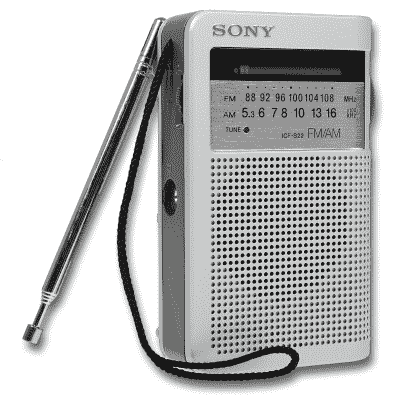

# 无线头盔扬声器接收+信号以分散佩戴者的注意力

> 原文：<https://hackaday.com/2015/02/06/wireless-helmet-speakers-receive-a-for-distracting-wearer/>

有什么能比骑着你最喜欢的滑板车在城里兜风更好的呢？骑着你最喜欢的踏板车在镇上兜风，当然是听一些很酷的音乐！[sswantly]注册了一门工业设计课程，任务是为特定用户(由他选择)创建一个无线电项目。他决定在摩托车头盔上增加一些无线扬声器，并设计一个安装在车把上的收音机。

【sswantly】从拆解班级指定的超便宜、老派、电池供电的索尼 ICF-S22 收音机开始。库存箱被丢弃，因为他必须做一个新的适合自行车的车把。胶合板构成了大部分的框架，而封面是黑色丙烯酸。让丙烯酸弯曲需要加热到 160 度，这样它就可以围绕一个专门为这个项目创造的形式弯曲。表壳上的几个切口允许驾驶者操作音量和调谐旋钮。

头盔上的扬声器来自无线耳机，并配有一个匹配的发射器。发射机从不必要的大盒子中取出，安装在收音机的新外壳中，并连接到收音机的耳机输出。将耳机部件放置在头盔的理想位置需要拆卸耳机。扬声器被放在头盔的耳罩里。最初耳机外壳的一部分和一些控制按钮安装在头盔的外部，以便于使用。连接组件的电线必须延长，以重新连接现在分散的部件。

为了听到甜美的音乐，骑手只需打开耳机和收音机。看看这个，看看更多的头盔扬声器，这次[有点古怪](http://hackaday.com/2010/10/31/halloween-props-voice-changing-daft-punk-costume/)。