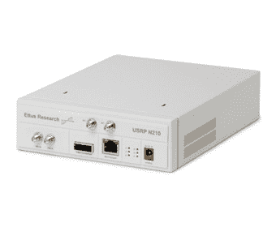
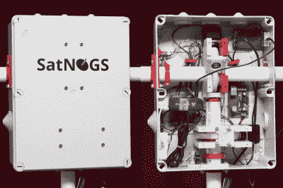
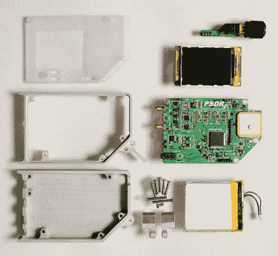

# 为什么您应该关注软件定义无线电

> 原文：<https://hackaday.com/2015/02/12/why-you-should-care-about-software-defined-radio/>

它还没有成为一个家喻户晓的术语，但软件定义无线电(SDR)是发展技术前沿的主要参与者。无论您是在开发面向大众消费的产品，还是只是玩玩，SDR 都是值得了解的，我会向您证明这一点。

## 特别提款权归结为一个难题

首先，让我们来解释一下“无线电”的含义。如果它通过无线电频率发送或接收，那么它里面就有一个收音机。这意味着你的 WiFi 路由器，你的手机，你的笔记本电脑，许多水表和电表，你的车库门开启器(但不是你的电视遥控器，它使用光)，无线安全系统传感器，警用无线电，你的无线鼠标/键盘，以及你经常在邻居院子里撞毁的四轴飞行器都有一个。收音机如此多产，我们很想告诉你它们几乎无处不在。

Ettus Research USRP N210

广播过去要难得多。在通信方面，你可以买一个昂贵的无线电接收机和/或发射机，需要熟练的操作员来使用。在较低的层面上，您可能需要选择特定的频段，处理调制器、混频器和滤波器设计等问题，以及制造过程中的大量障碍，这些障碍也会将您局限于特定的应用。

软件定义无线电通过允许您控制无线电硬件如何基于软件运行来解决这些问题。大规模生产的廉价硬件的可用性也推动了这种技术的出现。这不是广播的全部，但它使问题变得更容易。这导致了更广泛的采用，但我们认为目前所看到的只是冰山一角。

这里看到的是 USRP N210，它是硬件开发人员在产品中使用射频的专业工具。这个工具被证明是如此受欢迎，以至于 National Instruments 购买了设计师 Ettus Research，现在将 USRP 与他们的 LabVIEW 系统结合在一起。中档 USRP-210 型号是一款非常强大的 SDR，DC 工作频率为 6 GHz。

## 你可以在它建成后改变它

![Florian Fuchs/Wikipedia/CC-BY-SA 3.0 [CC BY-SA 3.0 (http://creativecommons.org/licenses/by-sa/3.0)], via Wikimedia Commons](img/19d40b6d1bffb8912145637edd2240d8.png)

佛洛里安·福克斯 CC-BY-SA 3.0[via Wikimedia Commons](http://commons.wikimedia.org/wiki/File:RealTek_RTL2838_DVB-T_USB_Stick.jpg)

SDR 的全部要点是不太需要专门的硬件。一个模块可以解决广泛的用途，甚至是那些目前未知的用途。构建和运输硬件的开销很高，但制定和分发软件(或固件)更新的相关成本可能要低得多。使用 SDR 进行通信的设备不会将平台局限于一组特定的通信。例如，如果您出售一个基本单元和多个远程单元，在版本 2 中切换通信方法可能会使旧的硬件变得无用。如果客户能够在简单升级后继续使用他们的旧配件，他们会很高兴。完全可以想象，这种升级会像许多智能手机一样，通过无线方式(像从基本单元)进行。

乘数当然是众包开发。对未来的一个预测是一个互联的世界。如果设备固件已经作为开源软件发布，一个积极的社区会找到一种方法使硬件更加有用。

在下一部分，我将讨论这里看到的 DVB-T 加密狗。但需要意识到的一件重要事情是，该设备内部的芯片是 SDR，并且已经在商业上使用。内部芯片组的多功能性证明了 SDR 是消费类硬件的可行选择。我很想看到可靠的数字，看看有多少已经售出，以观看电视，而不是修补特别提款权。不管怎样，这对生产这些产品的公司来说都是好事。

## 开始学几块钱

如果你对这一切几乎一无所知，不要感到羞愧。这是大多数人的立场，你不必花很多钱或知道很多来涉足 SDR。让我们面对现实吧，无线通信是务实的头脑最接近称之为“神奇”的东西，这使得 SDR 成为一种乐趣。

### 开始简单

真正让我惊讶的是 RTL-SDR 的出现。这是将电视调谐器 USB 加密狗用于软件定义无线电的实践。没错，这些“DVB 棒”是用来在电脑上观看广播电视的，但里面是一个 Realtek 2832U。

SatNogs satellite receiver is based on a DVB-T Dongle and SDR

将加密狗连接到你的电脑上，启动一些软件，你就可以监听各种声音信号和传输的数据。我们很喜欢在 Hackaday.io 上阅读 Droopy Nayhey 博士的] [SDR 指南，因为他正在走这条路。12 美元的硬件(公平地说，加上电脑和电缆)，他在跟踪飞机，收听紧急波段，调频广播，以及“寻宝”我们世界中所有正在传输的东西。](http://hackaday.io/project/3973-enter-the-complex-world-of-sdr)

不要害怕这一点，这些只是接收器，所以你不需要执照或事先培训。我们已经看到这些变成了自动飞机拍摄设备，你最终可以为 T2 增加 FlightAware 的飞行跟踪数据网络。2014 年黑客日大奖得主甚至[在一个 DVB 加密狗](http://hackaday.io/project/1340-satnogs-global-network-of-ground-stations)周围建了一个卫星接收站！看到那个垂直居中的小黑棍了吗？卫星的确将信息传回地球，你只需要监听数据。

对于入门和目标明确的应用程序，这些加密狗是一个很好的选择。但是它们被限制在大约 22MhZ 到 2200Mhz 之间，这取决于你使用的是哪种加密狗。超越这些限制需要转向不同的硬件。

### 越来越认真

Parts that make up PortableSDR

早些时候我说过，特别提款权解决了一些问题，但肯定不是全部。一个设备还不能统治所有的射频通信。因此，那些越来越认真的人将目光投向了专门构建的特别提款权，而不是搭载在那些电视接收机上。这在许多方面仍优于过去的无线电设备，因为这些电路板拥有一套高度通用的功能。

在这里，我们看到了一个有趣的 SDR 案例，[在 2014 年 Hackaday 奖](http://hackaday.io/project/1538-portablesdr)中名列第三。PortableSDR 不再需要计算机来驱动软件，而是将电路放在一个耐用的外壳中，并带有一个专用显示器作为用户界面的一部分。它的目标是那些对业余无线电越来越认真的人，但目前它仍然是一个只能接收的仪器。

周一，我们[呼吁](http://hackaday.com/2015/02/09/portablesdr-needs-a-cinderella-story-to-finish-its-kickstarter/)给[的便携式 Kickstarter](https://www.kickstarter.com/projects/1703258614/psdr-pocket-hf-sdr-transceiver-with-vna-and-gps) 一个灰姑娘的故事结局。我仍然希望这个能成功，因为我相信它是业余无线电运动现代化的一部分。

另一个重生的例子是专为业余无线电操作员设计的 SDR 设备。随着的进展，我们一直在关注这样的一个建造[。这一个围绕着一个](http://hackaday.com/2015/01/30/casing-up-the-teensy-sdr/) [Softrock SDR 板](http://www.wb5rvz.org/)，它由一个 Teensy 3.1 控制，同样，它有一个不需要电脑的专用用户界面。注意到传统业余无线电技术和黑客运动的融合了吗？

## 结论

还需要我多说吗？玩 SDR 的人越来越多。这将导致有趣的新应用，我相信它最终将推动消费电子设计。但是，如果你需要更多的灵感，只要看看人们围绕 SDR 建立的各种东西，并做出你自己的预测。

【特色图片来源: [HDSDR.de](http://www.hdsdr.de/screenshots.html)