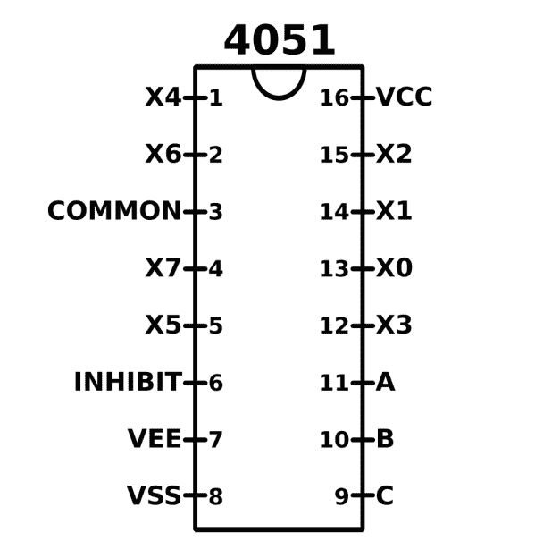
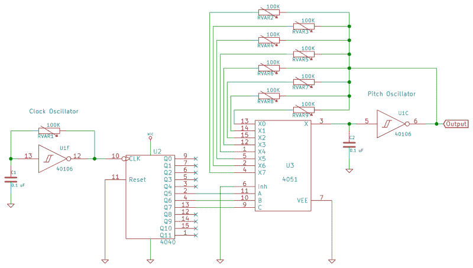
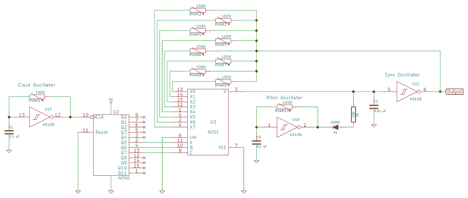

# 逻辑噪声:开关序列发生器有节拍

> 原文：<https://hackaday.com/2015/02/23/logic-noise-the-switching-sequencer/>

逻辑噪声就是使用逻辑电路来发出声音。最好是听起来令人愉快并且对创作音乐有用的声音。本周，我们将触及我最喜欢的芯片之一的表面，它几乎可以用于任何用途:4051 8 路模拟开关。顾名思义，您可以连接八个输入，并从中选择一个连接到输出。(或者，您可以将单个输入发送到八个目的地中的一个，但我们在这里不会这样做。)

为什么这很酷？想象一下，你想让我们的振荡器演奏八个音符。如果你完成了我们的第一部分，你就造出了一个听起来刺耳但用途广泛的振荡器。我让你手动点击八个不同的电阻或将电位计转到八个不同的位置。这个星期，我们将让 4051 接管一些控制，让我们做更先进的旋钮 twiddling。

[https://www.youtube.com/embed/fYravrAz2Zk?version=3&rel=1&showsearch=0&showinfo=1&iv_load_policy=1&fs=1&hl=en-US&autohide=2&start=150&wmode=transparent](https://www.youtube.com/embed/fYravrAz2Zk?version=3&rel=1&showsearch=0&showinfo=1&iv_load_policy=1&fs=1&hl=en-US&autohide=2&start=150&wmode=transparent)

4051 为什么牛逼？因为这周的项目只是冰山一角。没有什么可以阻止你将八个 CD 播放器或收音机连接到输入端，并在它们之间有节奏地切换。或者将八个任意电压施加到每个输入，并以音频频率步进通过它们，创建八步任意波表合成器。如果你是那种喜欢将计算机控制添加到方波噪声合成器中的人，4051 对与微控制器配合得非常好。这些应用超出了我们今天正在做的事情，但是看到森林*和*树木还是很好的。

## 有序间距:4051 开关

[https://www.youtube.com/embed/v56zL0c_08Q?version=3&rel=1&showsearch=0&showinfo=1&iv_load_policy=1&fs=1&hl=en-US&autohide=2&wmode=transparent](https://www.youtube.com/embed/v56zL0c_08Q?version=3&rel=1&showsearch=0&showinfo=1&iv_load_policy=1&fs=1&hl=en-US&autohide=2&wmode=transparent)

到目前为止，我们一直在改变张弛振荡器电路的反馈回路中的电阻来控制音高。但是如果我们不想再用手来控制音高呢？例如，我们可以把选择电阻的任务交给开关。事不宜迟，我向您介绍 4051 模拟开关。

右下角(引脚 9、10 和 11)是三个数字输入，用于选择开关的激活方式。根据这三个位的值，公共引脚将连接到各种 X 引脚中的任何一个。a 是最低有效位，C 是最高有效位。因此，当 A=B=C=0 时，common 连接到 X0，当 A=B=1 且 C=0 时，common 连接到 X3。

该芯片的电源有点复杂，因为它旨在通过开关支持正负(模拟)电压。在“正常”使用中，你可以将 VCC 连接到+5V，VSS 连接到-5V，VEE 连接到 0V 或信号地。这里重要的是，VCC 至 VSS 电压跨越输入范围，而 VEE 至 VCC 电压在逻辑信号的相关范围内。由于我们通过反馈路径传递单边(0V 至 5V 或 9V)方波，并且逻辑信号使用相同的电压范围，因此我们可以将 VSS 和 VEE 接地。

### 该电路

这里的电路建立在我们迄今为止所做的一切之上，所以找出振荡器的 40106 芯片，上周的 [4040 二进制计数器](http://hackaday.com/2015/02/17/logic-noise-8-bits-of-glorious-sounds/)将时钟流转换为二进制计数，当然，还有你的 4051 模拟开关。

对于这个电路，我们需要像以前一样在 40106 上设置两个振荡器。我们将这两个振荡器称为“时钟”和“音调”振荡器。时钟振荡器将控制节奏，并将其输出馈入 4040 计数器的输入。音高振荡器的反馈电阻有许多选项，由 4051 芯片选择，计数器的输出决定选择哪个电阻。这意味着我们的电路看起来像这样:

好的，一下子要理解很多，但是它分解成熟悉的部分。左边是堆叠振荡器示例的电路:一个可变振荡器驱动我们的二进制计数器，充当时钟分频器。在最右边，我们又有了一个简单的张弛振荡器，但在反馈电阻离开反相器输出的地方，电路分成 8 个独立的电阻，经过开关，返回反相器输出，为电容充电。还有一个秘密。开关正在选择使用哪个电阻器来确定螺距。

实际上，按照所写的构建这个电路需要很多布线，并且很容易丢失。相反，我建议只从一个反馈电阻开始，然后逐步增加。使用单个电阻器时，音高振荡器只会发出 1/8 周期的声音。开始时，将定时振荡器调整得相当慢，然后在音频振荡器上设置一个合理的音高。现在，您可以在序列中添加另一个电阻了。作为一个实用的布局技巧，请注意，您最终会将开关的五到八个电阻连接到同一点。确保你在实验板上给自己留了一点空间来建立这些联系。

应该使用什么电阻？如果你手头有源源不断的 100K 电位计，这是最理想的。但是我们中有谁知道呢？相反，这实际上是一个有趣的挑战，只需在 10K 和 100K 之间随机抓取一些不同的电阻值，并尝试从中制作一些音乐。实际上，将开关上的几个位置留空也是有意义的。这打破了反馈循环，让您在序列中获得音乐休止符。

当您摆弄选择位 A、B 和 c 的输入时，事情真的变得有趣了。如图所示，我们已经将计数器中的最低有效位连接到开关上的最低有效位位置，依此类推。这给了我们一个可预测的从一数到八的模式。也就是说，我们使用计数器芯片作为计数器。(哈欠！)

一旦你连接了三个或四个电阻，试着选择其他时钟分频作为输入。例如，如果您为选择位 A 使用相对较快的时钟输入，您将在两个音符(X 的偶数和奇数值)之间获得快速颤音，并在其中四个音符对中获得较慢的进展。这里有如此多的模式，你只需要尝试一下。八个可变电阻调节音高，多种方式控制节奏模式，这种设置真的不算太差。做好准备，在你造好它之后，至少花半个小时到处玩玩。

## 序列同步

到目前为止，我们已经从一个振荡器与另一个振荡器的硬同步以及通过手动改变一个振荡器的(相对较高的)频率来改变输出的音色中获得了很多好处。让我们实现自动化。

[https://www.youtube.com/embed/fYravrAz2Zk?version=3&rel=1&showsearch=0&showinfo=1&iv_load_policy=1&fs=1&hl=en-US&autohide=2&wmode=transparent](https://www.youtube.com/embed/fYravrAz2Zk?version=3&rel=1&showsearch=0&showinfo=1&iv_load_policy=1&fs=1&hl=en-US&autohide=2&wmode=transparent)

我们还需要一个振荡器来实现同步功能。(好在 40106 有六个逆变器，对吧？)现在电路将由一个驱动计数器和开关的时钟振荡器、一个由开关控制的同步振荡器和一个我们可以直接控制播放音乐的音高振荡器组成。注意，现在我们通过开关控制同步振荡器，手动控制音高振荡器。

在你从试验板上撕下东西之前，请注意，你可以很容易地将前一个电路的音高振荡器设置为本电路的(更高频率)同步振荡器，方法是更换一个低值电容器，并将电路的其余部分保留在原位。换上一个 0.01 微法电容作为同步振荡器，然后取出刚刚取出的 0.1 微法电容，用它来构建您的音高振荡器。像上次一样，用二极管和限流电阻将音高振荡器的输出连接到同步振荡器的输入。将您的放大器设置连接到同步振荡器的输出，享受这种美妙的感觉。

确保通过调整时钟振荡器探索同步速率调制频率的整个范围。很明显，同步开关频率在 2 Hz (120BPM)左右，但当同步开关频率接近音频频率时，确实会发生奇怪的事情。我非常喜欢这条赛道。

## 扩展ˌ扩张

这种电路设置有太多的方式。

如果您想弹奏奇异的节奏，可以使用非同步周期来驱动 A、B 和 C 引脚。取代我们这里使用的单振荡器加计数器设置，在 40106 上构建三个随机振荡器，并将它们用作 4051 的输入。根据各种时钟振荡器的相对周期，你会得到一些非常不同的模式。

或者，你可以将计数器保留在电路中，但给它提供一个不规则的时钟源，这样它采取的步骤就会不稳定。你可以用二极管组合几个周期不同的振荡器的输出来制作一个奇怪的时钟。使用[米老鼠逻辑](https://en.wikipedia.org/wiki/Mickey_Mouse_logic)你可以和或或多个振荡器一起放在计数器前。除非你非常幸运或聪明，它可能不是“音乐”，但那是在旁观者的耳朵里。

在上面的两个例子中，用[光敏电阻(LDRs)](https://en.wikipedia.org/wiki/Light_dependent_resistor) 代替时钟中的反馈电阻，会随着房间内光线的变化，给你带来动态变化的疯狂。如果你有足够的注意力和足够快的时钟速度，这实际上可以在一天中非常酷，因为声音是一个不断发展的纹理，而不是一个狂躁的音乐盒。

但你甚至不需要柜台就能享受 4051 的乐趣。将其中两个背靠背放置(公共引脚到公共引脚)会得到一个 8×8 开关:8 个输入中的一个可以路由到 8 个输出中的任何一个。您可以根据同步信号路径的需要多次重复该电路。同样，两个 4051 与一个双极性电源并联，构成一个可用于立体声的八路输入选择器。

## 下一次会议

在下一期文章中，我们将使用 CMOS 芯片研究一些放大器和滤波器电路。对于这些，我们需要一个不同的反相器芯片，4069UBE，它没有 40106 的内置迟滞。(请注意，UB 部分非常重要，它是我们需要的无缓冲输出。)在那之前，玩得开心点，把你的结果贴在评论里。