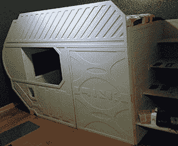
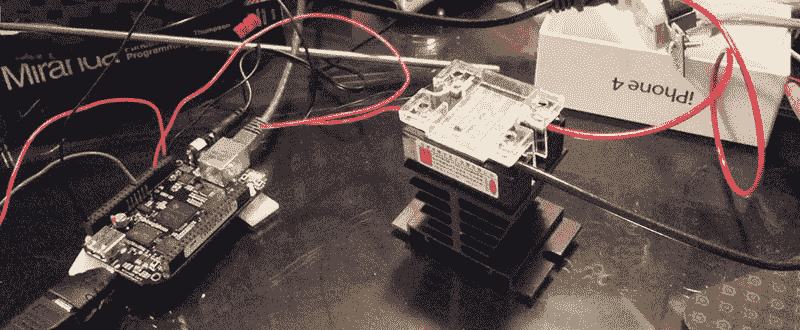

# hack let 35–beagle bone 项目

> 原文：<https://hackaday.com/2015/02/20/hacklet-35-beaglebone-projects/>

Raspberry Pi 2 刚刚推出一个月，现在这款新硬件上的复古主机仿真已经确定下来，是时候让每个人都做些真正的工作了。你知道，重新编译东西以利用新的 CPU，弄清楚如何让 Android 在 Pi 上工作，以及所有使 Pi 有用的好东西。

对于我们的普通读者来说，有另一种板在大多数情况下一样好，甚至在某些方面比 Pi 2 更好，这并不奇怪。这是 BeagleBone Black，对于这一期的 Hacklet，我们将关注 [Hackaday.io](http://hackaday.io) 上所有很酷的 BeagleBone 项目。

所以你有一台信用卡大小的 Linux 电脑和一个又小又旧的 LCD 面板。如果它没有 HDMI，VGA 或复合输入，可能就没有办法让这个显示器工作，对不对？没有。[当你可以用 10 美元做一个液晶斗篷的时候就不会了](http://hackaday.io/project/3788-beaglebone-black-8-lcd-cape-for-under-10)。

[Dennis]不久前有一个旧的数码相框，他决定为他的 BeagleBone 安装一个显示器。几根电线和一些 FPC 连接器，丹尼斯为他的骨头定制了一个显示器。总比等着那个 DSI 显示好…

[【thx 1082】正在给儿子](http://hackaday.io/project/3207-spaceship-bed)铺床。这不是你通常的赛车床，甚至不是一个非常酷的机车床。不，这是一张*飞船*的床。你的床是宇宙飞船吗？不，我不这么认为。

胶合板、中密度纤维板、油漆和胶水的大部分工作已经完成，这意味着这种床的最佳功能——带有液晶显示器、按钮、电视和一些 3D 打印部件的 BeagleBone 黑色——是[THX]目前正在进行的工作。他甚至在床上运行一个多人联网的星际飞船模拟器。你的床是星际飞船模拟器吗？

啤酒。[Deric]一直在使用比格犬骨黑研究多步发酵控制器。为了得到好的啤酒，你需要控制温度*和*时间，以免你喝了一些糟糕的泔水，我可能还会喝。

这个项目控制着发酵的每一个方面，从促进酵母生长，糖的代谢，到絮凝。该计划使用两个回路——一个用于加热，一个用于冷却——和一对温度传感器来确保啤酒正确发酵。

* * *

如果你在寻找更多的 BeagleBone 项目，[hackaday . io](http://hackaday.io/list/3562-beaglebone-projects)上有一个完整的列表，上面有 GLaDOs 眼镜、飞行计算机和计算机视觉。