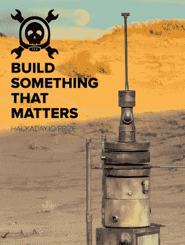
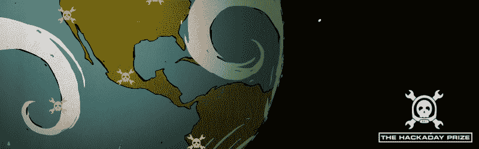

# 2015 年黑客日奖:打造有意义的东西

> 原文：<https://hackaday.com/2015/03/10/2015-hackaday-prize-because-a-simple-idea-can-change-the-world/>

[https://www.youtube.com/embed/X6nHL_hQ6t4?version=3&rel=1&showsearch=0&showinfo=1&iv_load_policy=1&fs=1&hl=en-US&autohide=2&wmode=transparent](https://www.youtube.com/embed/X6nHL_hQ6t4?version=3&rel=1&showsearch=0&showinfo=1&iv_load_policy=1&fs=1&hl=en-US&autohide=2&wmode=transparent)

去年，我们向您提出了构建下一代互联设备的挑战。六个月后，来自世界各地的最佳团队和项目争夺最大的奖项:同行的尊重和太空之旅。今年，我们向来自世界各地的黑客、工程师、制造商和创业公司发出号召，将他们的创造性努力集中在解决人类面临的严重问题上。

## 修复世界

 在接下来的几十年里，我们都将面临许多问题，无论是来自成本和石油消费的上升、干旱、食物的获取、人口结构的变化，还是医疗保健费用的增加。这些问题需要解决，没有比现在更好的时间来着手解决这些问题了。

我们想从你这里得到什么？我们希望你能找出未来几年人类面临的最大问题，并提出解决方案。这可以是更好、更低成本的太阳能组件、廉价的超声波仪器、更好的药物储存方法、更先进的农业生产测量方法，或者更便宜、更可持续的智能手机，以弥合数字鸿沟。这个世界充满了问题，但如果说黑客教会了我们一件事，那就是有足够多的人愿意找到解决方案。

## 奖赏

如果全球知名度还不足以激励个人，Hackaday 又回来了，为那些最能体现重要问题解决方案的设备颁发了一系列奖项。

大奖是乘坐你选择的航空母舰或价值 196，883 美元(一个[怪物集团](http://en.wikipedia.org/wiki/Monster_group)的数字)的太空之旅。其他大奖包括一台 90 瓦激光切割机、一套建筑工具(pcb 研磨机、3d 打印机、cnc 路由器、台式车床)、一次日内瓦 CERN 之旅和一次中国深圳之旅。

今年的新品是最佳产品奖。多走一步，展示一个生产就绪的设备(除了提供三个 beta 测试单元用于判断)，您可以获得 100，000 美元！参赛作品当然仍有资格角逐大奖和其他最高奖项。

我们能够再次实现这一目标，要感谢 [Supplyframe](http://supplyframe.com/) 的远见卓识，他成功地联合了电子行业的巨头作为 2015 年 Hackaday 奖的赞助商。 [Atmel](http://www.atmel.com/) 、 [Freescale](http://www.freescale.com/) 、[微芯片](http://www.microchip.com/)、 [Mouser](http://www.mouser.com/) 和[德州仪器](http://www.ti.com/)都已签约支持这项任务。

## 个人、大学、黑客空间和创业公司

如果你只是不想单干，让你的团队兴奋起来。毕竟是去年拿了大奖的队伍。SatNOGS 将 196，418 美元的现金选择权转变为一个推动项目向前发展的基金会。通过吹嘘你的公司会因为展示他们的工程技术而声名狼藉，来让老板加入进来。或者召集你的大学伙伴参加一些头脑风暴会议来帮助你写简历。最佳产品奖非常适合那些想要展示自己产品的初创公司。

## 《士师记》

今年加入评审小组的有 Akiba (Freaklabs)，Pete Dokter (Sparkfun)，Heather Knight (Marilyn MonRobot)，Ben Krasnow(Google x & YouTube 上的应用科学主持人)，Lenore Edman & Windell Oskay(邪恶疯狂科学家实验室)，以及 Micah Scott (Scanlime)。

我们的回归评委是 Limor“lady ada”Fried(Adafruit)，Jack Ganssle (Ganssle Group，& The Embedded Muse)，达夫·琼斯(EEVBlog)，Ian Lesnet(危险原型)，和 Elecia White(逻辑优雅)。

你可以阅读所有评委的简历，并在[我们的评委页面](http://hackaday.io/prize/judges)上找到他们的社交媒体和网页链接。我们感谢这些行业专家分享他们的时间和才能，使 Hackaday 奖成为可能。

## 告诉所有人

我们不常问:请告诉你认识的所有人 2015 年 Hackaday 奖的事！社交媒体分享图标就在这篇文章顶部的图片上方。将此页面或奖品页面([http://hackaday.io/prize](http://hackaday.io/prize))提交到所有您喜欢的网站。没有一个黑客应该在没有听说过#HackadayPrize 的情况下度过这一天，没有你的帮助，我们无法达到完全的媒体饱和。提前感谢！

## 现在就开始

不要等待，[现在就提出一个想法](http://hackaday.io/project/add)并贴上“2015HackadayPrize”的标签。我们将为有助于启动项目的早期想法派发奖品。当你充实你的计划时，你可以获得奖励来帮助构建原型，如 PCB、3D 打印、激光切割等。进入决赛，你将看到我们之前提到的五个最高奖项[。一个简单的想法可以改变世界。](http://hackaday.io/prize/details#Prizes)

