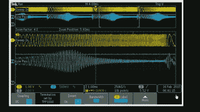
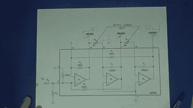
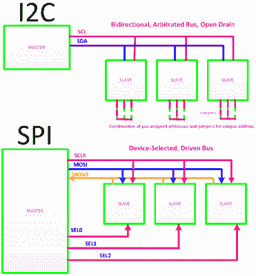
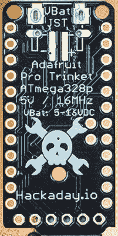
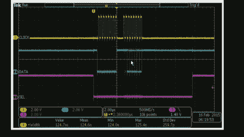
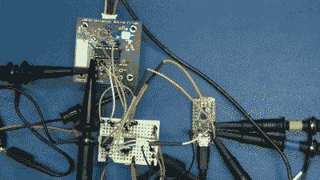
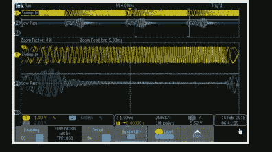
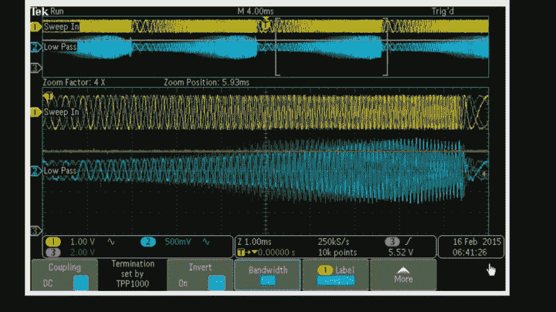
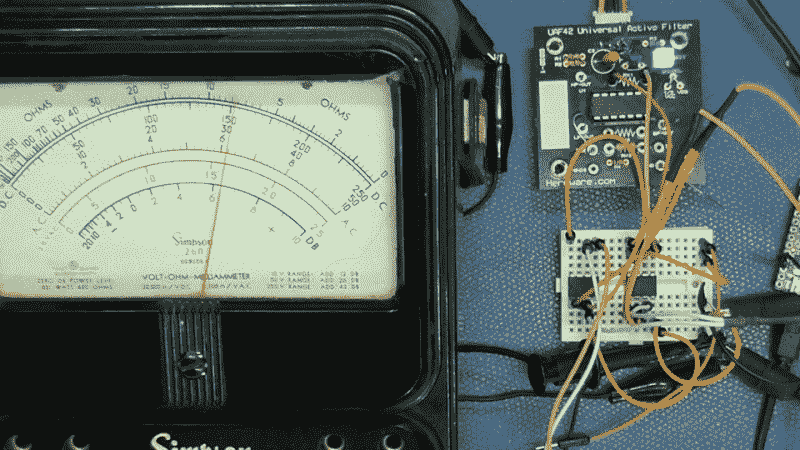

# 我们假设控制:SPI 和数字电位计

> 原文：<https://hackaday.com/2015/02/24/we-assume-control-spi-and-a-digital-potentiometer/>

在[的上一个视频](http://hackaday.com/2015/01/28/universal-active-filters-part-2/)中，我演示了一个通用有源滤波器，我可以用一个双组电位计进行调整，这里我用一个处理器控制的固态电位计代替电位计。对于那些太年轻而不记得的人，我们曾经说“固态”来区分它和使用真空管的东西…我们主要是指你可以把它摔下来而不会损坏。

  Using SPI to set Cutoff of Low Pass Filter  UAF42 Filter with Dual Ganged Pots

控制日常外设芯片的最常见方法是使用 I2C 和 SPI 等常见串行协议。以前，我们只有 8 位，幸运的是，如果其中 7 位有效，我们必须对外设或输入/输出(I/O)控制器进行内存映射，这意味着我们必须从微处理器获取许多控制和数据线，如数据、地址、读/写、系统时钟和其他几个信号，才能写入芯片中的几个控制寄存器。

[https://www.youtube.com/embed/D-wJSM2YLxM?version=3&rel=1&showsearch=0&showinfo=1&iv_load_policy=1&fs=1&hl=en-US&autohide=2&wmode=transparent](https://www.youtube.com/embed/D-wJSM2YLxM?version=3&rel=1&showsearch=0&showinfo=1&iv_load_policy=1&fs=1&hl=en-US&autohide=2&wmode=transparent)

如今，微控制器越来越多，它们往往具有内置的串行接口能力，控制各种外设功能非常简单；数字和模拟都一样。不是使用所述数据和地址线来映射每个外围设备(这是一种非常并行的方法),而是控制器仅使用少量信号线(例如串行数据和时钟)来与外围设备串行通信。不再需要旧系统设计的主要任务，即 I/O 和外围设备的映射。

## 用数字控制模拟

就流行程度而言，两个串行接口已经上升到了顶端:I2C 和 SPI。I2C 是一种更复杂的协议，它仲裁谁应该说话，并且基本上是双向的，这意味着数据输入引脚可以兼作数据输出。I2C 还意味着外围集成电路有预先分配的地址，因为接收器是可寻址的，所有的都可以在同一 I2C 总线上连接在一起。如果你不用调试 I2C 就更好了，在协议存在的早期，我不得不调试它，(但那是很久以前的事了)。

SPI and I2C Protocol Comparison

我认为 SPI(串行外设接口的缩写)更像是一种态度，而不是一种严格的协议，因为我见过各种关于时钟和选择如何工作的规范，所以如果是为生产而设计，通常值得检查一下细节。SPI 的核心是针对每个器件的独立片选和专用数据输入和输出。有利的一面是，数据线不必担心是双向的或必须处理竞争，因此它们被设计为真正的高电平有效和低电平有效驱动线，而 I2C 有一个无源上拉电阻，可能会限制最大速度或负载。

在这种情况下，我选择了我想要的数字电位计，并让它决定串行协议。在视频中，你会看到各种控制器和处理器，我看了看，并决定在 Hackaday Pro 饰品上，原因很简单，它有一个 Hackaday 头骨。

Hackaday Pro Trinket

IDE 的快速[下载，我能够通过引导装载程序与模块对话。仔细阅读内置示例，我们不仅可以看到用“C”编写的基于 SPI 的项目，还可以看到两个 SPI 示例中的一个是针对数字电位计的。我选择使用 MCP4161 数字电位计，尽管它与 SPI 示例不同，但对代码的改动很小。查看数据手册，我们发现首先写入零值，然后写入第二个值，该值表示电位计的电阻值为 256 步的$00-$FF 十六进制范围。示例代码位于一个循环中，两个字节都递增，因此我将第一个字节更改为$00，并保留递增代码，因为这对我们这里的演示很有用，并重新编译。](https://learn.adafruit.com/introducing-pro-trinket/setting-up-arduino-ide)

SPI Protocol Writing to Digital Potentiometer

我最初的计划是在一个 PCB 上演示数字电位计及其控制的滤波器，但遇到了太多电源的兼容性问题、接地问题，甚至是我用来在房间另一端驱动演示的长 USB 电缆的压降问题。使用一个小的无焊试验板，很容易将数字电位计连接到 SPI 总线，然后用它们代替双通道电位计。

Active Filer, Digital Potentiometer and Hackaday Pro Trinket

[如果你没有看到之前的视频](http://hackaday.com/2015/01/28/universal-active-filters-part-2/)，我使用一个扫描频率发生器来演示我们的可调滤波器的效果。函数发生器从输出低频开始，然后快速扫描到更高的频率。

其效果是，正确触发的示波器在显示器的左侧显示低频，在右侧显示高频。当滤波器在低频和高频之间移动时，其频率响应被视为在显示器的左侧和右侧之间移动，其中 x 方向表示频率。

  Low Pass Filter Sweep – Left to Right  Using SPI to set Cutoff of Low Pass Filter  

与我们上次的演示一样，我们看到滤波器在范围内上下移动，只是现在它是在一个简单的 C 程序的控制下，而不是手动调整。如果你愿意，可以想象一个模拟合成器，它取代了精心校准的控制电压来管理振荡器、滤波器和其他效果，同时相互密切跟踪，无需担心线性度或温度会影响控制精度。

## 模拟视图

最后，为了直观地证明数字控制电位计确实模拟了可变电阻，我连接了我 16 岁时就有的老式辛普森 260 伏欧姆表(VOM)。这么说吧，这意味着我已经拥有它将近 40 年了。将 VOM 设置为电阻，并记住零欧姆是向右偏移，增加电位计的效果很容易看到。

Simpson 260 showing an SPI controlled Digital Potentiometer

这只是让处理器控制我们模拟项目的一个简单例子。这些天来，我自动假设在任何大型项目中都会有一两条串行控制总线。