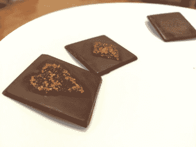

# 用激光使糖焦糖化

> 原文：<https://hackaday.com/2015/03/04/caramelizing-sugar-with-a-laser/>

如果你碰巧有一台激光切割机，你一定会尝试切割或雕刻一些它不是为之设计的东西。我们知道我们有。[邦妮]和她的朋友[布伦达]决定尝试新的东西——用激光使糖焦糖化。

 在他们当地的黑客空间，[纽约电阻](http://www.nycresistor.com/)，他们拿来一些巧克力块和彩糖，开始摆弄激光。这是 Epilog 公司的 60W 二氧化碳激光器。在测试了几个不同的选项后，他们最终选择了以下设置，只需一次操作即可获得最佳的糖焦糖化效果:

> 速度 100
> 功率 30
> DPI 300

通过在巧克力上撒一层薄薄的糖，你可以有效地融化糖并将其粘合到巧克力上——我们怀疑玩激光聚焦也可以帮助你微调自己制作糖果的过程。

你也可以用激光蚀刻巧克力——但这并不酷。或许你可以试试寿司游戏，为什么不在卷之前用激光雕刻海藻呢？或者用 CAD 设计出完美的[激光切割姜饼屋](http://hackaday.com/2012/12/07/design-a-gingerbread-house-in-cad-then-cut-pieces-with-a-laser/)？