# 逻辑噪声:锯掉模拟波形

> 原文：<https://hackaday.com/2015/03/09/logic-noise-sawing-away-with-analog-waveforms/>

今天，我们将踏上一次更少噪音的旅程，离开我们一直生活的舒适的数字世界。回报是什么？更平滑的声音，因为今天我们开始模拟之旅。

如果你还记得[我们的第一节课](http://hackaday.com/2015/02/04/logic-noise-sweet-sweet-oscillator-sounds/)，当时我正在解释基本振荡器如何加载和卸载电容，当它跨越两个不同的阈值时，触发输出高电平或低电平。当时，我们指出有一个三角波形正在产生，但如果没有缓冲，你很难放大它。今天，我们进行缓冲，将三角波输出到放大器。

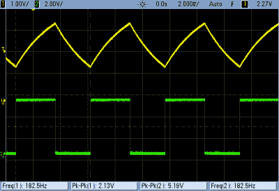

但是，只要我们在放大，我们可能会超速放大器，前往失真的土地。我们将这样做，并建立一个三角波振荡器，它可以变形为方波，通过一个圆形的方波。三角形听起来好听圆润，方波听起来明亮嘈杂。(你现在应该已经习惯了…)而我们得到了介于两者之间的一切。

当我们这样做的时候，我们也可以把三角波变成锯齿波来获得美妙的低音。然后，我们可以把这个巨大的锯齿波变成一个更亮的脉冲声波，它和上面的方波是近亲。

是什么让这一切对我们有用？一些带负反馈的无聊的放大，以及(错误地)使用逻辑芯片来得到它。休息之后，我将介绍我们今天的芯片:4069UB。

如果你不知何故错过了它们，以下是《逻辑噪音》的前三部分:

*   [悦耳的振荡器声音](http://hackaday.com/2015/02/04/logic-noise-sweet-sweet-oscillator-sounds/)
*   [8 位光荣音](http://hackaday.com/2015/02/17/logic-noise-8-bits-of-glorious-sounds/)
*   [切换音序器有节拍](http://hackaday.com/2015/02/23/logic-noise-the-switching-sequencer/)

## 4069UB

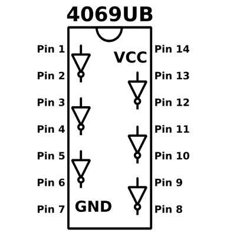4069 ub 是一个六路(无缓冲)逆变器。事实上，如果您还记得 40106 的引脚排列，您应该会觉得非常熟悉。唯一的区别是反相器中没有迟滞(和小曲线符号)。但是这有什么区别！逆变器没有缓冲和迟滞，因此我们可以将单个放大器用于模拟目的，而不是数字/逻辑目的。

请记住，“UB”部分是所有这些工作所必需的。它代表无缓冲，也就是说，在芯片内部没有特别尝试将输出转换成数字信号。(有些以“UBE”或“UBF”或其他什么结尾。只要有一个“UB”在某个地方，你就准备好了。)事实证明，无缓冲反相器只不过是一个推挽式 CMOS 放大器对。每个“反相器”单元看起来像这样:

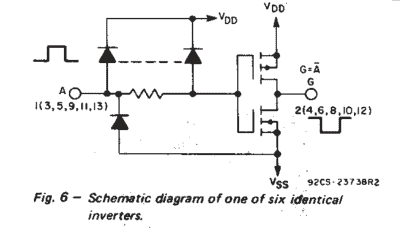

忽略输入保护二极管，可以看到它基本上只是两个晶体管:一个 N 沟道 FET 连接在输出和地之间，一个 P 沟道 FET 连接在输出和电源轨之间。(这就是 CMOS 芯片得名的互补 MOS 对。)

如果你没有刷上你的 MOSFETs，当输入栅极被拉至高电压时，N 沟道导通，当输入栅极被拉低时，P 沟道导通。这意味着当输入电压较低时，底部 FET 不导通，顶部 FET 导通，将输出电压拉高。对于高输入电压反之亦然。这就构成了一个基本的逻辑反相器。万岁！

但是中间会发生什么呢？在中间电源电压下，两个晶体管都将不同程度地导通。这使得输出电压是连续的、模拟的，并且与输入电压“相反”。为了给芯片一个像样的逻辑输出，它需要通过这个中间区域有一个高增益，使电压略高于中点导致输出明显是一个逻辑 0。

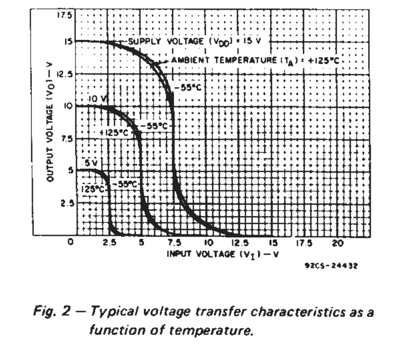

对于我们的目的来说，这个芯片的优点是从上面的 S 形增益曲线中获得的柔和削波效果。也就是说，增益在 VCC 和 GND 附近下降(线不太陡)。当我们调高放大器时，这就产生了令人愉悦的超速声音，并让我们通过控制输入音量和增益来控制输出上的模糊量。

## 缓冲和反馈

[https://www.youtube.com/embed/PgMHj3hAD1o?version=3&rel=1&showsearch=0&showinfo=1&iv_load_policy=1&fs=1&hl=en-US&autohide=2&wmode=transparent](https://www.youtube.com/embed/PgMHj3hAD1o?version=3&rel=1&showsearch=0&showinfo=1&iv_load_policy=1&fs=1&hl=en-US&autohide=2&wmode=transparent)

正如我们上面所说的，裸 4096UB 芯片在中点电压附近具有非常高的增益，这使得它作为逻辑芯片非常有用。为了使它对放大模拟音频有用，我们将使用(负)反馈来稍微降低增益。通过控制输入信号与反馈的比率，我们可以改变输出，从几乎完全无声到失真到电源电压的极限。

首先，我们的目标是获得-1 的电压增益。也就是说，输出信号与输入信号一样大，但在中点附近符号相反。如果你是电气工程师，这是一个“反相单位增益缓冲器”。缓冲器可以让我们监听放大器输入电路可能会淹没的信号。

还记得我们说过在 40106 逆变器的输入端子上有一个三角波吗？你试过把它们插到你的扩音器上吗？如果是这样，它可能没有工作，尽管你可以在示波器上看得一清二楚。即使我可以让它工作，仍然有一个音高变化，这取决于我的放大器上的音量旋钮设置。奇怪的东西！显然，放大器的输入电路与振荡器耦合。在两者之间放置一个缓冲电路，可以让振荡器振荡，放大器放大，而不会相互影响。这就是缓冲器的作用。让我们建造。

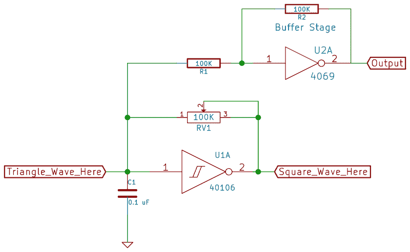

单位增益缓冲电路非常简单，只需通过一个电阻连接输入，然后在输出和输入之间的反馈中连接另一个阻值相同的电阻。为了直观地了解这是如何工作的，让我们简单地探究一下负反馈放大器。

这种电路(以及所有负反馈拓扑结构)的直觉包括首先认识到，在输入信号和负反馈相遇的地方，任何净信号电压都不能高于或低于芯片的零线电压。如果有正的净信号，逆变器输出将变为负，直到反馈使两者的连接点回到中性。如果输入相对于零线为负，输出将变为正，并将其拉回来。当反馈路径按预期工作时，它会将输入保持在中性电平。

简单说说这个零线电压。如果你熟悉运算放大器，零线电压就是正极端子上的电压。在我们的例子中，芯片在中轨电压附近从高到低切换，是 VCC 的一半，所以这是我们的中性点。您可以通过拔下输入并测量无信号时输出(和输入)的稳定电平来证明这一点。它将围绕 VCC/2。

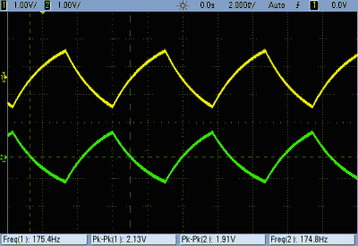因此，第一个基本前提是，反馈完全抵消了在逆变器输入端相遇的净信号。这种抵消意味着，通过输入电阻流入的任何信号电流都必须通过反馈电阻流出。如果将电压视为推动给定电流通过电阻所需的力，那么当两个电阻相等时，输出只需与输入一样努力。也就是说，当输入电压比零线高 0.1 伏时，输出将比零线低 0.1 伏，因为两者都在“对抗”相同的电阻。

这样你就有了:一个增益为负一的“放大器”。它不会使信号变得更大声，但现在您可以将缓冲级的输出直接插入您的音频输出，并在没有干扰的情况下聆听。为了好玩，这张图显示了示波器上的输入和输出。按预期工作。

## 放大器和过驱

太好了。现在我们有了一个漂亮干净的三角波振荡器。你可能会认为我们已经完成了，但是在 4069UB 上还有五个反相器门没有使用。如果再有五个放大器，我们能做什么？五个以上的放大器，有一个很好的平滑滚降很像老式电子管前置放大器吗？把它调到 11，看看它听起来怎么样！

[https://www.youtube.com/embed/Njiw1mFwhAg?version=3&rel=1&showsearch=0&showinfo=1&iv_load_policy=1&fs=1&hl=en-US&autohide=2&wmode=transparent](https://www.youtube.com/embed/Njiw1mFwhAg?version=3&rel=1&showsearch=0&showinfo=1&iv_load_policy=1&fs=1&hl=en-US&autohide=2&wmode=transparent)

从缓冲电路到放大器电路，我们要么让输入信号更容易地流入(降低输入电阻)，要么迫使输出更努力地工作(增加反馈电阻)。无论哪种方式，目标都是提高反馈电阻与输入电阻的比值，从而提高电压增益。

让我们构建另一个缓冲电路，但输入端不是 100kω电阻，而是使用 100k 电位计，以便让更多信号进入。现在它是一个放大器，增益由反馈电阻(100k 欧姆)除以我们在输入电位计上拨入的电阻的比值控制。(您可以使用比反馈电阻更大的电容，这样也能使电路更安静。但那很无聊。)

当输入电阻降至零时，你会天真地认为放大增益会趋于无穷大。相反，随着输出电压接近 GND 或 VCC 供电轨，增益会逐渐降低。实际情况是，像芯片的放大衰减这样的现实世界的效应占据了上风。这是一件坏事吗？如果你想在我们的三角波中加入一个不错的软限幅放大器过驱动声音，那就不用了。Woot。

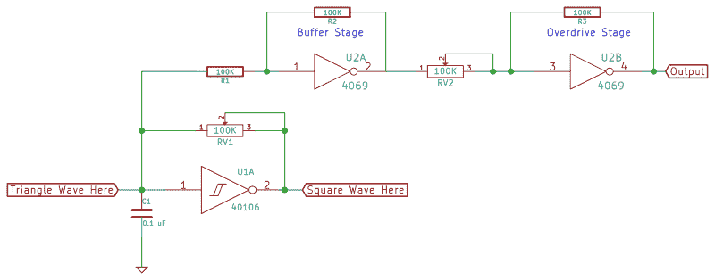

现在，只要我们有一堆免费的逆变器，让我们从超速声音的输出，并再次重新放大它。IC 的内置软削波将限制音量增益，但随着信号不断通过进一步的放大级，我们将获得更像方波的东西。请注意，模糊级以全增益运行，没有负反馈。我们要在这里进行模糊变形。就我的喜好而言，一个额外的放大器级足以获得一个不错的模糊音调，但是你可以根据你的需要，在有反馈和没有反馈的情况下，将多个级串联起来。见鬼，一半的芯片仍然闲置着，发疯吧。

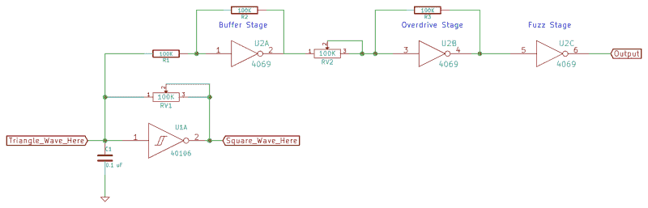

下面是第一级放大器和第二级放大器的一些波形示例。在低增益端，您可以看到第一级三角波(黄色部分)还不是很失真。但是，当我们调高增益时，顶部的点变圆，接近圆形方波。(“圆方”？)第二阶段的输出，绿色的，开始时几乎是方形的，后来越来越多。在两个输出之间，你有轻微的过驱动和完全模糊。没什么可抱怨的。

下面的示波器描迹显示随着音量旋钮逐渐调高，过驱动输出为黄色，模糊输出为绿色。可以看到，随着增益的增加，模糊通道基本上在过驱动通道停止的地方开始。

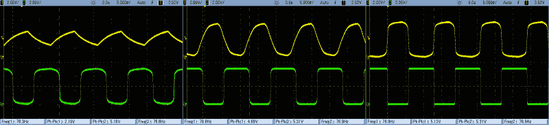

并且毫不犹豫地将其他音频源输入到这个芯片中。这种电路的一个版本可以追溯到 20 世纪 70 年代末，被称为[Craig Anderton]的“电子管声音模糊”，来自他的书 [*音乐家的电子项目*](http://www.amazon.com/Electronic-Projects-Musicians-Craig-Anderton/dp/0825695023) 。我虚度的青春看起来没那么虚度了吧？

## 锯齿波

[https://www.youtube.com/embed/E4LYzop9BLQ?version=3&rel=1&showsearch=0&showinfo=1&iv_load_policy=1&fs=1&hl=en-US&autohide=2&wmode=transparent](https://www.youtube.com/embed/E4LYzop9BLQ?version=3&rel=1&showsearch=0&showinfo=1&iv_load_policy=1&fs=1&hl=en-US&autohide=2&wmode=transparent)

好了，我们有了一个不错的三角波振荡器的可变过驱动版本。我们还能用新发现的模拟能力做些什么？这里，对我们的试验板降压转换器来说，最棒的是在振荡器的反馈路径中添加一个二极管，将三角波变成锯齿波。

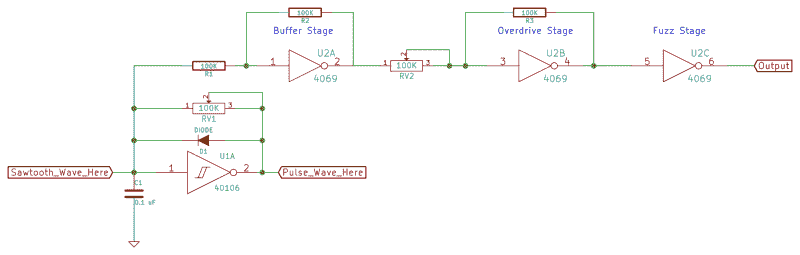

这是怎么回事？我们不再像以前那样通过反馈电阻对定时电容进行充电和放电，而是通过二极管更快地对其充电。这使得输入电压突然升高，几乎立即将输出设置为低电平。二极管仅在充电方向导通，因此电容必须通过反馈电阻缓慢放电。这种情况一直持续到达到阈值，此时输出再次变高，并再次通过二极管快速给电容充电。简而言之，输入端的电压波形为黄色，输出端的电压波形为绿色:

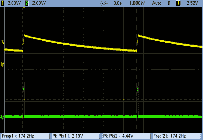

现在剩下要做的就是让锯齿波通过上面的缓冲放大器。那是锯齿波发出的刺耳的弓弦声。低调处理，你会得到经典的酸屋低音线。发疯吧。但是等等，还有更多。我们有一个锯齿加超速，加上全面的绒毛。

下面是黄色的过驱动输出和绿色的模糊输出的中增益和全增益的示波器描迹。对于锯齿波，绒毛最终会将锯齿波转换为一种脉冲波。它不是对称的方形，因为我们的锯齿波不是完全直的，也因为有一些 DC 失调电压通过三级传播，这是我们没有注意到的。如果想消除这种影响，可以在级间插入 0.1uF 的隔直电容，但我觉得这样做会失去一些特性。

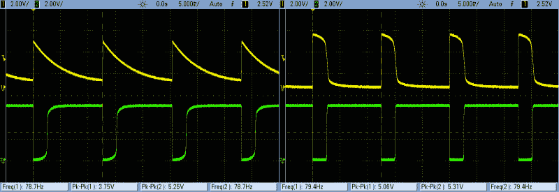

## 下一期:过滤器和鼓

现在我们已经有了一些经典的模拟合成器波形，是时候添加一些滤波器效果和鼓了。为了做到这一点，我们将继续沿着我们这次开始的模拟道路前进，所以如果你手头还没有几个 4069UBs，你还有一周的时间去搜集一些。