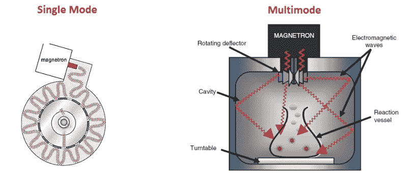

# 问问黑客日:微波的多种用途

> 原文：<https://hackaday.com/2015/03/09/ask-hackaday-the-many-uses-of-microwaves/>

当大多数人想到微波炉时，他们会想到那个可以快速加热食物的小魔术盒。家用微波炉的发明催生了整个冷冻食品行业，很难找到一个没有微波炉的家庭。你可能会感到惊讶，微波炉，或者更准确地说是反应器，也可以在世界各地的化学实验室和工业综合体中找到。它们用于有机合成——许多都装有加热时监控压力和温度的装置。大多数人可能不知道，大多数食品生产设施使用基于微波的水分固体分析仪。甚至有一个行业使用微波和酸来快速溶解或消化样品。在这篇文章中，我们将超越典型的磁控管/高压电源/电子器件，而是关注微波反应器的一些其他特性，这些特性可能是你所不知道的。

## 单模与多模

全世界数百万家庭中的典型微波炉被称为多模式型。在这种情况下，微波将呈现典型的波状行为，就像我们在物理学 101 中所学的那样。它们将形成相长和相消的干涉图案，在空腔中产生“热点”。一位读者向我们透露了这个例子，其中【Lenore】使用一种流行的印度小吃来观察多模微波腔中的辐射分布。因此，你需要某种类型的转盘来移动食物，以帮助均匀烹饪。你可以避免使用带有模式搅拌器的转台。这基本上是一个金属“风扇”,有助于将微波传播到整个炉腔。它们经常出现在工业微波中。下次你在 7-11 的时候，看看这个洞的顶部，你可能会看到一个。

多模式微波也需要隔离器来保护磁控管免受反射能量的影响。这些工作就像一个二极管，不会让任何微波反弹并击中磁控管。它吸收反射的能量并将其转化为热能。值得注意的是，所有微波能量都必须被多模腔吸收。食物没有吸收的会被隔离器吸收。最终，所有隔离器都会因热应力而失效。下次你用一千瓦的功率加热少量食物时，想想吧！

单模微波是你在化学和研究实验室里会发现的。在这些装置中，谐振腔被调谐到磁控管的频率——2.45 GHz。这使得微波场均匀。没有干扰，因此没有热点或冷点。微波场是完全均匀的。因此，没有反射能量，也不需要隔离器。这些特性使得单模微波比多模微波小得多，并且通常具有低得多的功率，因为有 100%的能量转移到样品中。虽然大多数多模微波是 1000 瓦以上，但典型的单模微波大约是 300 瓦。

## 功率测量

大多数微波炉只产生一种功率水平。功率是通过磁控管保持工作的时间来测量和传递的。因此，如果你以 50%的功率运行 1 分钟，磁控管将总共开启 30 秒。你可以通过以 100%的功率加热 1 升水 2 分钟来测量任何微波炉的输出功率。将温度差乘以 35，这就是你的瓦特功率。

还有其他类型的微波通过调节流经磁控管的电流来控制功率。这种类型的控制通常用于水分固体分析仪，需要更精确的控制来防止样品燃烧。

除了烹饪食物，你还用过微波炉~~和 arduino~~ 吗？请在评论中告诉我们！

感谢[]的提示！