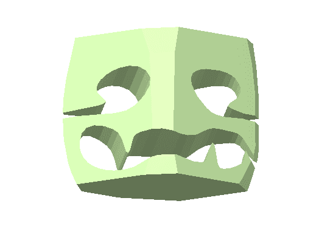

# 机器人商店！它切片，切丁，但是等等！还有更多…

> 原文：<https://hackaday.com/2015/03/06/robochop-it-slices-dices-but-wait-theres-more/>

你会喜欢我的剪裁的。

库卡机器人很酷。当它们不屈不挠地执行任务时，看起来既优雅又可怕。我们中没有多少人能像这样使用工业工具，因为它们使用起来并不简单(也不便宜！).艺术家[Clemens Weisshaar]和[Reed Kram]创造了一个装置，允许任何人潜在地控制这些橙色美女中的一个来完成他们的命令……所有这些都是从安全和舒适的电脑椅开始的。

对于他们的作品“机器人桌面”，艺术家们开发了一个网络应用程序，让你可以轻松地操纵虚拟立方体的表面。您可以旋转进行定位，然后使用直线或曲线工具绘制穿过其表面的向量，并减去材料。一旦你完成了你想要的杰作的雕刻，装置中的四个 KUKA 机器人中的一个将取回一个 40 x 40 x 40 cm 的泡沫块，并将其塑造成你在应用程序中创建的任何东西的现实版本。

从今天开始，你可以访问该项目的网站并[上传你自己的残缺立方体设计](https://www.robochop.com/chop)。如果你的设计被艺术家选中，它将成为汉诺威 CeBit 展会期间机器人安装过程中雕刻的 2000 件作品之一。表演结束后，你的魔方将会免费邮寄给你！我能看到这个更酷的唯一方法，就是他们把这个过程拍下来，这样你就能看到你的形状诞生了。

无论如何，我个人无法抗拒用工业级机械臂远程雕刻聚苯乙烯泡沫塑料的邀请，于是想到了这个宝石。

如果你想试试这个应用，你可以去他们的页面，真的…为什么不呢？

[https://www.youtube.com/embed/Y3ZKLmta2qg?version=3&rel=1&showsearch=0&showinfo=1&iv_load_policy=1&fs=1&hl=en-US&autohide=2&wmode=transparent](https://www.youtube.com/embed/Y3ZKLmta2qg?version=3&rel=1&showsearch=0&showinfo=1&iv_load_policy=1&fs=1&hl=en-US&autohide=2&wmode=transparent)

谢谢[hk]给我们指出了这一点！