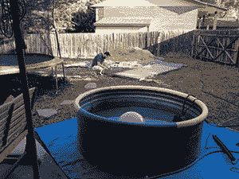

# 2015 THP 灵感:可再生能源

> 原文：<https://hackaday.com/2015/03/10/2015-thp-inspiration-renewable-energy/>

我们现在的大部分能量来自死藻类或死蕨类植物，我们都知道这不可能永远持续下去。根据定义，未来是可持续的，如果你正在为今年的 [Hackaday 奖](http://hackaday.io/prize)寻找一个改变世界的项目，没有什么比让世界摆脱碳基燃料更好的了。

最简单的太阳能建筑可以像[一个乡下人的热水浴缸](http://hackaday.com/2015/02/18/hippie-redneck-solar-heated-swimming-pool-slash-hot-tub/)一样有趣——在水泵和 JB Weld 的帮助下，一个太阳能热水器被改造成一个温水游泳池。你甚至可以花 100 美元建造一个基于软管的版本[。它们可以像太阳能设置的最大功率点跟踪充电器](http://hackaday.com/2014/08/07/easy-to-build-solar-pool-heater-saves-money-and-keeps-you-from-freezing/)一样有用——一些确保你最大限度利用太阳能电池的电子元件。当然，你可以用一台洗衣机和一个 555 定时器组成的风力发电机[迂回地获取太阳能。](http://hackaday.com/2013/04/01/windmill-made-from-washing-machine-555-chip/)

从太阳获取能量是一回事，利用它完全是另一回事。我们在交通上花费大量能源，为此有[一辆太阳能自行车](http://hackaday.com/2013/09/04/solar-power-for-your-bike/)、[一辆电动滑板车](http://hackaday.com/2010/08/25/electric-scooter-sings-as-it-travels/)，或者[一辆完全开源的电动汽车](http://hackaday.com/2014/06/11/open-source-electric-car-carben-produces-no-carbon/)。

建造使可持续能源成为可能的机器，甚至只是让我们使用所有能源的工具，这只是几个可以成为 Hackaday 奖优秀作品的想法。你可以走另一个方向，制造制造和维护这些设备的工具，比如想办法让这些电池和发电机远离垃圾填埋场。无论从哪个角度看，任何真正重要的东西都会成为 Hackaday 奖的一大亮点。