# 疯狂旋风预 Hackaday 奖启动之旅

> 原文：<https://hackaday.com/2015/03/18/crazy-whirlwind-pre-hackaday-prize-launch-tour/>

Hackaday 奖即将推出，但日期尚未公布。我决定做一次发布前的旅行，参观几个地方，顺便拜访一些 [Hackaday 奖评委](http://hackaday.io/prize/judges)。它从芝加哥开始，穿过旧金山参加硬件聚会和硬件会议，最后参观了[本·克拉斯诺的]工作室，[艾丽西娅·怀特的]工作室和邪恶的疯狂科学家实验室。

奖品现在正在运行，是你进入的时候了。看看我去过的地方正在进行的一些令人敬畏的黑客活动，然后提交你自己的想法来开始你的参赛。休息之后，请继续关注我，了解这次冒险的所有细节。

## 志镇

Catalyze Chicago 是一个专注于硬件企业家的联合工作空间，所以我当然要去那里。图中是一个安装在天花板上的鼓(右)，你可以用手机玩。

 [")](https://hackaday.com/2015/03/18/crazy-whirlwind-pre-hackaday-prize-launch-tour/img_20150225_134556147_hdr-copy-2/)  [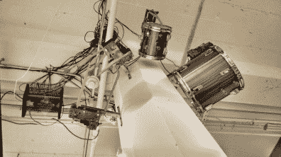](https://hackaday.com/2015/03/18/crazy-whirlwind-pre-hackaday-prize-launch-tour/img_20150225_133859984_hdr/) 

接下来，[泵站:一个](http://pumpingstationone.org/)。Hackaday 与 PS1 共同举办了一次聚会，非常有趣。我们都展示了我们的项目，并做了一些简短的交谈。有很多人拿着项目炫耀，我们在那里一直呆到深夜。[德鲁·富斯蒂尼]用他的项目打破了僵局，这个项目融合了加速度计和[显微视角](https://www.sparkfun.com/products/12923)。接下来是谢妮地铁公司的一系列项目(耶！)到[瑞安·皮尔斯]啤酒酿造用控制箱标签从阿贡国家实验室。

同样出现在泵站的还有:一台[BeagleBoard.org](http://beagleboard.org/)的【杰森·克里德纳】和一台运行[工具包](http://www.machinekit.io/)的 3D 打印机 SeeMeCNC。展示了一个巨大而强大的 3D 打印机器人手臂，它由一个 [Myo 手势控制带](https://www.thalmic.com/en/myo/)控制，然后是一个项目和照明谈话，以“我辞去了白天的工作，为我的妻子(一名地热工程师)制作传感器”开始。在泵站的观众镜头中，右二的男子开发了一个手镯，帮助患有 MS 的妇女使用手机。在娱乐方面，我看到的一个互动项目允许参与者访问本地无线网络来玩一个有趣的游戏。

 [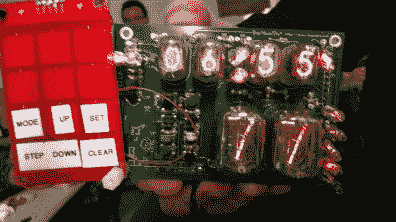](https://hackaday.com/2015/03/18/crazy-whirlwind-pre-hackaday-prize-launch-tour/img_20150225_185551543/) Nixie tube [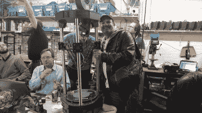](https://hackaday.com/2015/03/18/crazy-whirlwind-pre-hackaday-prize-launch-tour/img_20150225_190838958/) Jason Kridner  Giant robot arm [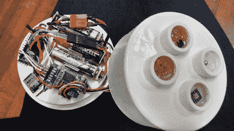](https://hackaday.com/2015/03/18/crazy-whirlwind-pre-hackaday-prize-launch-tour/img_20150225_210301781_hdr/) Low-power tri-sensor [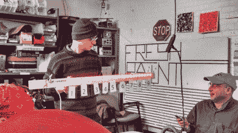](https://hackaday.com/2015/03/18/crazy-whirlwind-pre-hackaday-prize-launch-tour/img_20150225_200745388_hdr/) Fun game [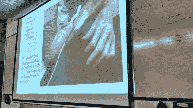](https://hackaday.com/2015/03/18/crazy-whirlwind-pre-hackaday-prize-launch-tour/img_20150225_200203570_hdr/) Bracelet for MS sufferer [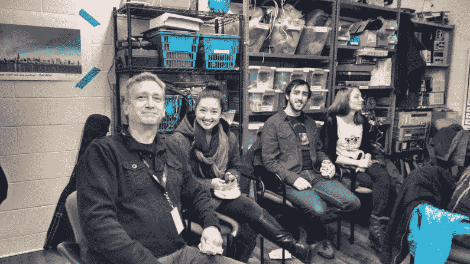](https://hackaday.com/2015/03/18/crazy-whirlwind-pre-hackaday-prize-launch-tour/img_20150225_191326248_hdr/) Crowd shot at PS1

离开芝加哥后，我前往旧金山，正好赶上硬件开发者的讲座银河(T4)，这是一个每月在[Supplyframe]办公室举行一次的聚会。本次 HDDG 有两位演讲者，分别是来自 600V、10A、24 位电表制造商 Mooshimeter 的[James Whong]和来自 salaee 的[Mark Garrison],他们讲述了他们的逻辑分析仪面临的制造挑战。

 顺便说一句，在三藩市，星巴克有无线充电。因此，虽然你可能讨厌星巴克，但他们提供的无线充电(和 1.90 美元的咖啡续杯)使它成为一个休息的好地方。

我参观了 [Othermill](https://othermachine.co/othermill/features/) ，这是一台令人难以置信的设计精良的 PCB 铣床(下图)。Othermill 位于 Felix F. Schoenstein and Sons 大楼(顶部)。[西蒙·达瓦洛斯]带我们参观了一下。

我还参观了 MAKE 的办公室，在某人的桌子上看到了 Keepon，这是一个用来娱乐自闭症儿童的小机器人(左)。

 [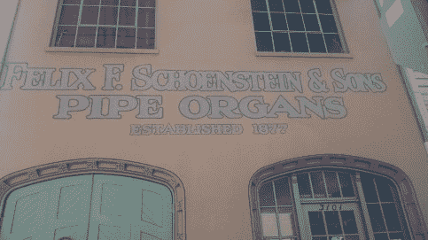](https://hackaday.com/2015/03/18/crazy-whirlwind-pre-hackaday-prize-launch-tour/img_20150227_111522662/) Othermill building [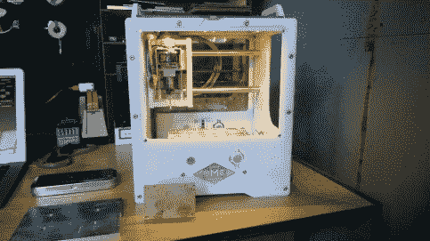](https://hackaday.com/2015/03/18/crazy-whirlwind-pre-hackaday-prize-launch-tour/img_20150227_120421978/) The Othermill [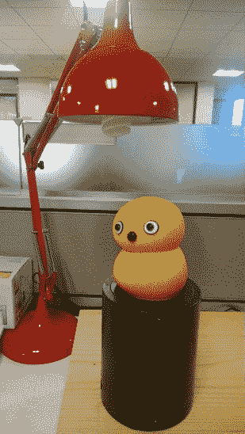](https://hackaday.com/2015/03/18/crazy-whirlwind-pre-hackaday-prize-launch-tour/img_20150227_131559942/) Keepon

第二天是 PCB 设计研讨会，从早上 10 点持续到晚上 8 点，这让我头疼(还好)！

硬件会议 3 ，基于硬件的初创公司第一年会议在加州圣莱安德罗举行。它是在一个零能耗的建筑里举行的，这个建筑有很多有趣的装饰。会议本身既有知识性又有娱乐性。推荐！

 [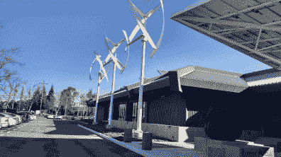](https://hackaday.com/2015/03/18/crazy-whirlwind-pre-hackaday-prize-launch-tour/img_20150301_091702498_hdr/) Net Zero Energy building in San Leandro, CA [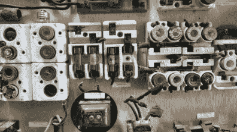](https://hackaday.com/2015/03/18/crazy-whirlwind-pre-hackaday-prize-launch-tour/img_20150301_101945401_hdr/)  [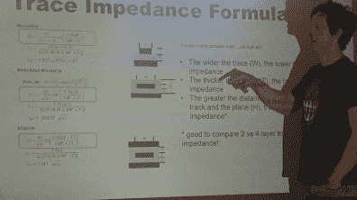](https://hackaday.com/2015/03/18/crazy-whirlwind-pre-hackaday-prize-launch-tour/img_20150228_142841375/) PCB design workshop [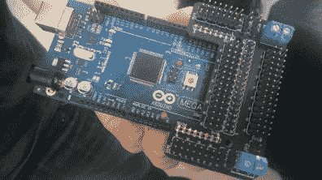](https://hackaday.com/2015/03/18/crazy-whirlwind-pre-hackaday-prize-launch-tour/img_20150301_121505323/) Arduino Mega shield

我为 Arduino Mega 找到了一个有用的突破盾！感谢[艾斯·谢兰德]的测试。

## Hackaday 奖评委到访

这次旅行以 2015 年 Hackaday 奖评委之旅结束。首先:[本·克拉斯诺]。在检查完 Delorian 后(我们认真地查看了内部和马达)，我们用他的示波器查看了从 I2C 线解码的十六进制数据。其他亮点和视觉糖果是一个巨大的铣床和…哦，快照，帽子。

 [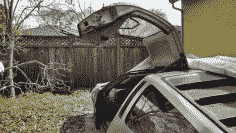](https://hackaday.com/2015/03/18/crazy-whirlwind-pre-hackaday-prize-launch-tour/img_20150302_121314390_hdr/) Delorean [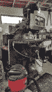](https://hackaday.com/2015/03/18/crazy-whirlwind-pre-hackaday-prize-launch-tour/img_20150302_122656503_hdr/) Bridgeport mill  Capacitor project [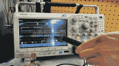](https://hackaday.com/2015/03/18/crazy-whirlwind-pre-hackaday-prize-launch-tour/img_20150302_131957304_hdr/) Mixed signal oscilloscope

我拜访的下一位法官是[艾丽西娅·怀特]。我在 Sparkfun 的教程中见到了著名的麦克斯韦。除了编写嵌入式软件和设计电子产品，[Elecia]还有一个名为 [Embedded](http://embedded.fm/) 的播客，由[Chris White]主持，我们还录制了一个 Hackaday 有奖问答。

 [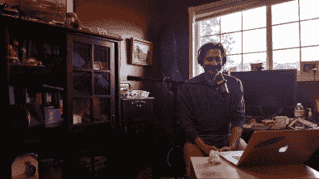](https://hackaday.com/2015/03/18/crazy-whirlwind-pre-hackaday-prize-launch-tour/img_20150302_153204944_hdr/) Chris White  Elecia White [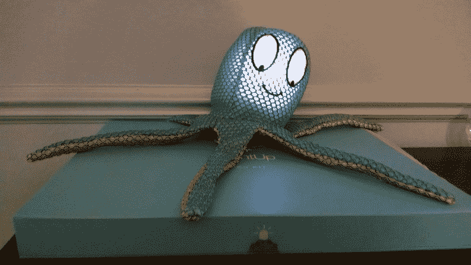](https://hackaday.com/2015/03/18/crazy-whirlwind-pre-hackaday-prize-launch-tour/img_20150302_151507859/) Maxwell

我最近拜访的两位 Hackaday 奖评委是[Lenore Edman]和[Windell Oskay]，他们共同拥有加利福尼亚州森尼维尔的[邪恶疯狂科学家实验室](http://www.evilmadscientist.com/)。有 555 定时器脚凳和一些用他们的鸡蛋机器人制作的漂亮设计，一个[数控鸡蛋装饰器](http://shop.evilmadscientist.com/productsmenu/768)。

 [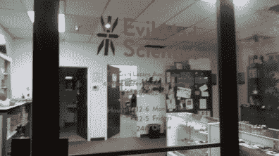](https://hackaday.com/2015/03/18/crazy-whirlwind-pre-hackaday-prize-launch-tour/img_20150302_190009522/) Front door at EMSL [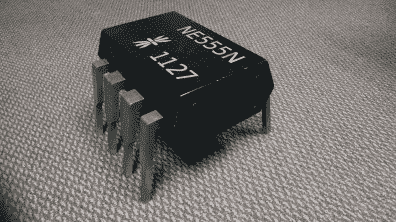](https://hackaday.com/2015/03/18/crazy-whirlwind-pre-hackaday-prize-launch-tour/img_20150302_190919237/) 555 Timer footstool [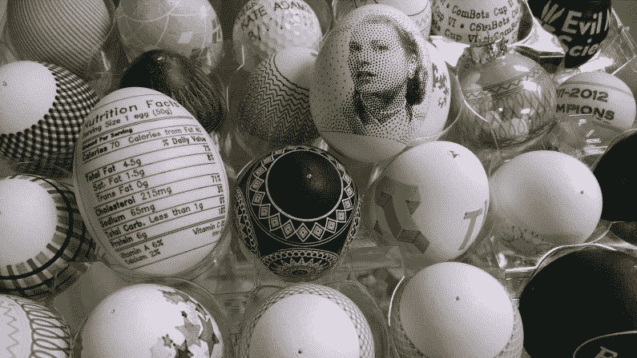](https://hackaday.com/2015/03/18/crazy-whirlwind-pre-hackaday-prize-launch-tour/img_20150302_192323108/) Egg-bot art

桑尼维尔的披萨派对是这次旅行的最后一站。[Kenneth Finnegan]向我们展示了一个 50 美元的小收音机，话题转到了某些沙漠地区的通信上。

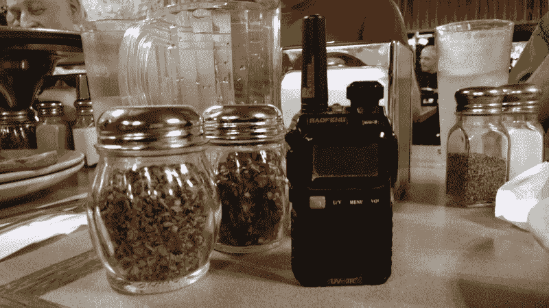

这是忙碌但有趣的一周。在我所去的每个地方，见到这么多的人，看到这么多非常优秀的项目，令人振奋。如果您愿意在您的黑客空间、餐厅、办公室或 launchpad 与我们共同举办活动，请在 prize@hackaday.com 告诉我们。

* * *

#### 2015 年[黑客日奖](http://hackaday.io/prize)由以下机构赞助:

