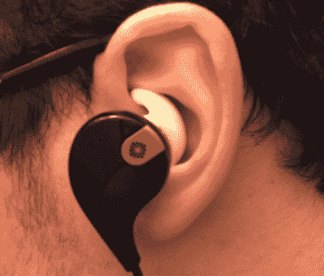

# 3D 打印模具和硅胶填缝

> 原文：<https://hackaday.com/2015/03/13/3d-printed-molds-and-silicone-caulking/>

你有没有一副耳塞和包装完全吻合的经历？大概不会。嗯，[乔]决定自己动手，铸造了为他定制的硅胶耳塞套。

传统的方法是制作一个耳塞模型，用它制作一个模子，用它铸造一个复制品……等等，等等。但是[乔]想尝试别的东西——他设计并 3D 打印了两部分模具，并使用普通的旧硅胶填缝填充。

首先，他在 SolidWorks 中 3D 建模耳塞套，然后他必须学习如何为它设计模具，但幸运的是，有一个方便的教程。打印模具后，他选择使用 100%硅胶填缝来制作零件，因为他在家里放了一些。问题是，这种材料可能需要几天才能固化——除非你掺入一些玉米淀粉。

[Joe]发现硅树脂与玉米淀粉的黄金比例约为 5:1，固化时间约为 20 分钟。

固化后，你只需要修剪掉多余的硅胶。在成型过程中，这被称为“飞边”。

因为这是他使用的填缝，你会想要洗去部分几次，因为这种类型的硅胶在固化时会产生乙酸。

耳塞非常合适，这启发了[Joe]尝试塑造更多的东西，比如使用自己面部的 3D 扫描制作的定制睡眠面具!