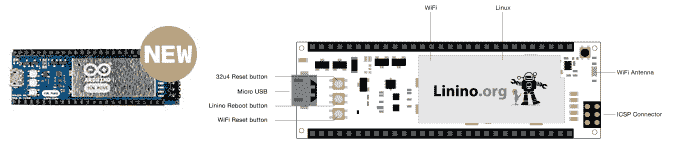
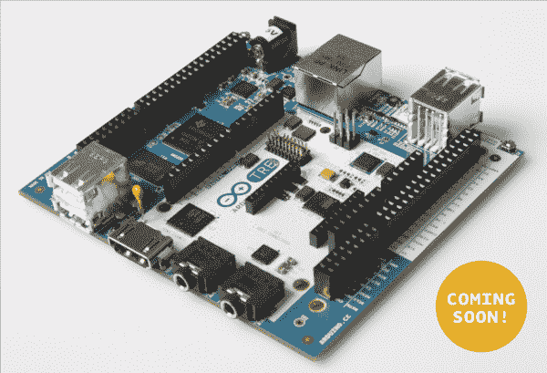
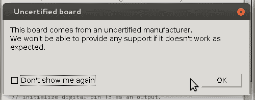

# Arduino V Arduino:第二部分

> 原文：<https://hackaday.com/2015/03/12/arduino-v-arduino-part-ii/>

自从我们上一篇报道 Arduino 诉 Arduino 案的文章以来，我们收到了一些提示，做了一些进一步的挖掘，了解了更多的事情。随着故事的发展，我们认为是时候与你分享了。

## 玩家们

简而言之，目前有两家公司自称为“Arduino”。第一，Arduino LLC 由[Massimo Banzi]、[David Cuartielles]、[David Mellis]、[Tom Igoe]和[Gianluca Martino]于 2009 年成立，运营网站 [arduino.cc](http://arduino.cc) ，并一直指导和发布使其全部工作的代码。这些人中的大多数早在 2005 年就已经在一起工作了，后来成为 Arduino 项目。

另一个“Arduino”过去被称为 [Smart Projects](http://www.smartprojects.it) ，是由【Gianluca Martino】创建和运营的该项目的制造部门。智能项目于 2014 年 11 月更名为 Arduino SRL。(A“责任有限公司”是意大利有限责任公司的一种形式。)他们从一开始就是 Arduino 主板的主要生产商，最近还注册了域名【arduino.org。

在更名前后，[Martino]将他的股份卖给了一家瑞士公司 Gheo SA，[Federico Musto]被任命为首席执行官。Gheo SA 由[Musto]拥有和管理，他还在美国和台湾经营一家名为 dog hunter，LLC 的设计咨询公司。

dog hunter 和[Musto] [帮助开发了 Arduino Yun](http://www.eetimes.com/document.asp?doc_id=1263246) ，这是一个 Arduino 与兼容 OpenWRT 的 WiFi 路由器的混搭。狗猎人还运行 Linino.org 网站，以支持在云的路由器部分运行的 Linux 发行版。

简而言之，一方是 Arduino LLC，由最初的 Arduino Five 运营，并托管 arduino.cc。另一方现在叫做 Arduino SRL，由前联合开发者[Federico Musto]运营，他买下了 Arduino 电路板的最大生产商，并开放了 arduino.cc。

## 法律状况

当我们之前报道 Arduino LLC 对 Arduino SRL 提起诉讼时，我们只了解了故事的一半。该诉讼于 2015 年 1 月提交，目前仍在审理中，早于 Arduino SRL 公司对 Arduino LLC 提起的商标诉讼。

该商标案件是由 SRL 智能项目公司于 2014 年 10 月 3 日提交的取消 Arduino LLC 在 Arduino 上的商标的申请。这个案子也仍然悬而未决，因为它在 USPTO 前面，[它是完全可见的](http://ttabvue.uspto.gov/ttabvue/v?qs=77708806)。这是我们所知道的。

[主张使 Arduino LLC 在“Arduino”](http://ttabvue.uspto.gov/ttabvue/v?pno=92060077&pty=CAN&eno=1)(PDF)上的商标无效，基本上可以概括为:“我们于 2014 年 9 月申请商标，自 2005 年以来一直生产标有 Arduino 的电路板。Arduino LLC 在 2009 年才成立，在申请商标时并不控制这个名字。

Arduino LLC 对此的回应是“我们拥有 Arduino 商标的时间不比你们长，我们否认所有其他的。”

此案的时间表如下[此处](http://ttabvue.uspto.gov/ttabvue/v?pno=92060077&pty=CAN&eno=2) (PDF)。基本上，探索阶段持续到 2015 年 6 月，直到圣诞节后才会有决定，除非他们提前解决。

我们不是律师，但看起来案件将围绕 Arduino LLC 在注册“Arduino”名称时是否实际控制该名称，以及 Smart Projects 大量生产标有“Arduino”的电路板是否会使该商标无效展开。相关的商标法[可以在这里找到](https://www.law.cornell.edu/uscode/text/15/1125#c)如果你知道你在这方面的东西，请随时在评论中告诉我们，或者直接发电子邮件给我们，或者通过举报热线。

因此，概括一下目前为止的故事，两个网站，两个“Arduinos”，和两起诉讼。

## 两个物联网的故事

不足为奇的是，这两个群体对未来的发展方向有不同的看法，但双方都押注于物联网。Arduino LLC 已经与英特尔合作开发伽利略系统，最近正与 BeagleBoard.org 合作开发即将推出的 Arduino TRE。Arduino SRL 坚持使用 WiFi 路由器 MIPS 解决方案，为 Yun 提供动力，并将其保留在内部。

如前所述,“云”至少是由[Musto]和“猎狗者”共同设计的。现在在 arduino.org 上，有一张“ [Arduino Yun Mini](http://arduino.org/products) ”的占位产品照片，日期为 2015 年 4 月 30 日。在不同的配色方案中，Yun Mini 看起来与 [Linino One](http://www.linino.org/product/linino-one/) 一模一样，而且考虑到【Musto】现在是 dog hunter(运营 Linino.org)和 Arduino SRL 的首席执行官，不需要太多硬件侦探就能把两者结合起来。当然，在 arduino.cc 产品系列中，云迷你是显而易见的。

arduino.cc 网站上的 Yun 的下一步是 Arduino TRE，这也是一个基于 Linux 的解决方案，配有 ATmega32u4。然而，在这种情况下，Linux 计算机以 1 GHz Sitara am 335 x 处理器的形式出现，本质上是 Beaglebone/Arduino 混搭。人们不禁会注意到 TRE 页面上的标语:“Arduino TRE，第一个在美国制造的 Arduino 主板。”这与 Smart Projects / Arduino SRL 主板上装饰的自豪的“意大利制造”丝网印刷相比，是一个巨大的转变。

这是分裂的原因吗？Massimo Banzi 说，他有兴趣与许多其他生产商合作，推出更新更好的 Arduino 产品，甚至希望能够在中国这个克隆之地销售。 ( [翻译](https://translate.googleusercontent.com/translate_c?act=url&depth=1&hl=en&ie=UTF8&prev=_t&rurl=translate.google.com&sl=auto&tl=en&u=http://playground.blogautore.repubblica.it/2015/02/11/la-guerra-per-arduino-la-perla-hi-tech-italiana-nel-caos/&usg=ALkJrhgcPGGWAX83o6tcqu8Kd56NoSuVFg))【Martino】和现在的【Musto】显然在意大利保持生产有既得利益，而 Arduino LLC 的利益通过走向全球得到更好的服务。也许这两者分道扬镳是很自然的。

## 代码

最后，在 3 月 10 日发布的 Arduino IDE 的最新版本中，故事发生了一个小小的转变。从版本 1.6.1 开始，Arduino 代码库有了一个补丁，当闪烁带有 USB 供应商 ID (VID) 0x2A03 的“Arduino”时，会弹出一个警告对话框。弹出消息显示“此板来自未经认证的制造商。如果它不像预期的那样工作，我们将无法提供任何支持。”

你可能不会惊讶 [USB VID 0x2A03 属于“猎狗者 AG”。](http://www.linux-usb.org/usb.ids)在任何类型的板卡上使用该 VID 时，Arduino IDE 都会弹出“未经认证的制造商”警告。所有这些中明显缺少的是其他各种假冒“Arduino”电路板正在使用的任何视频。要么他们人数太多，无法直接解决，要么这是一次针对阿杜伊诺·SRL 营地的有针对性的战术打击。

如果您没有 VID 0x2A03 的主板，您可以在 GitHub 上看到对 IDE 的更改，以提交“[增加了对未认证主板的警告](https://github.com/arduino/Arduino/commit/39d1dfc9995e75e858fa238c7c8881ee2d7679c6)”。向下滚动到对文件“hardware/arduino/AVR/boards . txt”的更改，您会看到发生了什么。(如果你不必以 Java 编码为生，请微笑:仅仅为了实现一个简单的弹出对话框，就增加了近 600 行代码！)

显然，至少有几个拥有 UNO 和 Mega256 的人已经看到了警告，并声称已经通过包括 Mouser 在内的知名零售商购买了他们的设备。

这不是 FTDI 风格的砌砖。只是弹出一个对话框。更好的是，它带有一个“不要再给我看”按钮，这样你就不会经常被唠叨了。它确实能识别电路板，使其正常工作，但当用户第一次发现它时，肯定会感到害怕。

## 未来

那么所有这些对我们所知的 Arduino 的未来意味着什么呢？毫无疑问，已经出现了代码分叉，对于物联网和两家公司的战略愿景，至少有两种不同的硬件设计方法。不过，商标问题可能要到 2016 年才能解决，因此在此期间，市场将会出现重大混乱。两个类似的网站就更不用说了。

你当然可以打赌，两家公司都将努力把好的产品推向市场，并试图保持对社区的控制。也许最终这对我们都有好处？请在评论中发表你的胡乱猜测和阴谋论。

当我们了解到更多信息时，我们会及时通知您。如果你有希望我们追查的线索，请打电话给我们。

非常感谢[相关用户]对商标申请的提示，以及[另一位匿名提示者]对 IDE 版本 1.6.1 更改的提示。