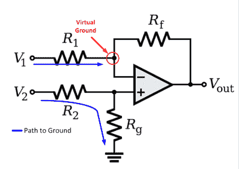
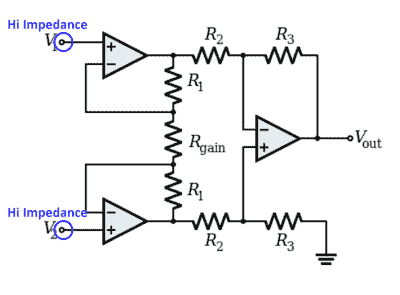
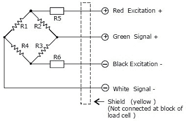
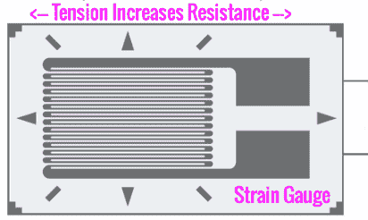
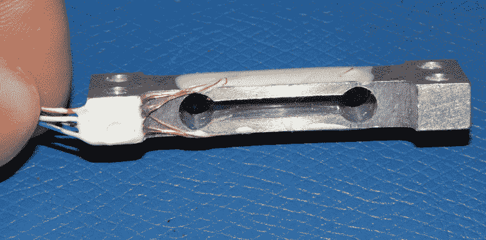
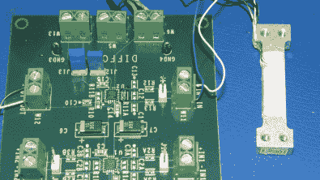
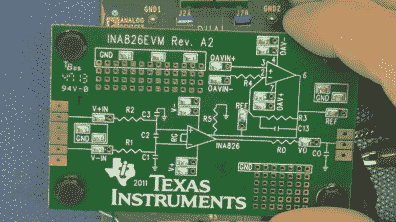
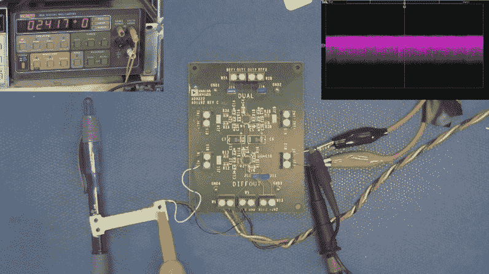

# 仪表放大器和如何测量微小变化

> 原文：<https://hackaday.com/2015/03/16/instrumentation-amplifiers-and-how-to-measure-miniscule-change/>

如今，大量传感器和模拟电路都是“控制器友好型”的，这意味着它们的输出信号可以轻松地与当今微控制器中常见的内置模数转换器(ADC)接口。这意味着信号通常已经过放大、滤波，并针对失调和线性度进行了校正。但当面对极低电平信号或淹没在较大信号中的信号时，可能需要仪表放大器。仪表放大器的品质包括:

*   两个输入端均具有高阻抗和低偏置电流的差分放大器。
*   放大极小信号时具有低噪声和低漂移特性。
*   抑制两个输入端电压的能力，称为共模抑制比(CMRR)

[https://www.youtube.com/embed/IXRDMI66CCo?version=3&rel=1&showsearch=0&showinfo=1&iv_load_policy=1&fs=1&hl=en-US&autohide=2&wmode=transparent](https://www.youtube.com/embed/IXRDMI66CCo?version=3&rel=1&showsearch=0&showinfo=1&iv_load_policy=1&fs=1&hl=en-US&autohide=2&wmode=transparent)

在我讲得太远之前，让我给你指出一个极好的资源；ADI 公司推出免费书籍[《仪表放大器设计指南》](http://www.analog.com/media/en/training-seminars/design-handbooks/5812756674312778737Complete_In_Amp.pdf "The Designers Guide to Instrumentation Amplifiers") (PDF)。这已经被添加到我的收藏中，因为我是数据薄一代，我已经打印并装订了我的副本。

如果我们看一个用运算放大器(OpAmp)制成的标准差分放大器，就会发现一些问题，即输入阻抗不高，而且不平衡。由于通过 Rf 由输出驱动，非反相输入端的节点是虚地；该支路的输入阻抗等于 R1。在同相输入端，阻抗等于 R2 加上 Rg，因为 Rg 直接接地。因此，由于配置不同，输入也不同。

Differential Amplifier OpAmp

我们可以代表一个更理想的仪表放大器，如下所示。请注意，仅使用高阻抗输入，没有外部接地路径。最后一级提供一个信号减去另一个信号的差分运算。以这种方式创建仪表放大器仍然需要使用稳定的放大器，最好是输入电流非常低的放大器，以前我使用 Precision Monolithic 的 OP-07 放大器，可惜现在 PMI 已经被 ADI 公司收购了。

Instrumentation Amp with 3 Amps

为了演示视频中使用的仪表放大器，我将数字电子秤中使用的传感器(称为称重传感器)连接到仪表放大器，并用 Keithly 电压表测量输出。由于我的定制 PCB 没有及时返回，我使用了手头的两个仪表放大器评估板中的一个，这是 ADI 公司制造的。

称重传感器由附着在金属框架上的应变片制成，本质上，我们测量的是铜走线因应力而产生的非常微小的长度变化——非常微小的信号！此外，由于压力计充当 15 伏电压的分压器，我们想要的极小信号会叠加在相对较大的 7.5 伏电压之上。去除两个输入端共有的 7.5 伏大 DC 信号的能力称为共模抑制比，这是选择仪表放大器时的一个重要方面。

      

将称重传感器连接到增益设置为 1000 的评估板，确实能提供足够的放大倍数，我们可以很容易地看到对称重传感器施力的效果。由于这是一个宽带放大器，没有进行真正的滤波，您可以看到示波器走线中存在的实质上是放大的噪声。

在实际的称重应用中，应明智地使用屏蔽和一些低通滤波，以产生代表称重传感器重量的一致 DC 电压。

    Instrumentation Amp Evaluation TI  

我将在以后更多地讨论降低漂移和噪声以及其它模拟技巧，同时仪表放大器通常是一些低电平或关键信号测量的关键，否则这些信号可能无法通过标准模数转换器进行测量。