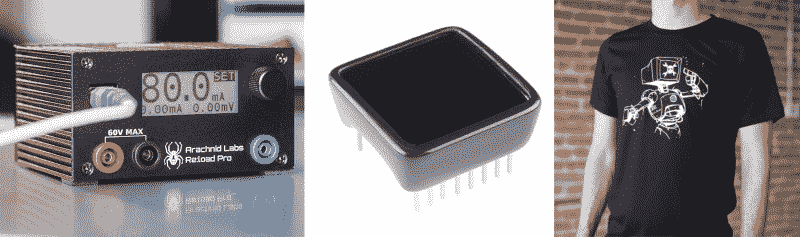

# 获奖时间:老龄化到位

> 原文：<https://hackaday.com/2015/03/31/time-for-the-prize-aging-in-place/>

就地老龄化是世界面临的一个日益严重的问题。随着人们开始活得更长、更健康，我们需要继续开发辅助技术，以促进独立和安全地活到晚年。这就是本周颁奖的主题。通过在 [Hackaday.io](http://hackaday.io) 上启动一个项目，并将其标记为 [2015HackadayPrize](http://hackaday.io/projects/tag/2015HackadayPrize) ，输入您关于就地老化的想法。在下周一之前做到这一点，你就有机会获得本周的大奖。

## 什么是就地老化？

我一直在谷歌上使用“定义”这个搜索词，对于就地老化，它会出现疾病控制中心的定义:

> “不管年龄、收入或能力水平如何，都能安全、独立、舒适地生活在自己家里和社区的能力。”

我喜欢这个定义。随着年龄的增长，我们有多容易忘记让所有人过上更好生活的概念？仍然没有让思维流程流畅起来？在列出奖项后，我将举例说明几个项目，这将让你很好地了解人们在做什么。

## 本周的奖品

我们将挑选三个最好的想法，基于它们帮助缓解一个广泛问题的潜力，这个概念所显示的创新，以及它的可行性。第一名将获得一个 [RE:load Pro](http://store.hackaday.com/products/re-load-pro) 可编程恒流负载。第二名将获得[一个 Sparkfun 微视](http://store.hackaday.com/products/sparkfun-microview)。第三名将获得一个 Hackaday [CRT-android 头戴式 t 恤](http://store.hackaday.com/products/crt-head-tee)。

## 有帮助的黑客

我能想到的与医学有关的最简单的例子。只要在正确的时间服用正确的药物，很多时候人们都可以独立自主，高效运转。确保这一点的最简单方法是使用有助于跟踪药物治疗计划的技术。[药丸提醒可以监控一个药丸盒](http://hackaday.io/project/4900-pill-minder-automatic-pill-dispenser)，如果你错过了时间表，它会向你发送提醒，如果你没有对提醒做出回应，它会提醒你的家人或护理人员。

我们还看到技术被嵌入到处方瓶盖中。这些瓶盖有一个定时器,每次开瓶时都会重置为零。但是任何一个在不同时间服用过几种药物的人都可以告诉你，这仍然是非常令人困惑的。我们想知道是否有人能设计出一个系统的原型，在你每次服药时使用计算机视觉来验证和记录药片？

当然，处方提醒只是众多唾手可得的水果之一。安全是另一个方面。这里有一个条目，旨在让那些患有阿尔茨海默氏症或记忆力问题的人安心，因为火炉已经关闭。

现在你明白我们的意思了。你有什么想法可以将就地老龄化的目标向前推进？

* * *

#### 2015 年[黑客日奖](http://hackaday.io/prize)由以下机构赞助:

