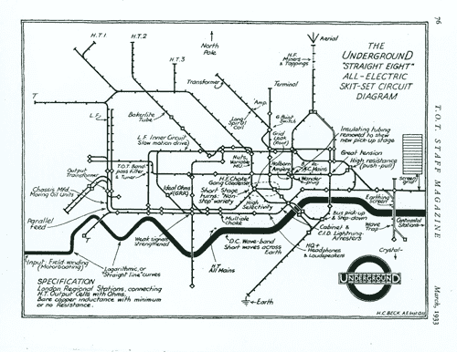
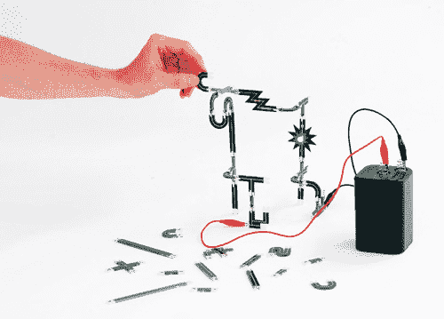

# 地铁地图广播和登基拼图

> 原文：<https://hackaday.com/2015/04/02/tube-map-radio-and-denki-puzzles/>

有时候，了不起与我们擦肩而过，直到过了一会儿我们才注意到它。这是 2012 年的，但它太疯狂了，即使很晚了，我们也要报道它。尤里·铃木是一名装置艺术家，他设计了[地铁地图收音机](http://yurisuzuki.com/works/tube-map-radio/)和[登基拼图](http://yurisuzuki.com/works/denki-puzzle/)。

地铁地图收音机的灵感来自伦敦地铁地图的原始设计者 Harry Beck 创建的图表，该图表将伦敦地铁网络的线路和车站显示为注释电路。该地图上的标志性地标由与其功能相关的组件表示，包括扬声器角所在的扬声器、代表巴特西发电站的电池和标记为皮卡迪利赛道的皮卡迪利广场。这项工作是伦敦设计博物馆委托的，PCB 布局是由神童正彦(神童电工)完成的。这个想法是将电子产品从“黑盒子”中拿出来，不仅仅是展示它，而是以一种人们可以试图理解其真正工作原理的方式展示出来。

另一个名为 Denki Puzzles 的项目同样引人注目。这是一套旨在教授电子学的工具，使用一套卡扣式组件。但不是所有的“砖块”或相同形状的单元，Denki 拼图是印刷电路板片的集合，其形式表明了特定的功能。把这些零件组合成一种物理电路图，你就能制造出可以工作的电子设备。例如，LED 单元看起来像 8 角星，电阻单元看起来像电阻符号。休息之后看看一些图片和视频

图片来源:古谷仁美·凯·尤达。

  Original Tube Map Drawing by Harry Beck  close up of AM Radio  [https://player.vimeo.com/video/48937359](https://player.vimeo.com/video/48937359)