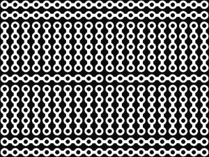

# 问黑客日:性能板的最新进展

> 原文：<https://hackaday.com/2015/04/05/ask-hackaday-the-latest-advances-in-perfboard/>

众所周知，Hackaday 举报热线收到了大量来自 Kickstarter 活动和管理 Kickstarter 活动的公关公司的电子邮件。这些大部分都是很糟糕的产品。想要一块不能充电的五磅电池？是啊，类似的东西。

每隔一段时间，我们都会遇到一个完全原创的提示。这些想法在独创性和实用性之间有一个平衡，[我不知道这个在哪里。是的，这是一个用于 perfboard 的 Kickstarter，但不像你见过的任何 perfboard。](https://www.kickstarter.com/projects/658903329/perf-the-perfboard-reinvented)

Busboard, or solderable breadboard

在我们深入探讨这个问题之前，让我们先弄清楚一些定义。*穿孔板*是一块在 0.1 英寸网格上钻孔的薄板。孔的两侧都镀有镀层，每个孔都是一个独立的电节点。 *Veroboard、*或 *stripboard* 是 0.1″网格上的一串孔。这些孔也是电镀的，但是一列中的所有孔都是单个电节点。您可以在孔之间切割轨道，但这里的基本思想是减少连接组件所需的导线数量。*左边的*是 Veroboard 的延续，布局类似无焊试验板。

所以我们来到了新发明，Perf+，重新发明的 perfboard。这个穿孔板也是一系列 0.1 英寸网格上的电镀孔。这些孔旁边是一个电镀总线。这条总线没有连接到任何洞；取而代之的是，用一点点焊料将其连接到同一行或同一列上的孔。你可以称之为“选择性 Veroboard”。

现在真正的诀窍是:在电路板的一侧，电镀总线垂直运行。在电路板的另一侧，电镀总线水平延伸。这意味着原型板上的任何两个孔都可以简单地用一点焊料连接成一个电节点。

如果曾经有一个想法，你可以指着它同时说，“这很聪明”和“我不知道如何使用它”，这就是你要的。我很确定这个想法并不比一块条板更好，但它与 T2 不同。如果你有任何关于如何使用这个新的、奇怪的、超凡脱俗的模板做些有用的事情的想法，请在评论中写下。