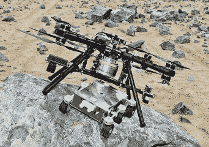

# 问 Hackaday:临近空间的四轴飞行器？

> 原文：<https://hackaday.com/2015/04/08/ask-hackaday-quadcopter-in-near-space/>

如果你选择接受它，你的任务是将一架四轴飞行器送上近太空，并安全返回地球。到达那里并不困难。事实上，利用高空气象气球，你可以在太空附近得到几乎任何你想要的东西。把它完好无损地放回地面完全是另一回事。

为什么有人需要这么做？好吧，看起来 ESA 的 StarTiger 团队正在从 NASA 的书里拿一张卡片，想要使用[天空起重机](http://mars.nasa.gov/msl/mission/technology/insituexploration/edl/skycrane/)在火星上软着陆一辆漫游车。但是，他们不是用火箭在火星的天空中保持起重机稳定，而是想用…你猜对了，四轴飞行器。他们称之为[dropper](http://www.esa.int/Our_Activities/Space_Engineering_Technology/Dropship_offers_safe_landings_for_Mars_rovers)。

乍一看，这种方法似乎有很多问题。火星上的大气密度比海平面上的地球大气密度低 100 倍左右。道具在这些条件下如何操作？当然需要进行测试，而地球的高层大气是进行这种测试的最佳场所。在 100，000 英尺的高度，平流层的密度大约与火星表面大气的密度相同。10 万英尺是高空气球的主要领地。更不用说火星上的重力大约是地球重力的 38%，这意味着地球上 5.5 磅的模型可以准确地代表火星上 15 磅的模型。

考虑到所有这些事实，人们可以得出结论，对比例模型火星四轴飞行器进行现实测试是黑客社区力所能及的。我们以前见过一些高空无人机的工作，但从来没有见过四轴飞行器。

现在轮到你做一些以前没有人做过的事情了。你认为你有能力完成这个项目吗？请在评论中告诉我们你将如何应对这一挑战。

[https://www.youtube.com/embed/nnIHWftmd0o?version=3&rel=1&showsearch=0&showinfo=1&iv_load_policy=1&fs=1&hl=en-US&autohide=2&wmode=transparent](https://www.youtube.com/embed/nnIHWftmd0o?version=3&rel=1&showsearch=0&showinfo=1&iv_load_policy=1&fs=1&hl=en-US&autohide=2&wmode=transparent)

嗯，沙漠星球，地面车辆正由一架飞行运输机运送。还有谁对此有[弗兰克·赫伯特]的感觉吗？