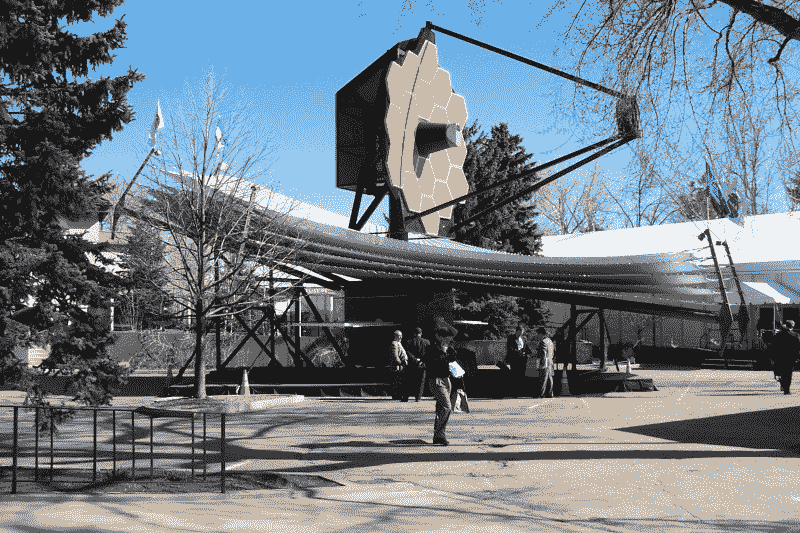
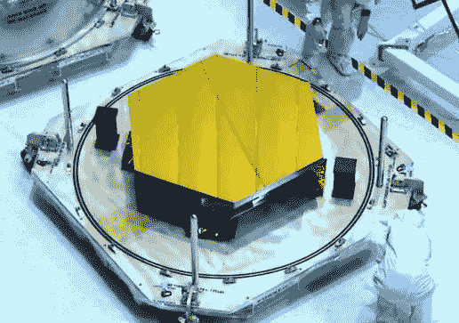
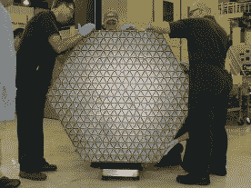
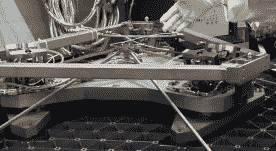
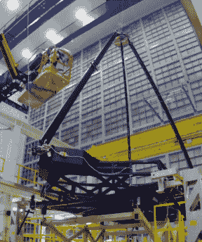
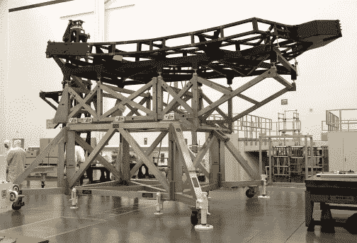
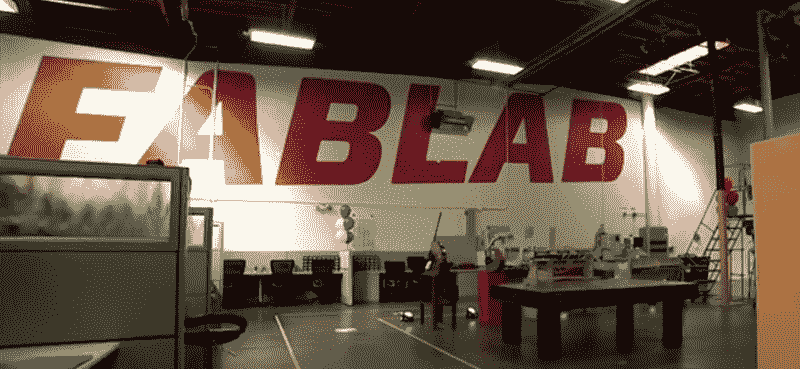
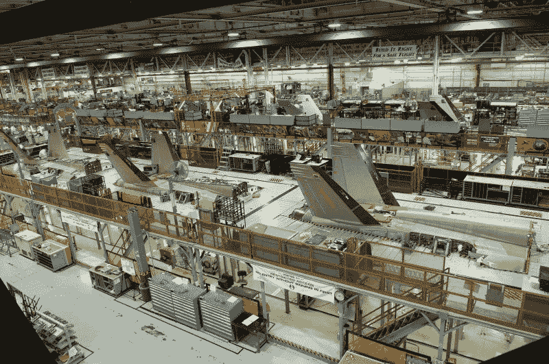

# 诺斯罗普:太空望远镜和喷气式飞机

> 原文：<https://hackaday.com/2015/04/20/hackaday-tours-northrop-space-telescopes-and-jet-planes/>

今年春天，我应邀参观了位于洛杉矶的诺斯罗普·格鲁曼航空航天系统公司的校园，感觉棒极了！诺斯罗普·格鲁曼公司将自己列为“全球领先的安全公司”，但偷走我心的项目是他们为美国宇航局进行的詹姆斯·韦伯太空望远镜(JWST)的工作。一方面，我看不出这怎么可能实现，因为望远镜似乎把你能想到的每一个艰难的工程挑战都塞进了一个项目中。另一方面，诺斯罗普公司(加上 NASA 和他们所有的分包商)已经做了很长时间的艰苦工作。

## 你如何参观诺斯罗普·格鲁曼公司？

这个机会落到了我的头上，因为[托尼·朗]是一名普通读者，也是诺斯罗普公司的一名工程师。他是他们私人实验室的创始人(我稍后会谈到这个实验室),他非常大胆地发了一封电子邮件询问是否有一名船员愿意过来。是的，请！

我已经前往位于帕萨迪纳的 Supplyframe 办公室(Hackaday 的母公司)。[托尼]提出在洛杉矶国际机场接我，然后我们去了加利福尼亚的雷东多海滩进行下午的探险。

## 詹姆斯·韦伯太空望远镜:工程的一切困难

我听说过詹姆斯·韦伯太空望远镜(JWST)，但从未仔细研究过这个项目的细节。上面你可以看到诺斯罗普建造的比例模型。我在巡演中并没有看到这个。它乘坐两辆半挂卡车到不同的地方，每次都有十几个人花四天时间来安装。那是一个不真实的，被放在星球表面的物品。把真的送上太空需要什么？

不仅仅是*进入太空。这是[要去第二个拉格朗日点](http://jwst.nasa.gov/orbit.html)。这是经过月球，距离地球约 150 万公里。如果这东西坏了，我们不能出去修理它。成功的压力很大。*

这颗卫星面临的主要问题是热量。它将使用一个反射镜阵列来收集来自非常遥远的天体的红外辐射。要做到这一点，它需要一个非常好的光学阵列来收集红外光并将其聚焦在收集器上，而且它必须与太阳、地球和月球的热量隔离。

  Finished Mirror delivered to Goddard  Back of the mirror  Mechanicals mounted on back of the mirror

有一个由 18 个六边形反射镜组成的阵列，将红外线反射到聚光镜上，然后再反射到传感器上。这些镜子不是由诺斯罗普公司制造的，但他们确实有一个原型展出，这太不可思议了！每面镜子都是由 Ball Aerospace 用铍制成的。凹面镀有反射金，安装在每面镜子背面的致动器可以弯曲表面来调整凹度，从而调整焦距。除此之外，还可以调整每个部分的滚动和俯仰。

  Early optical mount testing at Godard Space Center  Early Optical mount assembly

在诺斯罗普高湾，他们正在研究这些镜子的安装系统。它显示了比上面两张图片更多的进步。这是光学系统的中央安装结构。这种结构的宽度取决于将它发射到太空的火箭的大小。当我看到它时，折叠翼被添加到这个主要结构的两侧，以容纳双排镜子，这些镜子在存储位置时可以折叠到望远镜中。黑色材料本身是诺斯罗普公司制造的复合材料。作为一个例子，他们展示的横截面并不比你的指甲厚多少，但显然在铸管形状中相当坚硬。

你可以看到[一个展开过程的动画](https://www.youtube.com/watch?v=bTxLAGchWnA)，它在游览期间在高湾观景室播放。请注意五层隔热板需要自动展开，不会被绊住。这让我想起了埃德·范·西塞对国际空间站上[太阳能电池板展开问题](http://hackaday.com/2014/01/17/the-pioneering-lifestyle-in-low-earth-orbit/)的回忆。这是一个棘手的问题，看起来已经花了很多时间来确保这个设计从过去的问题中吸取教训。那个动画没有展示太多关于镜像机制的细节。我发现演示[镜子的机械部分如何工作的视频](https://www.youtube.com/watch?v=4gvPl3qWZIM)非常有趣。

了解更多关于詹姆斯·韦伯太空望远镜项目的信息是值得你花费大量时间的。我不是在开玩笑，这包括所有关于工程的困难。满足这台望远镜的规格所涉及的挑战令人瞠目结舌，我确信在许多不同公司从事该项目的人们将使这一切成为现实。

## 黑客空间推动企业文化

很高兴[Tony]和他的同事[Adam]站出来告诉我，他们联系了 Hackaday，因为他们想让人们知道诺斯罗普正在振兴他们的企业文化。他们正在招聘数千名工程师，这个过程的一部分是让工作符合这些工程师想要的生活方式。

朝着这个方向的一个大动作是他们私人实验室的形成。[Tony]是一名工程师，但他 50%的工作量都花在了私人实验室上。这基本上是一个黑客空间，在这个特定的位置向大约 2 万名员工开放。诺斯罗普制造惊人的东西，当设备不再被使用时，私人实验室有权使用它。想象一下可能性！

这项计划的一部分是让更多的工程师了解制造过程。[Tony]通过在私人实验室中编造一个简单的概念证明来进行研究。这是一条通向流行词“快速失败”的道路。在让你的部门参与一个可能既昂贵又耗时的项目之前，你可以测试出你头脑中有些模糊的部分。

这里看到的设备是去年其中一个团队[参与的一项挑战的产品。他们有大约六个月的时间来开发一种能清除未爆炸武器的机器人。它挂在 hackerspace 的一个地方，是一个很棒的构建。你只能辨认出一个藏在车身底部的蓝色球体。那是一个巨大的](https://www.youtube.com/watch?v=O03a9Dqz_60)[干扰抓手](http://hackaday.com/2010/10/26/robot-gripper-uses-coffee-to-pick-up-anything/)，由停在底盘上的黑黄相间的 shop-vac 提供动力。这个机器人是远程控制的，无线 GoPro 相机安装在周围和下面。当然，没有一个巨大的银色气喇叭，这个东西是不完整的。安全第一！

看看私人实验室能否建立通常与独立黑客空间相关的草根社区，将会很有趣。你可以在这个视频中一窥[空间的盛大开幕。我们不太记得看到黑客空间以这种方式营销。但如果这是让公司入伙的代价，那就非常值得。一个巨大的空间，惊人的工具，没有每月会员费，这是一个甜蜜的交易。哦，FabLab 这个名字显然来自他们的吉祥物，神话般的拉布拉多，在视频中可以看到它戴着一串珍珠。](https://www.youtube.com/watch?v=R7JYmbNN--0)

## F/18 装配厂

最后，我们参观了 F/A 18 E/F 超级大黄蜂装配线。这是一棵巨大的植物。我不知道如何更好地描述装配线的庞大规模，而不是说在这次参观结束后步行回到停车场花了不少于 20 分钟。

诺斯罗普·格鲁曼公司是波音公司在这个项目上的主要分包商，所以生产线的末端并不是一架完全组装好的飞机。但是机身——少了驾驶舱、机头、机翼和引擎——仍然是一个令人生畏的景象。我以前从未如此近距离地接触过战斗机，它的大小令人印象深刻。同样令人印象深刻的是铁路线所在的建筑，它建于 1942 年，至今仍是木结构。他们有巨大的工程柱，后来用钢筋加固过。但这一事实让它给人印象深刻。

组装过程中最关心的是 FOD，即异物检测。这些车辆暴露在巨大的力和振动下，会摇晃任何不应该松动的东西，这可能意味着对昂贵的机器造成可怕的损坏，甚至更糟。我发现一些真正有趣的事情是确保没有任何部分丢失的系统。所有组件都装在盒子里，每个盒子都有一个单独的开口区域。工具被扫描给每个员工，如果坏了或用坏了，工厂里有自动售货机通过计算机系统跟踪它们。

作为参观的一部分，我们参观了隔壁的复合材料工厂。有用来固化树脂的大型高压釜。这些就像一根管子，两端各有一个半球形的门。我不擅长判断时间和距离，但我估计这些东西直径有 18 英尺，至少有 35 英尺长。传统的复合材料制造——一名工人将碳纤维片放在模具上——正在进行中。但是隔壁房间住着一个机器人，看起来像是在《黑客帝国》中出生的。蜘蛛状头部在一个旋转心轴旁边工作，该心轴与正在制造的工件的形状相匹配。它铺设了大约七股碳纤维，构建了一个没有任何接缝的部分。树脂固化后，从零件内部手动一片一片地移除模具。对我来说，正在建造的部分看起来像进气道，大约 15 英尺长，直径可能 5 英尺，尽管它们是弯曲的，并不完全是圆柱形的。我无法获得关于它们的很多细节，但我被告知这些零件是为 F-35 联合攻击战斗机准备的。这是诺斯罗普·格鲁曼公司与洛克希德·马丁公司的另一份分包合同。

## 结论

感谢[Tony Long]和[Adam Gross]为 Hackaday 提供此次巡演。我有一种感觉，我正生活在我最喜欢的节目之一的一集里*它是如何制作的*，那太棒了！诺斯罗普·格鲁曼公司有一个教育拓展项目，所以如果你和[有联系，该地区的学校可以组织一次 JWST 之旅](http://www.northropgrumman.com/CorporateResponsibility/CorporateCitizenship/Education/Pages/OutreachInitiatives.aspx)！

[托尼]和我一起出去吃饭；一些美味的墨西哥玉米卷——这是我每次去洛杉矶都有的追求。之后，他和我一起去了零空间实验室参加开放之夜。自从我上次去 T2 后，他们已经搬走了，如果你在城里，你应该去看看。

### 属性:

我应该提到的一件事是，我无法在现场拍摄任何照片。我上面的故事是原创的，但所有的照片都是库存或应我的要求由诺斯罗普提供的。

通过 [JWST Flickr](https://www.flickr.com/photos/nasawebbtelescope/7509965680/in/set-72157629134274763) 发布的主图片

前镜通过 [YouTube 拇指](https://www.youtube.com/watch?v=6nskD9SeCDQ)。

通过 [YouTube 视频](https://www.youtube.com/watch?v=mT-frOWKHPo)延伸反射镜。