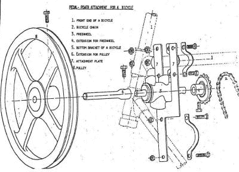

# 自行车驱动的一切

> 原文：<https://hackaday.com/2015/04/15/bike-powered-everything/>

很难说自行车不是超级方便的。他们不费吹灰之力就能把你从 A 点带到 B 点。既然这些机器如此简单方便，为什么不把它们用在交通运输以外的事情上呢？好吧，[约伯]正是着手这么做的。

[Job's]从一辆标准的单速自行车开始，然后添加一些零件。首先，在后桥上安装一个支架。当处于向下位置时，它将后轮抬离地面并提供支撑，使自行车不会翻倒。当翻转到“向上”位置时，支架形成了一个存放货物的架子，自行车可以以正常方式骑行。

接下来，由自行车底部支架和曲柄制成的千斤顶轴安装在车架的上管和下管之间。千斤顶轴的一侧是链轮，另一侧是大滑轮。当转换到[Job]所称的“动力生产模式”时，连接到后轮的链条从曲柄链轮上拆下，代之以连接到千斤顶轴的链条。

后支架放下来支撑自行车，踏板现在为千斤顶轴和大滑轮提供动力，是时候将自行车连接到任何类型的机器上了。一条皮带挂在滑轮上，并连接到一台耗电机器上的一个匹配滑轮上。这种两用自行车已经驱动了水稻脱粒机、花生脱壳机、水泵、台锯，甚至木材车床！

[Job]着手创造一种简单而廉价的方式，让自行车变得比在城里骑行更有用。我们认为他就是这么做的。更多自行车动力的东西，看看这个[发电机](http://hackaday.com/2014/12/06/cordless-drill-turned-into-bicycle-powered-generator/)。