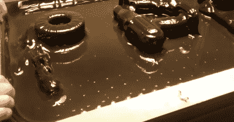

# “简易烘烤”真空发生器

> 原文：<https://hackaday.com/2015/04/17/easy-bake-vacuformer/>

关于黑客空间，我们最喜欢的一点是人们倾向于花大量时间来构建工具，或者修复/升级旧的工具。这是前一种情况。真空成型器。

[亚当]来信告诉我们这台真空成型机，它是他和其他几个成员为英国伯明翰的黑客空间[fizz pop](http://www.fizzpop.org.uk/)制造的。该设备用于吸取模具周围的热下垂塑料。这由两部分完成，真空台和加热机构将塑料片置于下垂状态。

这些工具的真空部分[已经很容易 DIY](http://hackaday.com/2014/10/19/diy-vacuum-former-on-the-cheap/) 很久了。钉板是一个非常好的桌面，在桌面下的一个外壳中有某种类型的真空电机(通常是一个或两个)。这种设计遵循那个通用公式。

另一方面，加热机制更难解决。塑料是笨拙的，热的时候易碎，所以框架是很常见的。FizzPOP 的工作人员以市场上可买到的模型为例，建造了一个框架，它可以沿着延伸到真空表面上方的四个垂直轨道(envision 桌脚)滑动。这些支腿还支撑着加热元件。通常这是镍铬合金线阵列，但这次不是。他们配有 70 个 10×7 方向的卤素灯。每个都有一个印刷电路板，用一个总线系统将它们连接起来。试运行表明，灯泡的强度使热点直接位于每个灯泡的下方。但是更多的测试帮助他们解决了这个问题，在加热阶段保持框架远离阵列。

休息之后是该队的 13 秒成名时间。一张黑色的高抗冲聚苯乙烯(HIPS)纸围绕着一系列拼出黑客空间名称的工具形成。

[https://www.youtube.com/embed/ZVI60xk7Db0?version=3&rel=1&showsearch=0&showinfo=1&iv_load_policy=1&fs=1&hl=en-US&autohide=2&wmode=transparent](https://www.youtube.com/embed/ZVI60xk7Db0?version=3&rel=1&showsearch=0&showinfo=1&iv_load_policy=1&fs=1&hl=en-US&autohide=2&wmode=transparent)