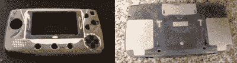

# RetroPie 再次遇到游戏装备

> 原文：<https://hackaday.com/2015/04/18/retropie-meets-game-gear-again/>

如果你是昔日视频游戏系统的粉丝，那么你可能对 RetroPie 很熟悉。对于那些不喜欢的人来说，RetorPie 是一个软件和视频游戏模拟器的集合，可以在树莓 Pi 上运行。该软件包可以让你轻松修复旧游戏，而不必拥有一堆游戏机或浪费你的呼吸吹墨盒。

[brooksyx]已经有了一个坏掉的游戏设备，树莓 Pi 和一个 4.3 英寸的液晶显示屏，所以他认为将它们放在一起成为一个手持 retro pie 是一个好主意。很明显，新屏幕不适合旧屏幕的位置。游戏设备的外壳被切割，新 LCD 屏幕的边框用环氧树脂粘合到位，缝隙被填满，最后用砂纸打磨。

屏幕并不是对该案例进行的唯一修改。在机箱正面右下方[brooksyx]添加了 4 个 N64 C 按钮。在后面，电池盒和墨盒槽被填满。

这个项目还没有完成，我们很期待看到它的成果。如果你喜欢这款复古便携式电脑，你可能会喜欢这款带未改装外壳的[游戏装备](http://hackaday.com/2015/03/02/retropie-turned-game-gear/)或者这款[大屏幕游戏机](http://hackaday.com/2014/07/27/original-gameboy-gets-stuffed-full-of-cool-parts/)。