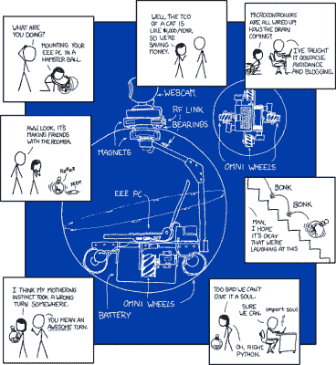

# BB-8 是真的！但是他们是怎么做到的呢？

> 原文：<https://hackaday.com/2015/04/19/bb-8-is-real-but-how-did-they-do-it/>

上周,《星球大战》系列中的新机器人 BB-8 在《星球大战》庆典上首次公开亮相。虽然这部电影的演员和工作人员一直说 BB-8 是真实的，但在舞台上看到它，在 R2D2 开车兜风将事情带到了一个全新的水平。问题是，它到底是如何工作的？

 我们(或许还有其他称职的科技极客)的第一反应是想到 [xkcd 的《新宠物》漫画。](http://xkcd.com/413/)早在 2008 年，【兰道尔·门罗】就建议用全向轮子和磁铁来制造这种“机器人”。BB-8 内部就是这样吗？没有人知道确切的答案，但这不会阻止我们试图找出答案！

BB-8 的家谱其实可能是从 [Sphero](http://www.gosphero.com/) 开始的。[《财富》报道【Sphero 是](https://fortune.com/2015/04/17/iger-star-wars-bb8-sphero/)[迪士尼 2014 年加速器计划的一部分。](http://disneyaccelerator.com/companies/)加速器项目中的每家公司都有一名来自迪士尼的导师。Sphero 的导师是迪士尼首席执行官 Bob Iger 本人。

#### 头部

那么如果 BB-8 的身体是基于一个 Sphero，头部是如何工作的呢？到目前为止，迪士尼工作人员对此保持沉默，但有很多猜测！如果观看高清视频，可以看到身体和头部间隙之间有几次闪光。这些可能是 BB-8 电子设备上的状态 led，但也可能是 IR LEDs 可能是光学鼠标类型传感器的一部分。陀螺仪、加速度计和光学流量传感器之间的传感器融合将为 BB-8 头部出现的倒立摆问题提供一个鲁棒的解决方案。

你认为 BB-8 是如何工作的？是磁铁，马达，还是原力？请在评论中告诉我们！

[https://www.youtube.com/embed/ABzjUf3E_0c?version=3&rel=1&showsearch=0&showinfo=1&iv_load_policy=1&fs=1&hl=en-US&autohide=2&wmode=transparent](https://www.youtube.com/embed/ABzjUf3E_0c?version=3&rel=1&showsearch=0&showinfo=1&iv_load_policy=1&fs=1&hl=en-US&autohide=2&wmode=transparent)