# 哈卡戴访问加拿大多伦多

> 原文：<https://hackaday.com/2015/04/24/hackaday-visits-toronto-canada/>

加拿大！正好赶上春天的到来。我去了多伦多，在艺术和技术会议 FITC 上演讲，与 HackLab 共同主持了一个 Hackaday 会议，参观了 TIFF 上的 DigiPlaySpace，并参观了 Globacore 的新住所。

FITC 是一个庆祝技术创新的会议。上图是由[Christopher Lewis]和[Creative technologies of Toronto]设计的立体模型，由 FITC 的参与者用了 4 天时间建造而成。这些建筑是激光剪纸，参与者使用阿蒂尼创造了一个简单的电路。一条信息以 ASCII 码编码到芯片中，建筑以莫尔斯电码闪烁出一条单独的信息，每栋建筑闪烁出一条不同的信息。使用摩尔斯->ASCII 手机应用程序(摩尔斯工具)来阅读信息非常有趣。

[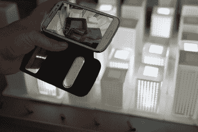](https://hackaday.com/wp-content/uploads/2015/04/dioramarama_morsetools_02.jpg)

Looking at Diorama Rama with Morse Tools

Hackaday 奖评委[Micah Elizabeth Scott]就她的作品做了一次演讲。[神经系统](http://n-e-r-v-o-u-s.com/)的【杰西卡·罗森克兰兹】讲述了她公司设计基于数学的物体的过程。她谈到了她的 3D 打印连衣裙，如下图所示，以及它是如何制作的。太神奇了！我还在 FITC 展示了我新发明的[呼吸项目](https://hackaday.io/project/5114-breathe)。

Kinematics by Nervous System

FITC 会议结束后， [HackLab](https://hacklab.to/) 与我们共同举办了一次聚会。来自 HackLab 的一个团队是 2014 年 Hackaday 奖的半决赛选手，他们凭借他们的[复古人口器](https://hackaday.io/project/1605-retro-populator)赢得了 1000 美元的组件，这是一款在 3D 打印机上改装的取放机器。我们喝了啤酒，还有饮料调配机器人 Luma Droid 提供的杏仁奶油口味的非酒精饮料。HackLab 是一个相当大的黑客空间，有一个巨大的会议室，一个设备齐全的厨房和经常供应的素食晚餐，还有一个单独的商店工具室。

 [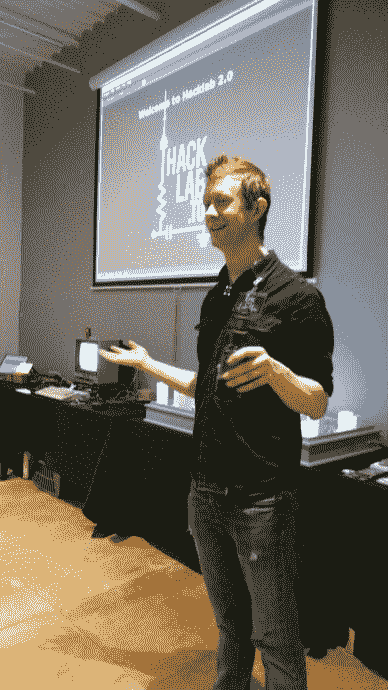](https://hackaday.com/img_20150415_201536305/) Eric Boyd kicks it off [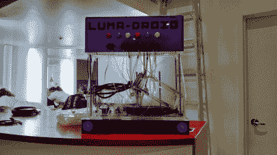](https://hackaday.com/img_20150415_181233126_hdr/) Luma Droid! [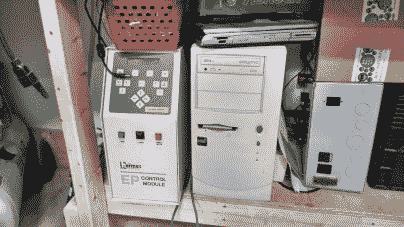](https://hackaday.com/img_20150415_181105603_hdr/)  [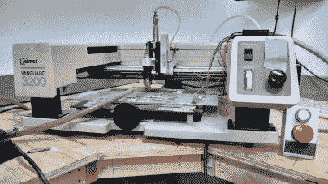](https://hackaday.com/img_20150415_181046904_hdr-2/) 3D router [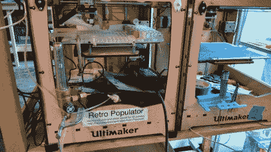](https://hackaday.com/img_20150415_180655340_hdr-2/) Retro Populator [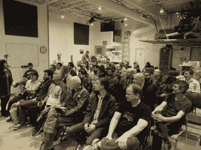](https://hackaday.com/1180109-w1024/) Full house at HackLab

在闪电谈话中，[陈珍珠]带来了她的英特尔爱迪生供电的闹钟，它只有一个功能——告诉她什么时候迟到。[Johannes van der Horst]带来了一个 USB 电流监控器，我们许多人在晚上结束时着迷了大约一个小时，插上电话或电池，只为了看到数字攀升。[Eric Boyd]谈到了 HackLab 正在进行的 DIY 生物项目。他们正在用 PCR 检测肉类，看看是否真的是牛肉。恶。

Kilpatrick Audio 的 Andrew Kilpatrick 向我们展示了他的合成器的旧版本，然后向我们展示了他的最新版本苯酚，它看起来非常光滑。

 [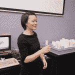](https://hackaday.com/pearl-chen/) Pearl Chen [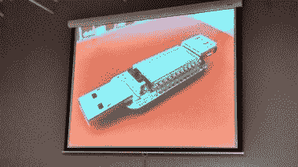](https://hackaday.com/img_20150415_220305752_hdr/) Johannes van der Horst’s USB current meter [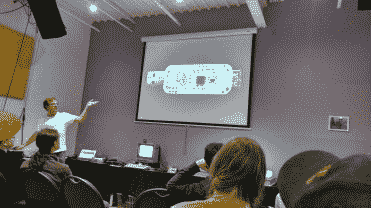](https://hackaday.com/img_20150415_220329260_hdr/) Johannes van der Horst’s USB current meter  Pearl Chen’s smart clock  Andrew Kilpatrick’s Phenol synth [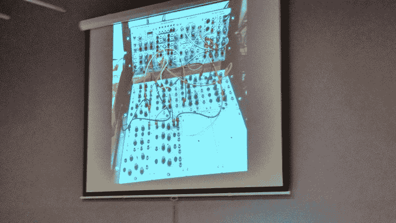](https://hackaday.com/img_20150415_213850936_hdr/) 

[休·埃利奥特]谈到了一个光摄影项目。[叶小开·布鲁姆奎斯特]谈到了 Hackaday 之前报道过的一个游戏手套项目。叶小开随身带着一台 Commodore 64，上面所有的游戏都可以装进 1 GB！【纳丁·莱西奥】讨论了有多少节目宣称你可以在几个小时内成为专家，但事实上，事情并不容易。[Jay Vaidya]向我们展示了一个控制加热器和空调的 IFTTT hack。[Andy Forest]向我们展示了一个令人印象深刻的安大略省电力系统的互动模型，这是 Steam 实验室的孩子们[创造的](http://steamlabs.ca/2015/03/ontario-power-system-education/)。

 [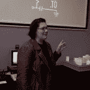](https://hackaday.com/nadine-lessio/) Nadine Lessio [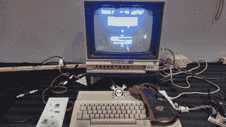](https://hackaday.com/img_20150415_234251917_hdr/) Leif Bloomquist’s gaming glove [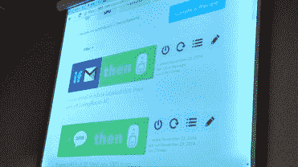](https://hackaday.com/img_20150415_212124589_hdr/) IFTTT hack [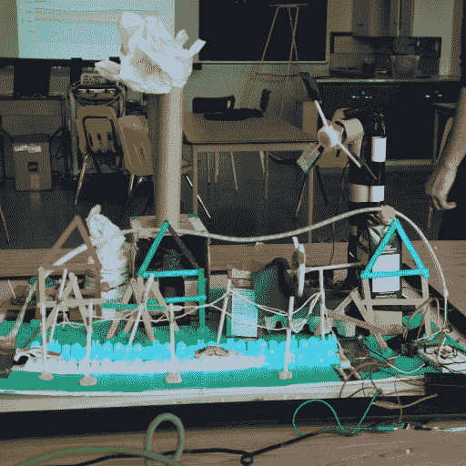](https://hackaday.com/model-power-grid/) 

那是一次超级有趣的聚会！感谢 HackLab 的主持。我们在洛杉矶、纽约、班加罗尔、旧金山和深圳有一系列即将到来的聚会和大型活动。查看我们的[活动页面](https://hackaday.io/events),了解我们希望在何时何地与您见面。

我在 TIFF 的贝尔灯箱前停下来看 DigiPlaySpace 展览。[Micah Scott]与瑞尔森大学 RTA 媒体学院合作，欢迎你走进来。注:所有照片直接从 [TIFF.net 的网站](http://www.tiff.net/kids-family/digiplayspace15/digiplayspace-1)上摘抄。

 [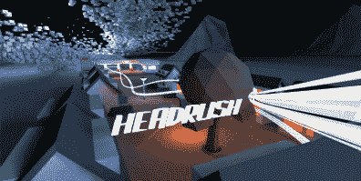](https://hackaday.com/headrush/) Headrush [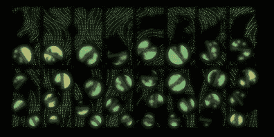](https://hackaday.com/forest/) Forest  Alien [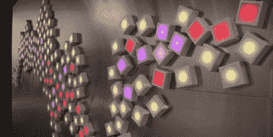](https://hackaday.com/six-forty-by-four-eighty/) 

我这次旅行的最后一站是参观 Globacore 的新办公室。我们花了一天左右的时间为他们最新的游戏 Power Cube 开发了一个虚拟现实控制器。Power Cube 是 Oculus Rift 的一种体验，带有一个定制的游戏控制器，其中包含一个加速度计、一个陀螺仪和一个磁力计，可以直接链接到游戏中。

多伦多见，我等不及要回来了！