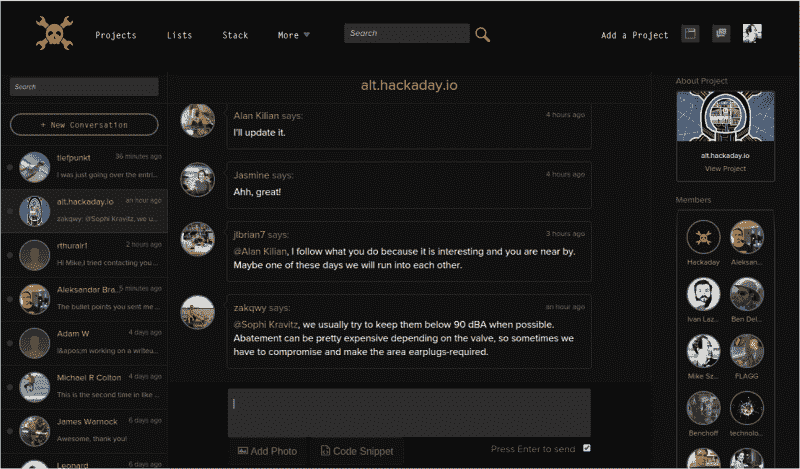
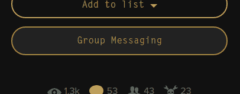
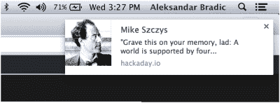
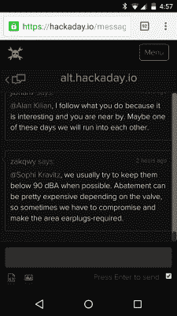

# 成就解锁:全球虚拟黑客空间

> 原文：<https://hackaday.com/2015/04/23/achievement-unlocked-global-virtual-hackerspace/>

大约 14 个月以来，我们一直在乘坐这辆失控的火车。拥有超过 6 万的注册用户和每月数十万的访问者，很难记得我们是如何从卑微的开始发展到现在的地位的。但这其中很大一部分是我们从你们那里听到的所有建议。在这份清单的最上面，有许多人要求更多的协作功能。本周，我们推出了一个更新，它将改变你与你的黑客同伴互动的方式。

这个全新的消息接口超出了我们开始开发时的想象。我们 Hackaday 的目标一直是形成虚拟黑客空间，这就是它。上图是 alt.hackaday.io 项目的群发消息。您可以看到，在许多其他正在进行的线程中，左边的线程被选中。右边是团队协作者的列表。Hackaday.io 上的每个项目都有群发消息功能，你需要做的就是添加你的合作者。

 你没有完成项目需要的技能？只是想头脑风暴下一个大项目？跳上 Hackaday.io，投入其中。前往你的一个项目，邀请一些合作者(如果你还没有的话)，然后点击左栏中的“群发消息”按钮。

这不是私人信息，也不仅仅是聊天。这是新的。它是持久的，它是瞬间的，它是漫长的，它是短暂的，它是你与其他黑客合作所需要的。我们甚至还不知道该叫它什么。你可以在这方面提供帮助，并且告诉我们你发现了什么。我们设计它是为了创造性的滥用。

## 可配置的通知

 第一次加载消息页面时，你会在顶部看到一个请求桌面通知访问的栏。当带有消息界面的选项卡未激活时，此功能会弹出一条消息。

如果您没有打开界面，当有新消息进来时，您会收到一封电子邮件。这可以为你所有的聊天进行全局切换，但我们确实有计划为每个聊天线程配置这些电子邮件。感谢[jlbrian7]的提示，Linux 上的 Firefox 用户[需要一个扩展](https://addons.mozilla.org/en-us/firefox/addon/gnotifier/)来启用通知。我在 Mint 上使用 Chrome，它在不添加软件包的情况下工作得很好。

## 伙计，手机

 这个虚拟的黑客空间与你同在，我们不只是在屋外交谈。有多少次你坐在板凳上想知道你到底做错了什么？拿出你的手机，抓拍一张照片，然后上传，这样你团队中的合作者就可以帮忙了。现在它在 iPhone 上稳如磐石。Android 需要在图像图标上快速双击才能触发，但我们会很快修复这个问题。

当然，图像也可以在电脑界面上工作，而且有一个代码工具可以在你的信息中嵌入片段。

## 团队邀请和请求

我们唯一没有发挥作用的部分是与自己对话的能力，但这一点即将实现。现在，您必须有合作者才能启用群发消息，而此次更新使这变得简单。

每个项目在左栏都有一个团队列表。您会注意到添加了一个邀请成员的文本框。只需输入他们的黑客名称，然后点击邀请按钮。他们会收到一条私人消息，指示他们接受您的邀请。

## 现在给它一个旋转

我们已经建立了官方的 [Hackaday Prize 黑客频道](https://hackaday.io/project/5373-hackaday-prize-hacker-channel)，这样你就可以马上试用了。欢迎随意交谈，但这也是为您的 Hackaday 奖参赛作品寻找团队成员的绝佳机会。我们还将在频道上定期举办活动。很快会有更多的报道！