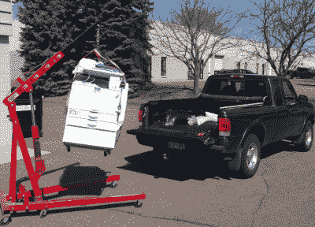
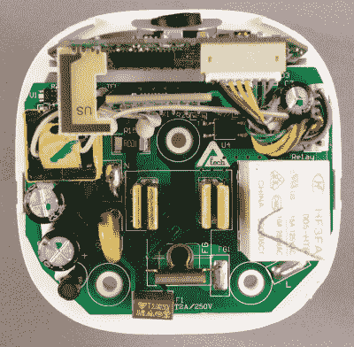
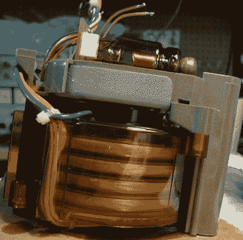
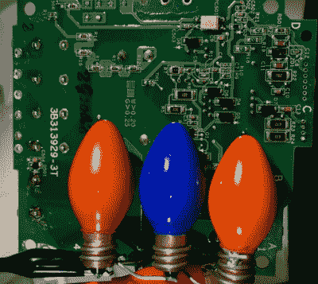

# 黑客 44–拆卸

> 原文：<https://hackaday.com/2015/04/25/hacklet-44-teardowns/>

几乎每个黑客、制造者和修补者接受早期教育的方式都是一样的:一个手里拿着螺丝刀，另一个手里拿着废弃的电子产品。要弄清楚一件东西是如何工作的，最好的方法莫过于打开它，检查每一件东西。近年来，拆机视频在 YouTube 上变得很受欢迎，一些很好的例子来自用户，如[[EEVblog](https://www.youtube.com/user/EEVblog)]、[[mikeselectricsuff](https://www.youtube.com/user/mikeselectricstuff)和[[极客团体](https://www.youtube.com/user/thegeekgroup)。本周的 Hacklet 是关于 [Hackaday.io 上的最佳拆卸项目！](https://hackaday.io)

 我们先从【zakqwy】和他的 [Savin C2020 拆机](https://hackaday.io/project/5236)说起。复印机(和多功能机器)是现代办公室的主力。这意味着黑客可以获得大量用过的、滥用的和过时的复印机。[Zakqwy]得到这个怪物时，它开始在他的办公室行为不端。复印机是一个古老的聚宝盆，里面有马达、齿轮、传感器(很多很多的光束传感器)和光学元件。缺点是爽肤水:它很脏，呼吸起来很不舒服，如果你不戴手套，它会进入你皮肤的毛孔，要花很长时间才能出来。[Zakqwy]坚持不懈，并在他的复印机中发现了一些令人敬畏的部件——比如用于运输黑色墨粉的[阿基米德螺旋](http://en.wikipedia.org/wiki/Archimedes%27_screw)。

 接下来是【鲍勃·布雷克】与[贝尔金·韦莫 Insight 拆解](https://hackaday.io/project/5093)。[Bob]想要一个 WiFi 插座，但不打算在不先拆开的情况下将某个东西同时插入他的电网和网络。[Bob]做了一件了不起的工作，用许多高分辨率的照片记录了他的拆卸过程——我们喜欢这些东西！他发现了一个相当不错的硬件设计。Insight 内部有 3 块互连的 PCB。电源开关和电源电路都在一块板上。它包括插槽和适当的爬电距离，这是人们在承载 120V 交流电源的设计中所期望的。一个小子板上有一个未知的芯片-[ Bob]猜测是电源感应电路。模块顶部的第三板 a 容纳主 CPU、[Ralink/联发科 RT5350F SoC](http://dlnmh9ip6v2uc.cloudfront.net/datasheets/Wireless/WiFi/RT5350.pdf) 、RAM 和所有重要的 WiFi 天线。

【dr hatch】用 [X 光拆头](https://hackaday.io/project/3665)把东西带进危险区。我们不确定[Drhatch]是不是真的医生，但他确实有一个 Heliodent MD 牙科 x 光头。如果不通电，现代 x 光机通常是辐射安全的。然而，辐射并不是唯一需要担心的危险——还有潜在的充电电容器和冷却油，其中可能含有有害的化学物质，如[PCB](http://en.wikipedia.org/wiki/Polychlorinated_biphenyl)等。在他的 x 光脑袋里发现了一些非常有趣的设计决策。电子管实际上是通过圆柱形高压变压器点火的。这意味着变压器充当光束准直器，像透镜一样聚焦 X 射线束。他还发现了大量的铅屏蔽。有趣的是，外壳中有两种厚度的铅。靠近灯管的屏蔽层厚度为 1 毫米，而稍远一点的屏蔽层厚度仅为 0.7 毫米。

 最后，我们有【丹尼尔·梅斯特】带[的 3ph 交流电机控制器(VFD)](https://hackaday.io/project/3927-inside-a-3ph-ac-motor-controllervfd) 。[Daniel]拆除了日立变频驱动器(VFD ),希望为一个项目制造变频器。这些高电压，高功率设备有相当多的内部进行，所以转换成为一个拆卸项目本身。像这样的 VFD 在工业中被用来以不同的速度有效地驱动大功率交流电机。正如(丹尼尔)所言，更便宜的产品“只是非常花哨的 PWM 模块”。处理 1.5 千瓦可不是闹着玩的。这款 VFD 的散热器中封装了一大块功率晶体管。控制板直接焊接到晶体管以及 DC 电源的整流二极管上。[Daniel]在设备通电的情况下做了一些测试，所以他用 3 个 C7 圣诞灯制作了一个定制的电容器放电装置。他们不仅保持电容器放电，还提供了装置安全的指示。没有光就意味着没有电。

不满意？想要更多的拆卸好处？查看我们最新制作的[拆解清单！](https://hackaday.io/list/5444)

这就是我们本周的全部时间。一如既往，下周见。同样的黑时间，同样的黑渠道，带给你最好的 [Hackaday.io！](http://hackaday.io/)

这就是我们本周的全部时间。一如既往，下周见。同样的黑时间，同样的黑渠道，带给你最好的 [Hackaday.io！](http://hackaday.io/)