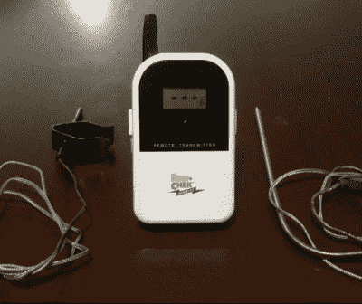
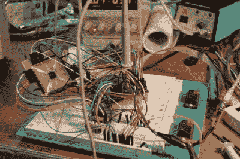

# hack let 45–逆向工程项目

> 原文：<https://hackaday.com/2015/05/01/hacklet-45-reverse-engineering-projects/>

迟早，我们所有人都会戴上逆向工程的帽子，开始钻研设备。也许你正试图让一台旧设备继续运转——制造商早已倒闭，零件也不再供应。它可能是带有锁定固件的可爱的新路由器。或者，可能只是你好奇。不管是什么原因，逆向工程都是一项有益的努力。我们最喜欢的一些逆向工程项目读起来就像间谍小说。不是斗篷和匕首，而是加密和烙铁。本周的 Hacklet 重点介绍了 Hackday.io 上一些最好的逆向工程项目！

 我们从【henryk pltz】和[逆向工程一个低成本的 USB CO₂监视器](https://hackaday.io/project/5301)开始。如今，一氧化碳检测和测量设备是家庭安全用品，并且已经变得相当便宜。二氧化碳测量设备不太常见，而且不出所料，也更贵。[Henryk]为大约 80 个€找到了一个设备，它做了他所需要的。附带的 USB 连接器应该只是为了电源，但当插入时，他的 Linux 盒子上列举的设备。附带的 windows 软件显示了来自探测器的实时数据，但没有太多关于协议的信息。是时候推出 Ida pro 了，并使用该软件大干一场吧！[Henryk]与他的 CO₂显示器的软件做了斗争，并得到了公正的奖励。

 接下来是【鲍勃·布雷克】[逆向工程小牛 ET-732](https://hackaday.io/project/4690) 。[鲍勃]喜欢烧烤，但讨厌照看他的吸烟者。值得庆幸的是，有专门为此目的建造的无线温度传感器，但它们的范围有限，而且你不能在房子周围有多个接收器。[鲍勃]的目标是通过将他特立独行的无线温度计数据发送到网上来解决这一切，这样他就可以在任何地方检查他的烹饪。首先，他必须对传感器使用的协议进行逆向工程。一个频谱分析仪告诉[Bob]传感器发射频率是 433.92 MHz，这对于像这样的低成本发射机来说很常见。[Bob]实际上在他的办公室里有一些兼容的接收器，所以他能够很快地用他的 Saleae 逻辑分析仪捕获一些数据。真正的乐趣在于弄清楚数据是如何组织的！

 一次偶然的机会，易趣网上出售了一个可爱的头戴式放大镜，但没办法控制它。[逆向工程生命光学 M5](https://hackaday.io/project/5325) 记录了他为让新头盔工作所做的努力。生命光学 M5 实际上是徕卡 HM500 头戴式变焦显微镜的重新命名版本。这些设备最初是为医疗用途而设计的。它们向使用它们的外科医生或牙医提供立体视图，并发送视频馈送以供团队的其他成员使用或记录。打开 M5 的头戴式盒子，发现了几个模块，但没有明显的控制变焦或对焦的方法。不过，对一些神秘电线的研究确实揭示了看起来像是 9600 波特串行数据流的东西。这是一个全新的项目，我们正在等待[Technics]的下一次更新，看看他是否会用他的新玩具做一些焊接工作！

 BIOS 密码保护——这是任何二手笔记本电脑买家存在的克星。有时候，删除这些密码就像取出 CMOS 电池一样简单，但其他时候就没那么简单了。[q3k]发现自己在后一种情况下使用了一批东芝 R100 笔记本电脑。也没办法启动它们。[q3k]没有放弃，尽管-他们打破了烙铁，并开始[逆向工程东芝 R100 BIOS](https://hackaday.io/project/723) 。R100 是奔腾 M 时代的机器——旧了，但仍可用于许多黑客目的。转储笔记本电脑的 ROM BIOS 并没有产生所需的信息[q3k]，因此他们转向 TLCS-870 控制器，并使用 Xilinx Spartan6 FPGA 构建了一个非常好的板来帮助这项工作。原来 870 只是用来电源管理的。–[q3k]现在将注意力转向了瑞萨微控制器，这可能正是他们正在寻找的 droid！

我们认为逆向工程项目非常酷，所以我们创建了一个[逆向工程列表](https://hackaday.io/list/5529)来组织它们。

一如既往，这篇文章就到这里，下周见。同样的黑时间，同样的黑渠道，带给你最好的 [Hackaday.io！](http://hackaday.io/?utm_source=hackaday&utm_medium=29&utm_campaign=hacklet)

一如既往，这篇文章就到这里，下周见。同样的黑时间，同样的黑渠道，带给你最好的 [Hackaday.io！](http://hackaday.io/?utm_source=hackaday&utm_medium=29&utm_campaign=hacklet)