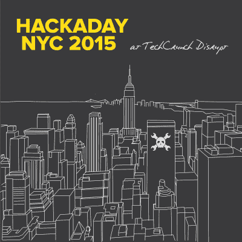
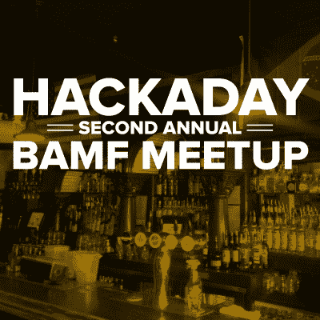

# 黑客日活动:纽约、洛杉矶、旧金山、洛杉矶

> 原文：<https://hackaday.com/2015/05/02/hackaday-events-ny-la-sf-la/>

今年春天，我们做了很多工作，让人们深入硬件黑客领域。我们有如此多的现场活动即将到来，我们将做周六上午 recaps，让您随时了解情况。如果您就在附近，应该计划参加以下即将举行的活动。

## 今天！纽约硬件黑客马拉松

我们希望您没有错过我们在纽约举办的[硬件黑客马拉松的公告。从今天下午开始，一直持续到周日。如果你 ***真的*** 想参与黑客攻击，我们或许可以帮你(在](https://hackaday.io/event/5213-hackaday-prize-worldwide-new-york-city) [Twitter](https://twitter.com/hackaday) 上联系我们)。但是你也可以在周日现场观看结果。门票在这里可以买到。

## 5 月 9 日& 10 日全球黑客大奖:洛杉矶

下周末，我们将开放加州帕萨迪纳的黑客日设计实验室，举办研讨会、讲座和为期一天的黑客活动。这是全球黑客大奖:洛杉矶。周六从*零到生产*研讨会开始，讨论从设计到生产。在晚上的社交时间之前，穿插着一系列来自出色主持人的演讲。周日，我们为免费构建敞开大门，并希望看到大量的人致力于他们的 Hackaday 奖条目。[现在回复](http://worldwide-la.hackaday.io/blog)！

## 5 月 16 日星期六，BAMF 聚会

在湾区创客集会上看到一切意味着你有很多时间可以走动。一天结束时，Hackaday 的工作人员准备休息一下，喝一杯美味的饮料。我们邀请您在 5 月 16 日星期六晚上 7 点加入我们。所有酷小孩都会去，所以请现在就回复。

这不是强制性的，但是很多人带着他们一直在做的硬件在这个聚会上炫耀，你也应该这样做！

## 5 月 23 日& 24 日 LayerOne 会议

每年我们来自 NullSpace 实验室的朋友都会在洛杉矶组织 LayerOne 会议。这是洛杉矶首屈一指的硬件安全会议。今年 Supplyframe 将赞助徽章，Hackaday 将在 Hackaday 硬件村扎营。

[Brian Benchoff]和[Mike Szczys]将破解他们自己的徽章，同时寻找其他人正在完成的令人敬畏的破解。我们将带来大量的赃物，并希望让每个人都在那里尝试至少一些级别的徽章黑客。