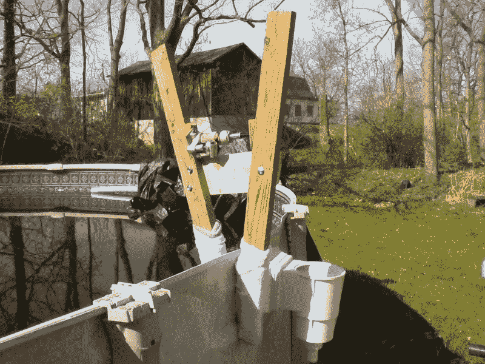

# DIY 液压钳拯救世界

> 原文：<https://hackaday.com/2015/05/04/diy-hydraulic-clamp-saves-the-day/>

[埃尔顿]写信告诉我们在今年荒谬的冬天后他们有一点兴奋。他们的游泳池结冰了，幸运的是，弄皱了衬里的边缘。他们四处询问，他们的泳池公司说他们最好让保险公司参与进来，因为这不容易修理——所以他们决定尝试自己修理。

现在，由于泳池衬里是一种相当厚的金属板，他们无法简单地将其锤打回原形，所以他们开始集思广益，制作自己的液压夹具。他们想出了一个非常聪明的物理学应用。所有的花费是大约 2 美元的硬件加上一些废木料和一个他们放在周围的酒瓶塞。

他们最初的一些想法包括剪刀式的夹子，甚至像活动扳手一样的老虎钳，但是最终，选择了下面的设计——并且成功了。

理想情况下，液压千斤顶会离支点更远，但因为它的额定重量为 2 吨，所以它足够坚固。为了避免刮伤衬里，他们还在木材末端扔了一些袜子。仍然相当笨重，这是一个两个人的工作弹出它。但是一旦他们去掉了主要的凹痕，他们就可以用橡皮锤来完成这项工作。流体动力万岁！

如果你在找链接，没有。[埃尔顿]把他的照片发给我们，直接告诉我们这个故事。