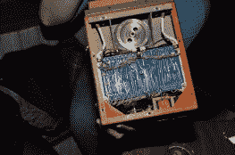
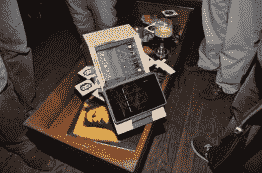

# 你可能在纽约的酒吧里看到的硬件

> 原文：<https://hackaday.com/2015/05/09/hackaday-meetup-nyc/>

我们的 TechCrunch 黑客马拉松纽约之旅即将结束，本周末我们将在帕萨迪纳的 Hackaday 设计实验室举办一场硬件黑客马拉松，但还有一场来自纽约的活动有待报道:[我们的城市畅饮](http://hackaday.com/2015/04/27/thursday-drink-up-in-the-city/)。

我们的饮料占据了鹿角啤酒和葡萄酒药店 90%的份额，这让那些通常不会使用电子设备的顾客十分恼火。

虽然这个聚会实际上只是 TechCrunch 黑客马拉松的一个见面会，而不是真正的“带来一个黑客”，但这并没有阻止一些人携带一些非常酷的硬件。凯蒂·菲顿纳多用卡车运出了一个飞行数据记录器(或者飞机的黑匣子，为了便于观察，漆成橙色)，据推测是一架 747 飞机的。

这个飞行数据记录器把相关数据保存在一圈聚酯薄膜带上。我们没有破解黑匣子的这一部分，但我们设法挖掘了电子设备。里面有非常奇怪的东西。控制电子设备有一个背板设计，其中每个卡有一个连接器，基本上是 2 排 50 或 75 个母插脚插座。这些卡不以任何方式键入，它们必须按一定的顺序放在底板上。电路非常简单；只是运算放大器、74 系列和 54 系列逻辑(不，我们也想不出来)、缓冲器和反相器的组合。最新的日期代码是 80 年代初的某个时候，所有的电路板上都有保形涂层。在黑盒子的外面有一个奇怪的连接器[Katie]承诺在她的[hack aday . io 个人资料](https://hackaday.io/katieincredible)上记录。

参加活动的还有来自纽约抵抗组织的一些人，来自 T2 的一些人，来自 T4 的一些工作人员。下图中的某处是一个 PacMan/Galaga 女士橱柜。是的，我测试了[蜜蜂溢出秘籍](http://hackaday.com/2015/04/11/reverse-engineering-galaga-to-fix-the-no-fire-cheat/)，可以用，但是高分在 50 万以上。

               