# 和在月球上漫步的人在一起

> 原文：<https://hackaday.com/2015/05/11/hanging-out-with-someone-who-walked-on-the-moon/>

乘坐月球沙滩车，驾驶人类制造的最强大的机器，卡住推进器，着陆，吃饭，睡觉，在月球上工作。没有比阿波罗计划更令人兴奋的了！我最近有机会旁听了麻省理工学院的课程,[工程阿波罗:作为一个复杂系统的月球项目](http://ocw.mit.edu/courses/science-technology-and-society/sts-471j-engineering-apollo-the-moon-project-as-a-complex-system-spring-2007/index.htm),在那里我见到了作为阿波罗 15 号指挥官登上月球的[大卫·斯科特](http://en.wikipedia.org/wiki/David_Scott)。我不仅旁听了一个长时间的问答环节，还能在课后与大卫共度时光。不是每天你都会遇到登上月球的人，以下是我对这次经历的记录。

   [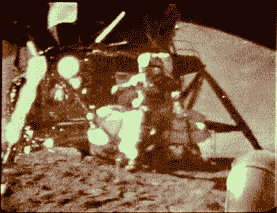](https://hackaday.com/2015/05/11/hanging-out-with-someone-who-walked-on-the-moon/as15_hfd_4/)  [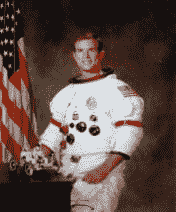](https://hackaday.com/2015/05/11/hanging-out-with-someone-who-walked-on-the-moon/dave_scott_apollo_15_cdr/)  [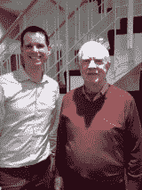](https://hackaday.com/2015/05/11/hanging-out-with-someone-who-walked-on-the-moon/gl-charvat-and-david-scott/) 

## 背景

在推进器卡住的事故中，大卫·斯科特和尼尔·阿姆斯特朗一起乘坐双子座 8 号。他是“T2”号阿波罗 9 号(T3)的指挥舱驾驶员，这是一次完整的阿波罗宇宙飞船系统的试飞。他作为[阿波罗 15 号](http://www.nasa.gov/mission_pages/apollo/missions/apollo15.html#.VUqv1EJlCVI)的指挥官登上月球，这是第一次搭载月球车的任务。

## 个性

大卫无愧于阿波罗宇航员的传奇身份，同时也非常平易近人。他的幽默感在许多场合让全班哗然。麻省理工学院的学生问了非常具体的技术问题。大卫对阿波罗系统的深刻理解令人印象深刻，没有一个问题是不能详细回答的，甚至没有任何细微差别是历史书上没有的。我敢肯定，如果我们要求的话，他会画出框图和原理图。

## 双子座 8 号和卡住的推进器

你可能听说过双子座 8 号期间推进器卡住的事件。其中一个机动推进器卡在开启状态，导致飞船旋转越来越快。如此之快以至于大卫和尼尔·阿姆斯特朗都开始昏厥了。他们通过关闭一个推进器系统并使用再入推进器来停止旋转而幸存下来。

任务不得不提前结束。重返开始于非洲上空，这不是最初的计划。重返大气层时，他们越过了喜马拉雅山，随后很快降落在中国南海。大卫告诉我们喜马拉雅山的景色绝对令人惊叹。

大卫和尼尔并不完全相信他们已经成功飞越了正常着陆所需的海洋。幸运的是，尼尔能够用他的镜子观察窗外，透过窗户看到海洋，从而证实了这一点。降落伞打开了，没有必要在陆地上弹射出去！

 [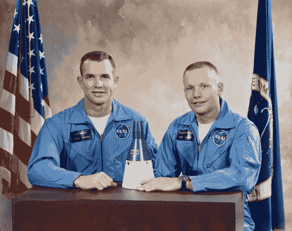](https://hackaday.com/2015/05/11/hanging-out-with-someone-who-walked-on-the-moon/s65-58499/) Photos from the Gemini 8 mission. [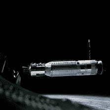](https://hackaday.com/2015/05/11/hanging-out-with-someone-who-walked-on-the-moon/s66-25782/)    [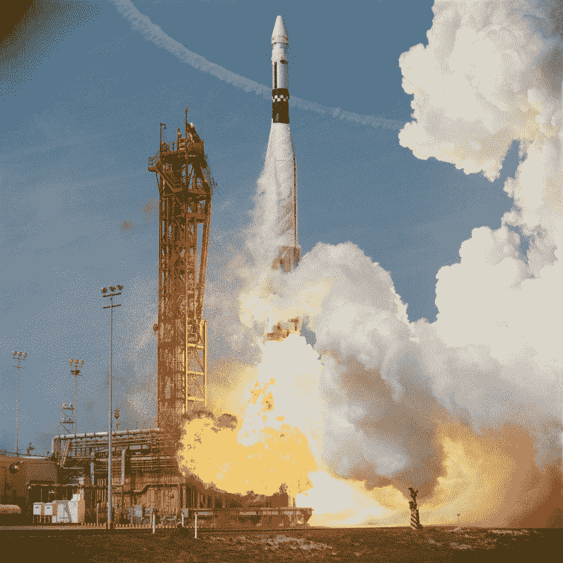](https://hackaday.com/2015/05/11/hanging-out-with-someone-who-walked-on-the-moon/s66-24482/) 

## 阿波罗模拟的质量

大卫告诉我们，模拟结果非常准确。他的回忆是模拟和在月球上的唯一区别是你在月球上的事实。相当支持阿波罗模拟器。

[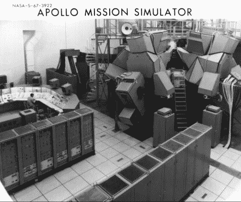](https://hackaday.com/wp-content/uploads/2015/05/c264b.jpg)

Apollo mission simulator.

大卫是模拟的忠实粉丝。他告诉我们，当去太空旅行时，你会想尽可能多地在地面上进行模拟，这样你就可以了解系统和你的同事。阿波罗甚至在一个巨大的真空室内模拟了 CM 和 LM 的部分任务。

模拟器是数字和模拟混合系统。大卫告诉我们，运行模拟的人试图通过引起大量的警报、假警报、系统故障、部分故障等等来杀死他们。它需要一个工程师的头脑来解决几乎任何警报所呈现的难题，因为警报并不总是它们看起来的那样。在一次真正的任务中，正确解决机器反馈的难题是生死攸关的事情。

大卫对有争议的 LM 飞行教练说了一些友好的话。这是一种在地球大气层中飞行的运载工具，用来训练宇航员；与尼尔·阿姆斯特朗撞车并险些丧命的是同一辆车。如果没有这一点，登月将会更加危险。

[https://www.youtube.com/embed/xJa4yQ0AIbU?version=3&rel=1&showsearch=0&showinfo=1&iv_load_policy=1&fs=1&hl=en-US&autohide=2&wmode=transparent](https://www.youtube.com/embed/xJa4yQ0AIbU?version=3&rel=1&showsearch=0&showinfo=1&iv_load_policy=1&fs=1&hl=en-US&autohide=2&wmode=transparent)

## 起飞时中止控制

在指令舱的左侧座位(飞行员座位)的左侧有一个中止控制。这是一件非常有趣的事情，如果你在飞行开始时带着整个火箭组(F1 发动机运转)向上飞，你向右旋转它，那么整个火箭组现在处于手动控制下，坐在左边座位的飞行员手动驾驶整个火箭。

这一功能从未使用过，但在模拟中测试过多次。显然，在手动控制下，你必须在驾驶人类有史以来最强大的机器时，将一对交叉的针排列在前面板上的一个仪器上。听起来极具挑战性，对吧？

[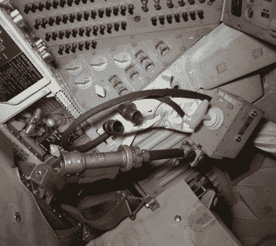](https://hackaday.com/wp-content/uploads/2015/05/a16_tc.jpg)

如果你向左转动中止手柄，那么 CM 顶部的逃生火箭就会发射，使机组人员承受 14G 的压力。没有人想把它转到左边，因为你可以想象，14G 会感觉不太好，除了个人舒适之外，机组人员非常积极地让事情不管发生什么都工作。

即使当阿波罗 12 号被闪电击中，导致电力系统在它爬升到大气层时变得疯狂，中止控制也没有被触动。他们还是去了。

## 阿波罗 15 号着陆

大卫和詹姆斯·欧文以陡峭的下降角降落在月球上两座最大的山峰之间，这样他们就可以安全地在两座山峰之间“穿针引线”。大卫承认驾驶 LM 是一个挑战，但随着 J 任务(包括漫游者、工具和实验)的增加，这一挑战就更大了。这种重量损失因山路造成的陡峭下降角而进一步加剧。

[https://www.youtube.com/embed/2121F_0VbxU?version=3&rel=1&showsearch=0&showinfo=1&iv_load_policy=1&fs=1&hl=en-US&autohide=2&wmode=transparent](https://www.youtube.com/embed/2121F_0VbxU?version=3&rel=1&showsearch=0&showinfo=1&iv_load_policy=1&fs=1&hl=en-US&autohide=2&wmode=transparent)

## 为什么在下降的最后阶段要手动控制

大卫谈到了登月舱如何完全靠自己在月球上着陆，但着陆的最后一部分总是由手动控制。这不是大男子主义的战斗机飞行员在操纵装置上逞能，相反，这是一个安全问题。如果在下降的最后阶段出现警报灯，就没有太多的时间作出反应和排除故障。相比之下，如果飞行员在控制中，他会感觉到航天器在出现问题时会做一些不同的事情，并能够自然地进行补偿。这就是为什么着陆的最后阶段是用手动控制实现的。

[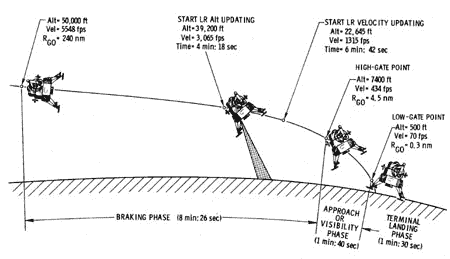](https://hackaday.com/wp-content/uploads/2015/05/phases259x450.jpg)

唐·艾尔斯，他是设计登月舱软件，特别是着陆程序的关键人物，坐在我旁边的观众席上，对这一切反应良好。那天晚上晚些时候，我和唐聊了聊，他也非常有趣，是一个非常好的人，他向我解释说，整个阿波罗计算机是由或非门制成的，并向我展示了其中一张逻辑卡。

## 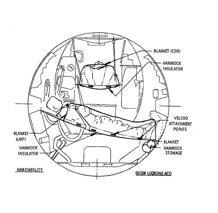
生活在月球上

在阿波罗 15 号期间，大卫和詹姆斯必须在月球上生活和工作 3 天，这意味着他们必须制定在登月舱上生活、吃饭和睡觉的程序。这不是一项简单的任务。

穿着太空服睡觉不舒服，导致睡眠不足。宇航服必须每天晚上脱掉。脱下宇航服，不让月球尘埃落在登月舱的所有东西上是很困难的，显然这是在一个大袋子里完成的，至少可以最小化它。登月舱里搭起了吊床，人们穿着内衣睡觉。

他们研究了昼夜节律，这在当时并不为人所知。为了保持他们的睡眠-觉醒周期，月亮时间变成了休斯顿时间。

当检查登月舱上的宇航服时，他们发现月球上结块的灰尘具有惊人的研磨性。这引起了人们对宇航服气密性的担忧。

## 月球车，月球上的沙滩车！

如果你有任何疑问，但大卫证实了[月球车](http://nssdc.gsfc.nasa.gov/planetary/lunar/apollo_lrv.html)驾驶起来真的很有趣。车辆有一个宽轴距，低重心，每个车轮都有自己的发动机。但是有一次，当漫游者几乎滑下一座山时，引起了轰动。

[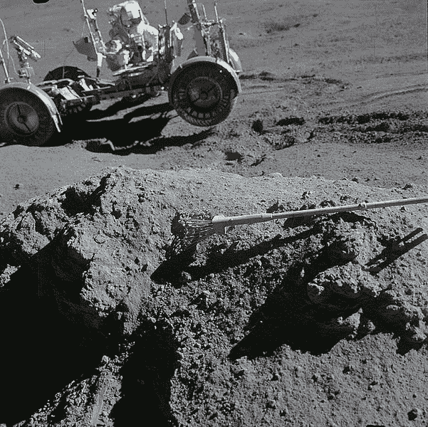](https://hackaday.com/wp-content/uploads/2015/05/601px-apollo_15_green_boulder_irwin_holding_lrv.jpg)

Preventing the lunar rover from sliding down a mountain.

大卫和詹姆斯注意到在一座相当陡峭的山的一侧有一块绿色的巨石，所以他们开着漫游车驶向它。在 1/6 的重力下，没过多久火星车就开始[向山下侧滑](https://www.hq.nasa.gov/alsj/a15/a15.sta6a.html)！詹姆斯不得不用自己的双手抓住它。在这段时间里，任务控制中心没有实时视频，所以这些人把它放在 DL 上。

这是绿色岩石的照片，背景是漫游者，它的一个轮子在空中，詹姆斯实际上举着车，防止漫游者进一步滑下山。

## 羽毛和锤子重力演示

羽毛和锤子哪个在真空中下落更快？大卫想马上测试一下[羽毛和落锤](http://nssdc.gsfc.nasa.gov/planetary/lunar/apollo_15_feather_drop.html)，因为存在静电导致羽毛不掉落的风险。为此，他带了两根羽毛，一根用于录像演示，另一根先测试一下。幸运的是，演示取得了巨大的成功。大卫对成功实验的反应是“怎么样？"!

[https://www.youtube.com/embed/KDp1tiUsZw8?version=3&rel=1&showsearch=0&showinfo=1&iv_load_policy=1&fs=1&hl=en-US&autohide=2&wmode=transparent](https://www.youtube.com/embed/KDp1tiUsZw8?version=3&rel=1&showsearch=0&showinfo=1&iv_load_policy=1&fs=1&hl=en-US&autohide=2&wmode=transparent)

## 阿波罗时期的 NASA 文化

参与创业，我一直很好奇其他快速组织的文化是什么样的。阿波罗的速度很快，在大约 7 年的时间里，他们从双子座任务到在月球上行走，这个组织包括近 40 万人(当然这是一个很高的估计，包括分包商等等)。

他们是怎么做到的？我特意问了大卫这个问题。

宇航员密切参与了开发工作。大卫参与了制导和导航的发展。他还从飞行员的角度设计了指令舱和登月舱面板的布局，以方便使用。

例如，每个主要子系统的代表都参加了星期五的 Tindall 会议。会议的目标是解决问题并做出影响所有主要系统的决策。与会的工程师被授权为他们各自的团队做决定，决定通过 [Tindall memos](http://tindallgrams.net) 在程序中传达。

> “我刚从麻省理工学院带着每周新增溃疡的配额回来，我想你可能会感兴趣。”比尔·廷德尔，1966 年 6 月 13 日。

这些备忘录读起来很有趣，但也是让每个人保持一致的关键。当然，当更多的信息在接下来的一周可用时，一些决定被推翻，但这是同步脉冲。

总之，*会议是为了做决策，每个工程师都有发言权，无论什么级别都要倾听。*

大卫还指出，一般来说，阿波罗的工程师都是能干的。他们可能从未做过要求他们做的事情，但他们愿意试一试，犯错误，并从错误中学习。

## 阅读这本书和明德尔教授

听着，你可能永远也不会有机会和去过月球的宇航员一起出去玩。但是参与过各种任务的宇航员都非常乐于分享他们的经历。

这一经历归功于麻省理工学院工程与制造(STS)历史弗朗西斯和大卫·迪布纳教授。明德尔教授创建了这门课程，并撰写了《T2 数字阿波罗》一书。对于那些对阿波罗系统的导航、导航和许多其他技术细节感兴趣的人来说，这本书是必读的。

Mindel 教授还写了另外两本书，可能会引起黑客社区的兴趣:

*   [战争，技术，以及在美国军舰监视器上的经历](http://www.amazon.com/War-Technology-Experience-Aboard-Monitor/dp/0801862507)，
*   [在人和机器之间:控制论](https://jhupbooks.press.jhu.edu/content/between-human-and-machine)之前的反馈、控制和计算，我最近读完了这本书，它的主题是二战中用于火控的机电计算机，这是最近在 hackaday 上引起兴趣的[话题。这本书是那些对第二次世界大战技术的具体细节和历史背景感兴趣的人的必读书。](http://hackaday.com/2014/10/28/retrotechtacular-fire-control-computers-in-navy-ships/)

## 摘要

我们可以从阿波罗计划如何完成其任务中学到很多，并且应该总是抓住机会倾听那些为阿波罗计划工作的人的意见。如果你有机会见到与这个项目有关的人，请在下面的评论中告诉我们你的经历。

* * *

**作者简介**
[Gregory L. Charvat](http://glcharvat.com/Dr._Gregory_L._Charvat_Projects/About.html) 是载人航天飞行的狂热爱好者，是[小型和短程雷达系统](http://www.amazon.com/Short-Range-Practical-Approaches-Electrical-Engineering/dp/143986599X)的作者，Hyperfine Research Inc .、Butterfly Network Inc .(这两家公司都是 4 家 4catalyzer 公司)的联合创始人，Camera Culture Group 麻省理工学院媒体实验室的客座研究科学家，Gregory L. Charvat 电气工程实用方法系列的编辑，以及 CNN、CBS、Sky News 等的客座评论员。他是麻省理工学院林肯实验室的技术人员，他在穿墙雷达方面的工作赢得了 2010 年 MSS 三军雷达研讨会的最佳论文，并且是 2011 年 Provost 研究亮点的麻省理工学院办公室。他曾在麻省理工学院教授短期雷达课程，他的“构建小型雷达”课程是 2011 年排名第一的麻省理工学院专业教育课程，并被其他大学、实验室和私人组织广泛采用。从早年开始，Greg 开发了许多雷达系统、铁路 SAR 成像传感器、相控阵雷达系统；拥有多项专利；并开发了许多其他传感器、无线电和音频设备。他撰写了许多出版物，并因其作品受到媒体的关注。Greg 于 2007 年获得密歇根州立大学电气工程博士学位，2003 年获得 MSEE 博士学位，2002 年获得 BSEE 博士学位，他是 IEEE 的高级成员，曾在 2010 年、2013 年和 2016 年 IEEE 国际相控阵系统和技术研讨会的指导委员会任职，并于 2010 年至 2011 年担任 IEEE AP-S Boston 分会主席。