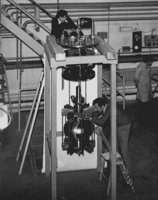
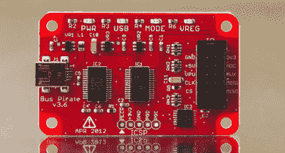

# 描述 CERN 竞赛——本周奖励升级

> 原文：<https://hackaday.com/2015/05/08/caption-cern-contest-prize-upgrade-this-week/>

欧洲核子研究中心竞赛的第 13 周可能已经过去了，但是我们无畏的科学家仍然在摇晃他的咖啡因热潮。感谢字幕！我们仍在试图弄清楚墙上的面孔是否是名人，以及墙上的卡通明信片上到底是谁。一些读者在背景中发现了看起来像是压缩空气软管的东西。每个办公室都有自己的咖啡站，但我们打赌这个欧洲粒子物理研究所的实验室有一些严重起泡的牛奶！

搞笑的是:

*   “薛定谔的拳头碰撞”——贾勒特
*   “尽管其他科学家拒绝了约翰用六速手动变速器控制加速器的想法，但他经常闭上眼睛，想象在引擎盖下几万亿电子伏的机器齿轮间换档。”- [ [MechaTweak](https://hackaday.io/MechaTweak)
*   “在欧洲粒子物理研究所，咖啡没有太大的冲击力，但确实有一些冲击力。”–[[thx 1082](https://hackaday.io/THX1082)]

本周的获胜者是[[Matt](https://hackaday.io/pretenda)]“这将是一张 gooood coffee rush 自拍。我所有的朋友都这么做。我们把它们贴在墙上。”–欧洲核子研究中心的工作人员确实走在了时代的前面。[马特]从 Hackaday 商店赢得了一件可爱的[机器人头像 t 恤！](http://store.hackaday.com/products/robot-head-tee)

## 第 14 周:奖励升级！

 我们在 Hackaday 这里看到了很多奇怪的设备，但是[第 14 周的图像](https://hackaday.io/contest/4200-caption-cern-contest/log/17486-caption-cern-contest-week-14)让我们无话可说，至少在几分钟内。这到底是什么东西？压力容器？射频室？看着这张图片和另一张描绘欧洲核子研究中心实验室中一个奇怪装置的图片，我们没有一点概念。我们确实知道它很大，这两位欧洲粒子物理研究所的科学家正在努力让它为…某事做好准备。它也有鳍。鳍让一切变得更酷。除此之外——我们将在 [Hackaday.io .上把它交给我们字幕团队的得力助手](https://hackaday.io)

 本周我们会增加一些甜头。到目前为止，我们每周的奖品是一件 t 恤。虽然服装很重要，但我们知道黑客喜欢黑客工具，所以本周的奖品将是来自黑客日商店的[巴士海盗。我们将尝试每周用不同的设备进行升级。](http://store.hackaday.com/products/buspirate-v3-6-thm180c4m)

将您的幽默标题作为评论添加到此项目日志中。确保你是在评论 [**比赛日志**](https://hackaday.io/contest/4200-caption-cern-contest/log/17486-caption-cern-contest-week-14) ，而不是比赛本身。一如既往，如果你真的有关于图像或图像中的人的信息，请在[原始图像讨论页面上让 CERN 知道。](https://cds.cern.ch/record/1836954)

祝你好运！