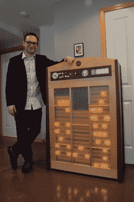

# 继电器计算平方根

> 原文：<https://hackaday.com/2015/05/08/relays-calculate-square-roots/>

小时候看过一个基于继电器的旧电脑展览后，[Simon]受到启发，制作了一个简单的双继电器锁存电路。从那时起，他就迷上了继电器如何进行计算。然而，他已经从第一个锁存电路走了很长的路，最近完成了一个巨大的五年项目，该项目使用机电继电器来计算平方根。

平方根计算器的框架可以容纳多达 30 个相同的继电器模块，每个模块容纳 PCB 上的 16 个继电器，总共 480 个继电器。基于模块的设置使维修和维护变得轻而易举。数字通过一部旧电话的转盘输入计算机，并存储在计算器的中继存储器中。数码管显示器完成了该设备过去的时代主题，并显示正在输入的当前数字，或正在计算的数字的平方根。

这个项目的真正神奇之处在于，每个继电器都有一个 LED，每当继电器通电时，它就会发光，这就向用户显示了机器的所有部件的确切位置。[Simon]从 2009 年开始从事这个项目，最近在 2014 年完成，它已经在 San Mateo Maker Faire 和华盛顿州雷蒙德市的微软研究院展出。我们以前见过这个的[小版本，但从来没有这么大的规模，也从来没有像平方根这样的特定运算。](http://hackaday.com/2011/04/22/relay-calculator/)

下面视频。感谢[Bonsaichop]的提示！

[https://www.youtube.com/embed/gI8luQnyM9A?version=3&rel=1&showsearch=0&showinfo=1&iv_load_policy=1&fs=1&hl=en-US&autohide=2&wmode=transparent](https://www.youtube.com/embed/gI8luQnyM9A?version=3&rel=1&showsearch=0&showinfo=1&iv_load_policy=1&fs=1&hl=en-US&autohide=2&wmode=transparent)