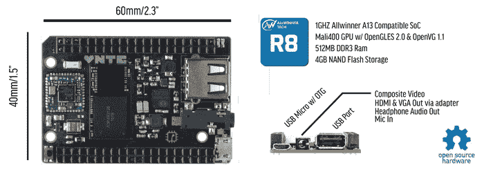

# C.H.I.P .是一个 9 块钱的 Linux 特洛伊木马

> 原文：<https://hackaday.com/2015/05/08/c-h-i-p-is-a-linux-trojan-horse-for-nine-bucks/>

我相信你已经听说过 9 美元的 Linux 电脑。说九块钱当然很性感，但这个数字旁边真的应该有一个星号。如果你想要 VGA 或 HDMI 之类的东西，你需要一个适配器板，这增加了成本(本来板只支持复合视频输出)。一旦 Kickstarter 实现，我也有关于 MSRP 的问题。但是我想的不是成本；无论发生什么，这仍然是非常便宜的领域。相反，我更愿意把它看作是 Linux 被更广泛接受的交付设备。

硬件的要点是一个小电路板，带有一个号称 1GHz 时钟的 SoC，半千兆字节的 ram，四千兆字节的闪存，一个 USB，WiFi 和蓝牙。它还有使其成为手持设备的附加设备，并被宣传为游戏控制台。如今，你从这些 SoC 中获得的成本令人惊讶，不是吗？

至少十年来，人们一直宣称今年是 Linux 桌面年。那不是正确的思考方式。成年人对品牌很忠诚，企业会坚持只做有效的事情。试图转换这两个例子是徒劳的。但是，加州公共卫生协会正在掀起一场始于树莓派的运动。

这些都是入门级电脑，很大一部分用户将是孩子。我还没有亲身体验过这款新主板，但市场营销人员肯定会努力展示用户对 GUI 的熟悉程度。这是在销售 Linux 和 LibreOffice 等流行的软件包，甚至没有告诉人们他们将采用 Linux。如果最年轻的树莓派使用者因患有慢性重型肝炎而进入青春期，那么他们成年后的早期会是什么样子呢？至少，他们不会对开源软件有根深蒂固的偏见(除非 Rasbperry Pi、C.H.I.P .和其他人的经历是负面的)。充其量，他们会完全接受自由/开源软件，成为下一代代码贡献者和概念传播者。那么每年都将是 Linux 桌面之年。