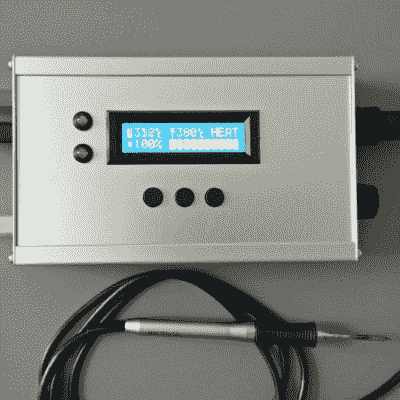

# 在已经很棒的 Weller WMRP 中加入惊人的焊接功能

> 原文：<https://hackaday.com/2015/05/11/hacking-amazing-soldering-features-into-the-already-great-weller-wmrp/>

德国焊接工具制造商 Weller 有一系列被称为 WMRP 系列的微型烙铁(铅笔)。这些是 12V、40 W 或 55W 的单元，具有 3 秒的加热时间，并且允许在不需要任何工具的情况下快速更换尖端。[FlyGlas]围绕运行 Arduino 的 ATMega 微控制器为 [WMRP 系列](http://www.weller.de/de/Weller--Produkte--Produkt-Details.html?article_id=D0714714001379336377A103882#{"string":"","current_site":"weller","current_brand":"Weller"})建造了一个整洁的[焊接站/控制器](https://github.com/FlyGlas/WMRP)。

它包含了你在专业钻机上看到的大部分功能。

*   利用 c 型热电偶测量焊头温度的低失调运算放大器
*   使用 WMRP 焊笔中的 PTC (KTY82-210)进行冷接点补偿
*   输入电压测量
*   焊笔电流测量
*   识别焊锡笔是否放在支架上(–>待机)
*   3 个按钮用于保存和调用温度值
*   设置焊接温度的旋转编码器
*   带照明的 16×2 字符 LCD 模块
*   用于调试和固件更新的 USB
*   用于+12V 电源输入的 4 毫米安全插座和用于连接 ESD 保护的保护接地插座

来自微控制器的 PWM 信号使用 MOSFET 控制负载电流。使用基于霍尔效应的线性电流传感器-[ACS 712](http://www.allegromicro.com/en/Products/Current-Sensor-ICs/Zero-To-Fifty-Amp-Integrated-Conductor-Sensor-ICs/ACS712.aspx)测量负载电流。在发送到微控制器 ADC 输入之前，使用[零漂移、单电源、RRIO 双通道运算放大器](http://www.analog.com/en/products/amplifiers/operational-amplifiers/zero-drift-amplifiers/ad8552.html#product-overview)ad 8552 对相应的线性输出电压进行缓冲和轻微放大。为确保 ADC 测量精确稳定，使用了低噪声精密基准电压源–[ADR 392](http://www.analog.com/en/products/linear-products/voltage-references/adr392.html)。另一种精密电阻分压器允许测量输入电压。电源输入具有过流和反向电压保护。一组按钮和一个旋转编码器连接到微控制器，以允许设置和调整。模拟部分测量来自焊笔的热电偶电压以及待机开关状态。手柄有一个嵌入式簧片开关，由支架中的磁铁激活，使其进入待机模式。另一个模拟部分使用焊笔内的 [PTC 传感器](http://www.nxp.com/products/sensors/temperature_sensors/KTY82.html)执行冷接点补偿。

Git repo 包含初始的 Arduino 代码，它仍在开发中。虽然硬件源文件不可用，但如果您想尝试构建它，repo 确实有 pdf、gerbers 和 BOM 列表。休息后请观看演示视频。感谢[Martin]提供的提示。

[https://www.youtube.com/embed/le2HaKJ6B1A?version=3&rel=1&showsearch=0&showinfo=1&iv_load_policy=1&fs=1&hl=en-US&autohide=2&wmode=transparent](https://www.youtube.com/embed/le2HaKJ6B1A?version=3&rel=1&showsearch=0&showinfo=1&iv_load_policy=1&fs=1&hl=en-US&autohide=2&wmode=transparent)