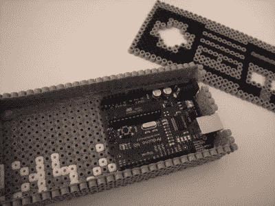

# 融合工艺珠制成的 NES 控制器

> 原文：<https://hackaday.com/2015/05/23/nes-controller-made-out-of-fused-craft-beads/>

闭上眼睛，回想一下，很久以前，当你还是个孩子的时候。还记得那些彩色的珠子吗？孩子们会把它们放在一个小塑料钉板上，排列成某种艺术图案，然后熨烫，把珠子融合成一个精巧的小饰品。它们对孩子来说很有趣，但对我们成年人来说又有什么用呢？嗯，[Lalya]已经展示了它们可以用来制作一个独特而有趣的 NES 控制器。

首先，控制器的前面板放在钉板上，记住要反过来放，这样珠子熔化的一面朝向控制器。顶部面板中留有用于 D-pad 和 B/A 按钮的孔。控制器的侧面、背面和底部面板以相同的方式制成。热胶水把箱子面板粘在一起。

外壳内部是一个 Arduino 和试验板，带有三个通孔瞬时按钮。这些被连接到 Arduino 输入，当连接到计算机时，一个草图模拟击键。不幸的是，现在 D-pad 的功能只是一个按钮。[Lalya]用这个项目来控制 iTunes。也许下一个版本会对电子游戏更友好。

拥有自己的 NES 控制器娱乐可能不在你的清单上。但是你必须承认，这是一个非常简单和廉价的方式来定制外壳。