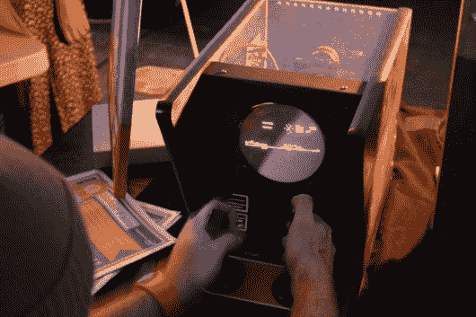
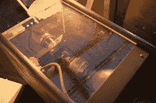

# 在矢量显示器上播放的《战地》带手动上弦轭架

> 原文：<https://hackaday.com/2015/06/09/battlezone-played-on-vector-display-with-hand-wound-yoke/>

我们是[埃里克]和朋友们多年来在 TubeTime 所做工作的崇拜者。我们能记得的最早的一个是[decatron 厨房定时器](http://hackaday.com/2009/04/06/dekatron-kitchen-timer/)，我们仍然在讲述【Eric】故意省略按钮去抖的故事，以便让[的向量 flappy bird 更难](http://hackaday.com/2014/05/26/flappy-bird-mon-am/)。

TubeTime 今年又回来了，我们有机会在湾区制造商集会上与他们交谈。该组织专门从事旧显像管显示器的工作，今年的产品在许多方面都非常出色。首先，软件方面是运行在 STM32 F4 发现板上的仿真器。这些板上的芯片有一对 12 位 DAC，用于驱动矢量显示器的 X 和 Y 轴。运行原始 rom 的代码是从现有项目中移植过来的，但游戏的音频是一种工作的黑客。

这个特别的展示是事情变得真正迷人的地方。显像管本身最初是作为电视修理工的测试设备制造的。令人着迷的是[Eric]不得不自己倒带偏转线圈才能让它再次工作。幸运的是，他记录了很多关于他对这一过程的初步研究和他的实验，这些实验是为了[纠正他在工作时遇到的一些失真问题。](http://tubetime.us/?p=214)

请务必前往 TubeTime，并[阅读他们对《战地机器》的概述](http://tubetime.us/?p=280)。休息之后，我们还嵌入了一些我们自己的照片以及在 BAMF 的采访。

[https://www.youtube.com/embed/Ue1lRHRuREg?version=3&rel=1&showsearch=0&showinfo=1&iv_load_policy=1&fs=1&hl=en-US&autohide=2&wmode=transparent](https://www.youtube.com/embed/Ue1lRHRuREg?version=3&rel=1&showsearch=0&showinfo=1&iv_load_policy=1&fs=1&hl=en-US&autohide=2&wmode=transparent)

  Battlezone on a vector tube  The tube (better image on Tubetime site)  One of the best booth signs at the Faire