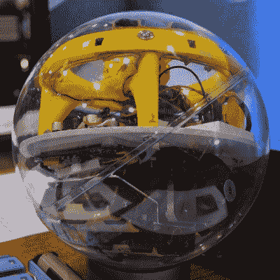

# 互动机器人:淘气球计划

> 原文：<https://hackaday.com/2015/05/21/interactive-robot-project-naughty-ball/>

在湾区制造者集会的一个月前，有不祥的预测说整个集会将会充满 BB-8 机器人，这种可爱的宇航技工机器人我们将会在今年 12 月*原力觉醒*时看到更多。这一预测被证明为时过早。有大量的 R2 单位在集会上飞行，但是没有一架 BB-8。或许在今年九月的纽约创客节上。

 关于球形机器人，我们今年在 Maker Faire 上确实有一个友好的滚动伙伴。这是加州大学戴维斯分校的学生[很久康]，[路易]和[Yunan Song][的一个项目，他们在](https://www.youtube.com/watch?v=9jN-kKy9LQ0)周围滚动，寻找戴着红外脚踝带的人。他们的团队称之为淘气球计划，但我们称之为微型 BB-8 机器人的第一步。

淘气球的设计有些别出心裁；它被安装成一个两轮平衡机器人，在一个透明的塑料球体里。一吨电池足够好地工作，因为镇流器，步进电机和机械加工的塑料轮平衡和操纵球机器人，球上半球的结构容纳了所有有趣的电子设备。

有一个黑色的 BeagleBone，带 WiFi 适配器，几个电机驱动器，一个 IMU，以及一个非常有趣的 3D 打印支架，可以旋转机器人的眼睛——红外摄像头可以在球内旋转，并跟踪佩戴红外传输脚踝带的人。

就机器人项目而言，在 Maker Faire 上，你真的不能比一个跟随主人的半自主球机器人做得更好，这些人在这个项目上投入的工作量使它进入了一个新的水平。你可以在下面查看他们项目的视频描述。

[https://www.youtube.com/embed/9jN-kKy9LQ0?version=3&rel=1&showsearch=0&showinfo=1&iv_load_policy=1&fs=1&hl=en-US&autohide=2&wmode=transparent](https://www.youtube.com/embed/9jN-kKy9LQ0?version=3&rel=1&showsearch=0&showinfo=1&iv_load_policy=1&fs=1&hl=en-US&autohide=2&wmode=transparent)