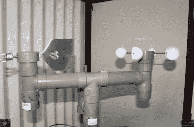
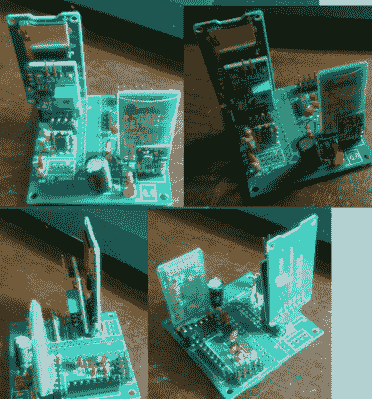
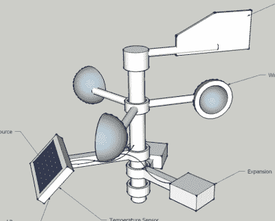
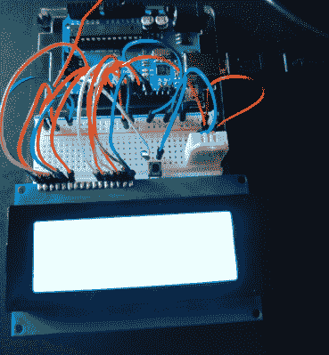

# hacklet 48–天气感应项目

> 原文：<https://hackaday.com/2015/05/23/hacklet-48-weather-sensing-projects/>

纵观历史，人类一直受天气的支配。计划像婚礼或海战这样的大型户外活动？更好地期待晴朗的天空！人类还没有能力随心所欲地改变大自然，但是黑客们正在努力！在此之前，我们可以测量当前的状况，并预测不久的将来的天气。基于云的计算机模型和全球传感的一点帮助，甚至允许我们提前几天建模和预测天气模式。毫不奇怪，制造商、工程师和黑客喜欢气象项目。我们发现有两个基本的项目组(它们之间有一些重叠):传感项目和显示项目。本周的 hacklet 关注 Hackaday.io 上一些最好的天气传感项目！

 我们先从【迪尼斯堡】[模块化气象站](https://hackaday.io/project/1878)说起。这个 2014 年 Hackaday 奖的参赛者是一个 DIY 户外气象站。[diysciborg]在他的大部分机械制造中使用了容易获得的 PVC 管和金属片。他的风速计本身就是一件艺术品。将 8 个磁簧开关安装在印刷电路板上的插槽中，使得这个轻薄的装置能够轻松感知风速。其他传感器包括 TLS230R 光频转换器，用于测量阳光、一氧化碳、风向等。Arduino Pro Mini 是这一切的中心。

 【克洛维斯·弗里岑】正在用他的项目 [FacilTempo](https://hackaday.io/project/4564) 拯救地球免受全球变暖之苦。FacilTempo 是一个气象站，也是 2015 年 Hackaday 奖的参赛作品。这个想法是制造一个简单和低成本的装置，它可以大量建造并放置在地球上的任何地方。[克洛维斯]计划测量温度、湿度、大气压、阳光和雨水。他还希望增加一个 Sparkfun 传感器来监测风速和风向。所有的数据都将通过无线电线路传输。[Clovis]正在增加 FacilTemp 通过 433 MHz、WiFi 或蓝牙进行通信的能力。整个传感器套件及其机载 ATmega328 将由一个 LiPo 电池供电。电池将由太阳能或风能充电，这取决于现场可用的能源。已经有 8 个项目记录在案，FacilTempo 正在全力抗击全球变暖！

【Ulf Winberg】正在建造[低成本气象站](https://hackaday.io/project/5068)，这是他 2015 年 Hackaday 奖的参赛作品。低成本气象站的目标是成为一个 50 美元的当地天气条件传感器套件。[Ulf]计划利用风能和太阳能为整个装置提供动力。他希望通过将电能储存在超级电容器中来避免使用电池。到目前为止，功率计算已经占用了他相当多的设计时间。50 美元的材料清单限制是[Ulf]认真对待的一个问题。他正密切关注他的组件选择，以确保这个目标可以实现。该系统将通过 Laird BL600 蓝牙低能耗收发器传输风速、风向、太阳和其他数据。

 最后我们让【格雷格·米勒】带着[气象站泽塔](https://hackaday.io/project/640)回到基础。泽塔是格雷格的第一个大项目。他只是最近才学会焊接，但他已经从一个小小的 Arduino 中挤出了很多性能。这个想法是创建一个两个站点的系统。室外站将监测天气，包括温度、湿度和气压。数据将被传输到一个带有类似传感器的室内站。室内站还将包括一个 20 行 x 4 列字符 LCD 来显示数据。[Greg]系统的室内部分即将完成，他正在学习 XBee 数据无线电的详细信息。他还将包括一个 Adafriut CC3000 分线板，以实现气象站的网络功能。我们喜欢看到像这样雄心勃勃的早期项目！

如果你想看到更多这样的项目，请查看 Hackaday.io. 上的[天气感应项目列表](https://hackaday.io/list/5907-weather-sensing-projects)

这就是本周的 Hacklet，一如既往，下周见。同样的黑时间，同样的黑渠道，带给你最好的 [Hackaday.io！](http://hackaday.io/?utm_source=hackaday&utm_medium=29&utm_campaign=hacklet)

这就是本周的 Hacklet，一如既往，下周见。同样的黑时间，同样的黑渠道，带给你最好的 [Hackaday.io！](http://hackaday.io/?utm_source=hackaday&utm_medium=29&utm_campaign=hacklet)