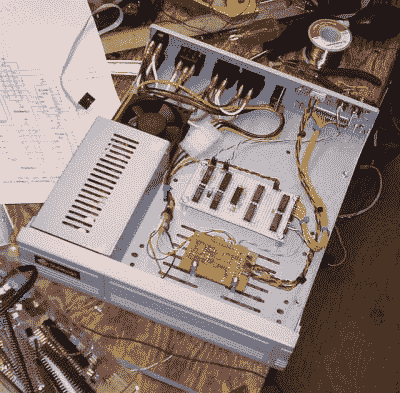
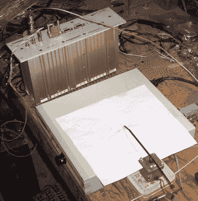

# 测量铷标准的准确度

> 原文：<https://hackaday.com/2015/05/27/measuring-accuracy-of-rubidium-standard/>

铷标准，或铷原子钟，是一种高精度的频率和时间标准，通常精确到 10 ^(11) 的几个零件以内。这仍然比一些更精确的标准低几个数量级——例如，NIST-F1 的不确定性为 5×10 ^(-16) (预计在近 1 亿年内既不快也不慢一秒)，最近的 NIST-F2 的不确定性为 1×10 ^(-16) (预计在近 3 亿年内既不快也不慢一秒)。但是 Rb 标准相对便宜、紧凑，并且广泛用于电视台、移动电话基站和 GPS 系统，并且被认为是次要标准。

[Max Carter]最近就拥有了这样一台设备——朗讯 RFG-M-RB，它在移动电话基站上已经使用了多年。很明显，他有兴趣弄清楚它是否真的像预期的那样精确，并建造了一个基于[广播频率的精密频率比较器，该比较器使用步进电机来表征漂移](http://www.maxmcarter.com/rubidium/index.php)。

## 请比较 WWVB 广播

WWVB Receiver

最明显的检查方法是使用另一个精度更高的信号源，如铯时钟，并进行相位比较。因为这是不可能的，他决定使用 NIST 的时间/频率服务，在 60 kHz 上广播。他这样做是因为大约 30 年前，他为 WWVB 制作了一个接收器，从那以后，这个接收器就一直在他店里的一个角落里运行，自制作以来只进行了一次小的调整。

Comparator Circuit Installed in a Case

他的想法是，通过使用数字相位比较器比较 WWVB 接收器的输出和 Rb 标准的输出，来计算和累积相位“滑移”。标准的精度将通过 N(滑动次数)随时间的导数来计算。该电路是一个正交混频器:它从一个输入中减去另一个输入的频率，并输出差频。相位信息在来自两个相位比较器的脉冲的占空比中传送。低通滤波器/施密特触发器电路将脉冲积分并转换为数字逻辑电平。正交相位输出连接到步进电机驱动器，该驱动器将逻辑电平输入转换为电机绕组中的双向电流。逻辑电路是面包板，与电机驱动器一起，装在已经有电源的计算机硬盘驱动器外壳中。

Testing the Rb Standard

## 进行测量

为了检验它是否如理论预测的那样起作用，他首先描述了 TCXO 的特征。晶体标准操作约 2.5 小时(9000 秒)。当时指针顺时针移动了 90 度。因为完整的旋转需要 400 步，所以 90 度代表 100 步。1 MHz(进行比较的频率)的每个“滑动”周期产生一个阶跃脉冲。因此，为了表征测试中的标准，可以计算脉冲数(用步进器，配有一个热粘合电缆带指针)，乘以 1/1000000，然后除以经过的秒数。在这种情况下，步数为+100，耗时为 9000 秒。计算结果是 100^(-6)/9000 = 1.1×10^(-8)。这是 TCXO 随时间推移的误差系数。

接下来，是时候测试 Rb 标准了。他跑了 44 个小时的测试，逆时针(负)方向累计走了 7 步。频率误差系数计算为-4.42×10 ^(-11) 。铷标准的长期老化率规格通常在每年 5×10 ^(-11) 的范围内。

后来，他将步进电机安装在一个旧的模拟时钟盒内，并在上面安装了一个指针。他还建立了一个附加电路，有 5 个 LED 作为输出，起到一种 [LEDscope](http://www.maxmcarter.com/rubidium/ledscope.html) (同步示波器)的作用，直观地显示标准比参考快还是慢。最后，他还建造了一个[计算机接口](http://www.maxmcarter.com/rubidium/wwvb_computerized.php)来将长期频率数据记录到计算机中。

即使你没有一个 Rb 标准，[Max]的系统在验证和调整(如果需要的话)其他来源的频率方面也是非常有用的。休息后的视频显示来自 WWVB 接收机的 1 MHz，而来自信号发生器的 0.999960 MHz。差频为-40 赫兹，步进器逆时针转动(每秒 1/10 转)。

[https://www.youtube.com/embed/yvfKui7oGNQ?version=3&rel=1&showsearch=0&showinfo=1&iv_load_policy=1&fs=1&hl=en-US&autohide=2&wmode=transparent](https://www.youtube.com/embed/yvfKui7oGNQ?version=3&rel=1&showsearch=0&showinfo=1&iv_load_policy=1&fs=1&hl=en-US&autohide=2&wmode=transparent)

感谢[Chris Hemingway]发送这个提示。