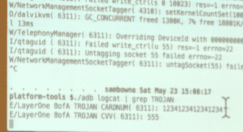

# 将木马程序添加到主要的金融 Android 应用程序的容易程度

> 原文：<https://hackaday.com/2015/05/24/the-ease-of-adding-trojans-to-major-financial-android-apps/>

这是一次既有趣又可怕的谈话。在周六下午举行的 LayerOne 大会上，【山姆·鲍恩】展示了 [*如何木马金融安卓应用*](http://www.layerone.org/speakers/#sambowne) 。[Sam]计算出，由银行和投资公司等主要金融机构提供的 80-90%的应用程序都容易受到攻击，特洛伊木马程序可以轻而易举地进入这些应用程序。

## 一些背景

[Sam]做了很好的工作，简洁地描述了使 Android 特别容易受到攻击的环境，这是本次演讲的主题。Android 程序被打包成 APK 文件，很容易解压。“编译”后的代码本身被称为 smali，其可读性与 Java 类似。使用 grep 解包和搜索这个字节码超级简单。一旦找到了感兴趣的部分，smali 代码就可以被修改，整个东西就可以被重新打包。该应用程序将需要辞职，但谷歌不控制签名密钥，所以攻击者可以简单地生成一个新的密钥，并用它来签署应用程序。用户仍然需要安装文件，但 Android 允许从网页、电子邮件等安装应用程序。所以这对坏人来说也不是问题。

## 袭击

那么能做些什么呢？这是关于信息收集的。[Sam 的]概念验证使用 python 脚本为每个局部变量插入日志。该脚本查看 smali 代码中每个模块的开头，获取局部变量的数量，将其递增 1，并使用这个额外的变量通过 logcat 写出值。

ADB Log shows the Credit Card Number

他在美国银行 app 上现场演示。从用户的角度来看，它和官方应用一模一样，因为它是官方应用。但是，当您注册您的帐户时，日志会报告您在这里看到的卡号。显然，这种信息可以很容易地用多种技术打电话回家。

如上所述，绝大多数银行和金融应用程序都容易受到这种攻击，但一些应用程序试图让这变得更加困难。他发现 Bancorp 应用程序从不在本地变量中公开这些信息，所以它不能被注销。然而，同样的木马技术作为一个键盘记录器工作，因为他发现每次按下一个键时，同样的函数不断被调用。Capital One 应用程序也是如此，但它模仿的是谷歌的 Android 键图值，而不是 ascii 不过很容易转换回可读数据。

## 无法报告漏洞

最令人不安的是，这些公司中没有一家有报告安全漏洞的方法。听到[山姆]讲述他向查尔斯·施瓦布报告这些问题时的挣扎是很有趣的。在线联系表格被破坏，无法发布数据，几个公开发布的电子邮件地址退回了电子邮件。当他终于有一个人接受了这封邮件时，他后来发现另一个用户在一个论坛上报告说，没有人对任何施瓦布账户进行回复。他使用了一个他过去曾多次使用的技巧……[发推特给查尔斯·施瓦布的首席执行官](https://twitter.com/sambowne/status/569563052275851264)开始了一次直接信息对话。这本身就是一个安全问题， [@SwiftOnSecurity 指出](https://twitter.com/swiftonsecurity/status/570005846618456064)每当@SamBowne 向一位首席执行官发推文，都是因为他发现了该公司平台的一个漏洞，并且找不到与该公司联系的合理方式。

## 有希望

虽然非常罕见，但有时这些应用程序确实会被打补丁。在他的报告之后，贸易大王的应用程序进行了更新，当(山姆)再次尝试利用漏洞时，它在启动时崩溃了。日志报告验证失败。这表明注入的代码被注意到了，但是[Sam]想知道验证是否包含在应用程序本身中。如果是的话，就有可能追踪到它并使它失效。

这听起来好像我们所有的 Android 用户都应该感到绝望，但事实并非如此。增加验证功能，即使有可能击败它，也确实能让应用程序更安全；攻击者可能不想投入额外的时间来试图击败它。此外，还有一些售价几千美元的 obsfucators，通过使变量名不可读，使这些攻击变得更加困难。Android 开发套件现在提供的免费 obsfucator 不会改变所有东西的名称…局部变量保持不变，程序员习惯于使用描述性的变量名称。例如，美国银行在上面的例子中使用了“CARDNUM”。

## 幻灯片

整个演讲的幻灯片和测试结果可以在他的网站的[的“即将到来的事件”部分找到。](https://samsclass.info/)