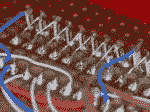
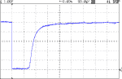

# LED 矩阵加盖革计数器

> 原文：<https://hackaday.com/2015/05/25/led-matrix-plus-geiger-counter/>

很多项目的完成是因为有人把零件放在那里。在这种情况下，[Ed Nisley]得到了一个漂亮的 8×8 RGB LED 矩阵，需要一些东西来显示。[Ed]详细描述了桌子上的东西转变成盖革计数器的独特矩阵显示器(据推测他也坐在某个地方)。结果是一个像放射性衰变一样随机的光秀，这是非常随机的。

 第一贴覆盖[硬件布局](http://softsolder.com/2015/05/18/random-led-dots-hardware-layout/)。它是在 protoboard 上构建的，但最终看起来比我们的项目好得多，因为[Ed]花了一些时间将移位寄存器 IC 和行驱动器晶体管隐藏在矩阵本身下面，这在上面得到了很好的嵌入。巧妙之处在于，SMT 电阻直立焊接在电路板下方，以节省空间。可爱。

第二篇文章介绍了[电路设计](http://softsolder.com/2015/05/19/random-led-dots-circuitry/)，如果你是一个用最少数量的微控制器引脚驱动许多 led 的新手，值得一看。有八行，每行八个发光二极管有三种颜色。如果不使用移位寄存器，这将需要 8*8*8*8 =太多的引脚来控制。如果你想要一个只用四个微控制器引脚就能做到这一点的例子，看看吧。(剧透:由 AVR 硬件 SPI 外设驱动的级联移位寄存器。)

第三个帖子开始[充实软件](http://softsolder.com/2015/05/20/random-led-dots-hardware-spi-vs-data-layout/)。[Ed]选定了七种颜色(和 off)的显示屏，因此矩阵的总状态可以被塞进仅仅 32 个字节，这甚至可以很好地适合一个微型微控制器，更不用说庞大的 ATmega328 了。将所有这些都包装在一个结构数组中，并提供几个助手函数，可以快速完成软件方面的工作。在行尾增加一个同步脉冲来触发示波器是一个不错的选择。

 接下来是[盖革计数器接口软件](http://softsolder.com/2015/05/21/random-led-dots-radioactive-noise/)的帖子。当检测到放射性衰变事件时，代码以毫秒为单位读出时间，并以此作为随机性的来源。为了消除噪音，时报通过一个简单的散列函数运行:Jenkins 散列(链接)。这个散列函数对我们来说是新的，似乎对快速和肮脏的微控制器应用非常有用。

最后一篇文章详细介绍了[在启动时预加载矩阵，并运行一个测试序列](http://softsolder.com/2015/05/22/random-led-dots-startup-lamp-test/)，使每个 LED 闪烁，以确保它们都在工作。使用单个随机值作为软件伪随机数发生器的种子确保了它(几乎)永远不会以相同的显示开始两次。

Phswew！这是一个精心设计的项目的大量文档记录！希望它能激励你从你的垃圾抽屉里找出一些很酷的东西来建造。