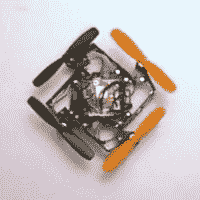

# 可折叠四旋翼飞行器是原始的

> 原文：<https://hackaday.com/2015/05/26/foldable-quadrotor-is-origamilicious/>

洛桑联邦理工学院的一个团队已经开发并制造了一架四轴飞行器，它的手臂可以在起飞前展开。这个想法是，当你用完后，你可以把这个设备折叠起来，这样就可以在你的背包里存放更多的四头肌。

展开机构依靠转子旋转的扭矩将臂摆动到位。一旦完全展开，一个弹簧加载的襟翼折叠起来，抓住一些磁铁，形成一个 L 形结构，没有人的干预不会重新折叠。

 在正常飞行条件下，四轴飞行器有两个左旋螺旋桨和两个右旋螺旋桨，马达旋转方向相反。为了展开，两个马达需要反向运转，直到框架卡到位。他们使用传感器(霍尔效应？)来检测臂锁定，然后转子在四轴撞击地板之前快速切换回它们的正常旋转。在视频中，他们展示了他们已经很好地调整了它，以至于他们可以把它扔到空中发射。哇哦。

一切仍处于原型阶段，下一个目标是“加强手臂，使它们能够承受碰撞”，所以不要指望在你当地的爱好商店里看到这些。与此同时，如果你去西雅图参加 IEEE [国际机器人和自动化会议](http://icra2015.org/)，你就能亲眼见到他们，会议从今天开始，一直持续到周五。如果有人去，多拍点视频，贴在评论里？

[https://www.youtube.com/embed/JaEyI0R8ivU?version=3&rel=1&showsearch=0&showinfo=1&iv_load_policy=1&fs=1&hl=en-US&autohide=2&wmode=transparent](https://www.youtube.com/embed/JaEyI0R8ivU?version=3&rel=1&showsearch=0&showinfo=1&iv_load_policy=1&fs=1&hl=en-US&autohide=2&wmode=transparent)