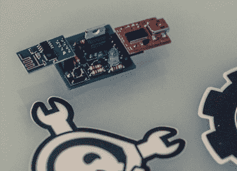

# 在深圳与我们见面

> 原文：<https://hackaday.com/2015/06/07/meet-us-in-shenzhen/>

Hackaday 全球大奖将于下周末在中国深圳举行！有很多事情要做，尽可能多地加入我们:

## 零到产品车间

6 月 19 日星期五，我们的*零到产品*研讨会的回复现在。这是由[马特·博格伦]创作并展示的，他分享了自己专业设计和布局印刷电路板的经验。您只需掌握基本的电子学知识，就可以开始设计这里所示的开发板了！

## 聚会并分享您的经验

整天在创客大会上占据一个令人敬畏的展位让我们感到厌倦。我们将在 6 月 20 日星期六晚上 7 点开始充电。加入我们的仿生酿造吧(请友好地告诉我们你要来)。和往常一样，当我们出去玩的时候，我们喜欢看到和炫耀黑客。如果东西很容易放在口袋或背包里，那就随身携带。

## 在我们的 SZMF 展台制造一些逻辑噪音

是的，我们已经提到过了…我们会在深圳创客节露营，教人们如何用逻辑芯片制作音乐。我们的活动是基于[埃利奥特·威廉姆斯]奇妙的[逻辑噪音系列](http://hackaday.com/tag/logic-noise/)。停下来，打个招呼，拿些贴纸！

* * *

#### 2015 年[黑客日奖](http://hackaday.io/prize)由以下机构赞助:

