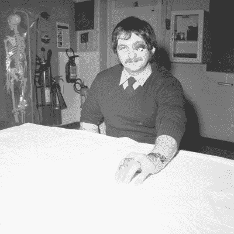

# 欧洲核子研究中心竞赛——安全科学绝非偶然

> 原文：<https://hackaday.com/2015/06/11/caption-cern-contest-safe-science-is-no-accident/>

第 18 周已经成为历史，但是在你写了一些很棒的说明之前！衷心感谢所有参赛者。机敏的读者[ [jlbrian7]](https://hackaday.io/jlbrian7) 又来了！他揭示了这幅图像背后的故事。照片中的女人正在手动分析在[气泡室中拍摄的带电粒子照片。](http://en.wikipedia.org/wiki/Bubble_chamber)他链接到[一篇来自费米实验室的文章](http://history.fnal.gov/neutrino.html#fermilab)，以及一部 1971 年的关于格格巫的电影，格格巫是当时 CERN 最大的气泡室。这部电影很值得一看。它面向外行，解释气泡室的设计、构造和操作。照片扫描部分从 14:40 开始。视频中有很多“20 世纪 70 年代主义”，比如将分析照片的女性称为“扫描女孩”。电影制作人甚至用一个真实的扫描女孩作为章节的结尾——一个可能是 NSFW(按今天的标准)的 ASCII 艺术打印出的裸体模特，由控制数据公司的超级计算机打印。

搞笑的是:

*   "塔巴塔，地下城主，在爆炸的原子里策划了今晚的地下城和龙的游戏."-[[lloydcannoniii](https://hackaday.io/JohnnyRico)
*   “欧洲核子研究中心，唯一一个你可以看着网飞和你在同一张桌子上吃午餐并密谋全球统治的地方。Muwahahaha！”–[[约书亚](https://hackaday.io/hacker/27967-joshua)
*   “他们在欧洲粒子物理研究所非常认真地对待克巴尔太空计划。这里你可以看到第一个交互式实时轨道视图显示。”–[[haxtormoogle](https://hackaday.io/HaxtorMoogle)

本周的冠军是[ [Jarrett]](https://hackaday.io/Jarrett) “周五晚上是实验室的导弹指挥之夜。这是一个严重的事件”

本周我们将颁发两个奖项——一个给[jlbrian7],表彰他对这张和其他 CERN 图像的研究，另一个给[Jarrett],表彰他的获奖说明！恭喜你们俩。享受来自 Hackaday 商店的[逻辑盗版！](http://store.hackaday.com/products/logic-pirate)

#### 第 19 周

 [几乎每个工作场所都要担心安全问题。](https://hackaday.io/contest/4200-caption-cern-contest/log/19322-caption-cern-contest-week-19)许多公司都有一支安全团队，他们接受过处理紧急情况和帮助病人的训练，直到合适的医疗技术人员到来。在典型的办公室环境中，这种训练相当容易，但是如果你在科学的前沿工作呢？欧洲核子研究中心的安全小组接受各种训练，包括严重烧伤的手和部分摘除的眼球。不要担心，这些只是模拟受伤，这可能是为什么这位 CERN 科学家如此平静，甚至对着照片微笑！欧洲核子研究中心的医疗室似乎也储备充足——有完整的骨架，至少有四种不同类型的灭火器。

所以，即使我们已经对这张照片[(和附带的相册)](https://cds.cern.ch/record/752802)中发生的事情有了一个相当好的想法，我们确信你会想出一些很棒的说明。开始吧！

本周的奖品是来自 Hackaday 商店的一颗浅蓝色豆子。将您的幽默标题作为评论添加到该项目日志中。确保你评论的是 [**竞赛日志**](https://hackaday.io/contest/4200-caption-cern-contest/log/19322-caption-cern-contest-week-19) ，而不是竞赛本身(或这篇文章)。

一如既往，如果你真的有关于图像或图像中的人的信息，请在[原始图像讨论页面上让 CERN 知道。](https://cds.cern.ch/record/1836672)

祝你好运！