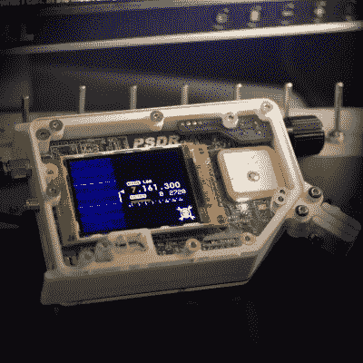
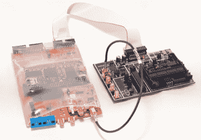

# hack let 51–众筹项目

> 原文：<https://hackaday.com/2015/06/12/hacklet-51-crowdfunding-projects/>

啊众筹。你可能会说我们在 Hackaday 对它又爱又恨。我们已经看到一些通过 Kickstarter、IndieGoGo 等网站资助的伟大项目。我们也看到过一些项目，创作者承诺的比他们能够实现的要多。虽然错过交付和彻底的骗局确实受到了很多媒体的关注，但我们认为，总体而言，众筹是一个获得项目资金的可行平台。

言归正传， [Hackaday.io](https://hackaday.io) 托管了数千个项目。毫不奇怪，其中一些已经有了众筹活动。本周的 Hacklet 聚焦于那些已经跃上众筹舞台的项目。

 我们先从【路易·博登】和 [SmartMatrix](https://hackaday.io/project/5900) 说起。[Louis]创建了一个基于 Teensy 3.1 的出色系统，用于在 32×32 RGB LED 面板上显示图像、动画图形和随机图案。LED 面板与商用 LED 广告牌中使用的类型相同。SmartMatrix 是开源的，包括用于黑客攻击的额外 pin。我们自己的[Mike Szczys]黑进了 SmartMatrix，创造了一个 1 像素的 PacMan 克隆体。【Louis’】Kickstarter 快结束了，而[需要一个巨大的推动力来让完全组装好的 SmartMatrix](https://www.kickstarter.com/projects/pixelmatix/smartmatrix-dynamic-led-art-display-and-music-visu) 实现它的目标。即使活动不成功，我们也认为这是一个伟大的项目，你可以随时从 Hackaday 商店得到一个自己动手组装的工具包！

下一位是 PortableSDR 的迈克尔·R·科尔顿。PortableSDR 是 2014 年 Hackaday 奖的五名决赛选手之一。这个袖珍型软件定义无线电收发器最初是一个火腿无线电项目:一个便于火腿在背包旅行中携带的无线电系统。它现在已经发展到如此之多，具有软件定义的无线电接收和传输、矢量网络分析、天线分析、GPS 和许多其他功能。[Michael]在他的 [Kickstarter 活动](https://www.kickstarter.com/projects/1703258614/psdr-pocket-hf-sdr-transceiver-with-vna-and-gps/)中筹集了高达 66，197 美元，并且他已经将手工组装的原型交付给了他们各自的支持者！即使是较低级别的奖励也很棒——[迈克尔的] PSDR 钥匙链实际上是 PCB，只需大约 10 美元的额外部件，就可以变成与[maple](http://wiki.leaflabs.com/Main_Page)兼容的 ARM 开发板。

 接下来我们有[芯片密语者](https://hackaday.io/project/956)，【科林·弗林的】嵌入式安全测试系统，获得 2014 年黑客日奖第二名。我们已经在博客上多次[报道了](http://hackaday.com/2015/02/27/chipwhisperer-hits-kickstarter/)[科林](http://hackaday.com/2014/10/29/the-hackaday-prize-interview-with-a-chipwhisperer/)和[芯片密语者](http://hackaday.com/2014/07/04/thp-entry-embedded-hardware-security-with-the-chipwhisperer/)。你可以随时从[科林的]公司[NewAE 科技公司 T12 买到完整的芯片语声器。作为一款硬件安全工具，ChipWhisperer 的售价为 1500 美元，令人难以置信。不过这个价格对于普通黑客来说还是有点高。[Colin]为 ChipWhisperer 的一个轻量级版本创建了一个](http://newae.com/) [Kickstarter 活动](https://www.kickstarter.com/projects/coflynn/chipwhisperer-lite-a-new-era-of-hardware-security)。这个版本是学习硬件安全的一个很好的平台，也是测试嵌入式系统的一个工具。该活动取得了巨大的成功，筹集了 72，079 美元。

然而，并不是每个众筹项目都必须付出巨大的努力。[ZeptoBit]只是想解决一个问题，他需要一个使用 ESP8266 模块的【Arduino using 盾。ESP8266 WiFi 模块已经风靡了几个月，但连接到 Arduino Uno 可能会有点痛苦。双排. 100 接头对面包板不友好。ESP8266 的 3.3 V 电源和接口要求意味着需要一个调节器和电平转换器来使两块电路板协同工作。[ZeptoBit]把这些都放在他的翼板上。效果非常好，以至于他发起了一个 [Kickstarter 活动](https://www.kickstarter.com/projects/902741881/8266wing-wifi-shield)来进行小规模的董事会——他最初的目标是3500 韩元，或 425 美元。他最终筹集了 13，705 韩元，或 1665 美元。对于一个爱好项目来说一点也不差！

如果这对你来说还不够众筹美好，看看我们的[众筹列表吧！](https://hackaday.io/list/4355-crowd-funding)本周的 Hacklet 到此为止，一如既往，下周见。同样的黑客时间，同样的黑客频道，带给你最好的 [Hackaday.io！](https://hackaday.io/)