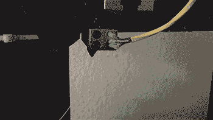

# 使用细丝速度传感器防止打印失败

> 原文：<https://hackaday.com/2015/06/16/prevent-failed-prints-with-a-filament-speed-sensor/>

如果你使用过一段时间的 3D 打印机，你可能经历过由于喷嘴堵塞而导致的打印失败。如果你不在旁边停止打印，喷嘴几个小时都是热的，充满了细丝，堵塞会变得更严重。[Florian]着手用一个测量细丝速度的[编码器来解决这个问题](http://www.cuddleburrito.com/blog/2015/6/11/preventing-failed-prints-with-filament-feed-encoder-and-arduino)，它充当喷嘴堵塞的早期预警系统。

【Florian】设计了一个带有轮子和编码器的小组件，用来测量细丝的运动。细丝在被送入 3D 打印机之前会从编码器轮下穿过。编码器连接到 Arduino，Arduino 在编码器旋转时测量格雷码脉冲，编码器计数通过串行端口传输到计算机。

当灯丝由于喷嘴堵塞而减速或停止时，Python 脚本会播放通知声音，让您知道应该检查喷嘴，打印可能会失败。一旦[Florian]解决了他的设置中的一些问题，如果脚本可以在喷嘴故障时停止打印，那就太棒了。关于如何检测打印故障，您还有其他想法吗？请在评论中告诉我们。