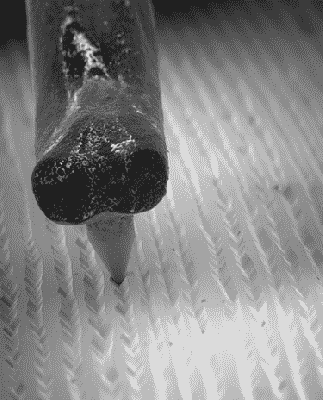

# 电子显微镜眼中的留声机

> 原文：<https://hackaday.com/2015/06/16/phonographs-through-the-eye-of-an-electron-microscope/>

Hackaday 奖评委本·克拉斯诺最近很忙。他用他的扫描电子显微镜(SEM)制作了一个唱机唱针播放唱片的动画。(YouTube 链接)这是同一张 [80 年代的 SEM【本】在 11 月](http://hackaday.com/2014/09/03/ben-krasnow-hacks-a-scanning-electron-microscope/)黑回来的。不幸的是，[本的] JSM-T200 不够大，容纳不下一整张 12 英寸的唱片，所以他不得不把一张唱片的一小部分剪下来。不过，黑胶唱片不是在那里做的。SEM 需要一个导电表面来成像。乙烯是绝缘体。[Ben]通过使用他的真空室在乙烯基上蒸发一薄层银来处理这个问题。

仅仅对记录进行成像是不够的；[Ben]想要一个针穿过唱片丛的动画。他拆开一根旧留声机唱针，把它安装在扫描电镜的一根铜线上。由于 JSM-T200 的双级设置，[本]能够独立移动记录芯片和针。然后，他可以把唱片移到唱针下面，就好像它真的在播放一样。[Ben]用他的示波器记录了 60 帧，每帧间隔 50 微米。他使用 [八度](http://www.gnu.org/software/octave/) 来处理数据，最终得到了你在左边看到的令人敬畏的 GIF 动画。

尽管如此，本还没有完成。他尝试了一些其他的记录格式，包括 CD 和 DVD 光学媒体，以及[电容电子盘](https://en.wikipedia.org/wiki/Capacitance_Electronic_Disc)，这是一种来自 RCA 的晦涩格式，在市场上惨败。[Ben]面临的最大挑战是对 CD 介质进行成像。人们熟悉的 CD 凹坑存储在薄铝层上，夹在漆标签和塑料盘之间。他试图用化学物质溶解塑料，但留下的塑料足以扭曲图像。解决方案原来是双面胶带。将一些胶带粘在 CD 上并将其剥离，干净地去除了铝，并提供了一个坚固的基底来将样品安装在 SEM 中。

我们很好奇是否可以从 SEM 图像中提取立体声音频数据。用一个玩具机器人的单声道录音成功做到了这一点。谁会是第一个使用图像分析软件从[Ben 的]图像中获取音频的人？

[https://www.youtube.com/embed/GuCdsyCWmt8?version=3&rel=1&showsearch=0&showinfo=1&iv_load_policy=1&fs=1&hl=en-US&autohide=2&wmode=transparent](https://www.youtube.com/embed/GuCdsyCWmt8?version=3&rel=1&showsearch=0&showinfo=1&iv_load_policy=1&fs=1&hl=en-US&autohide=2&wmode=transparent)