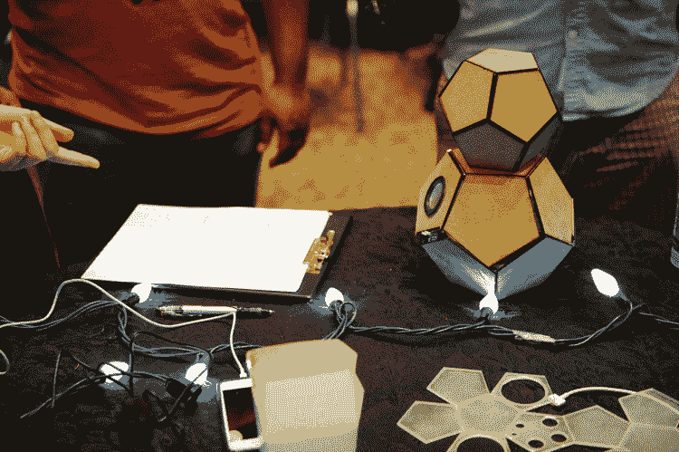

# 硬件的崛起:PCH 黑客马拉松

> 原文：<https://hackaday.com/2015/06/17/rise-of-hardware-a-pch-hackathon/>

上周末，我有幸在安大略省滑铁卢市的 [KW 黑客马拉松](http://blog.hardwarehackathon.com/post/121605014355/icebox-wins-the-kw-hackathon-and-is-off-to)上提供帮助，该活动由 PCH 硬件公司赞助，该公司在世界各地举办[黑客马拉松和聚会](http://hackathon.pchintl.com/)以帮助激发发明和企业家精神。这是他们举办的第六次基于硬件的黑客马拉松。

当他们举办黑客马拉松时，他们会召集当地的赞助商，为参赛者提供工具和资源，让他们在不到 54 小时的时间内开发出一个工作原型，然后他们可以向评委小组推销，赢得一些令人敬畏的奖项。我们提到它是免费注册的吗？下一站是在英国伦敦。

就我个人而言，我在产品设计和开发方面提供了一些指导，但更重要的是，我开放了我的巨型激光切割机的使用，以帮助团队创建真正的原型，并了解更多关于使用激光切割机快速成型的信息。起初，每个人都想 3D 打印他们的原型——但是可用的打印机数量有限，而且等待时间很长。我们向他们介绍了像[www.makercase.com](http://www.makercase.com/)这样的网站，这个网站将为你指定尺寸的外壳生成激光切割计划，当然，还有搜索谷歌“激光切割 arduino 案例”的能力，以找到电子产品的预设计激光设计。

一些在 CAD 方面更有经验的团队发挥创意，做出了很酷的十面体，这实际上有助于按照他们在纸上设想的方式创建工作原型。

除了主要活动之外，他们还举办了主题演讲和研讨会，以帮助团队进一步发展创意——我们认为 Communitech(举办场地)很好地总结了举办黑客马拉松的目的:

> “有用的东西确实来自黑客马拉松:一些实现了的想法，但更重要的是，新的人类黑客联系和更深刻的能力意识，以及我们超越软件领域的创造能力。”

总的来说，这个活动太棒了，这让我们希望有更多这样的活动。当有创造力的人聚在一起开始设计和制作东西时，你可以感觉到房间里兴奋的嗡嗡声。哦，免费食物也很棒——尤其是对学生来说。

有关此次活动的更多信息，请查看 Communitech News 的[Darin White]撰写的[新闻文章](http://news.communitech.ca/news/communitech/rise-of-hardware-pch-hackathon-draws-the-best/)。